#  Azkaban 工作流管理器

## 工作流管理器系统背景

一个完整的数据分析系统通常都是由大量任务单元组成，例如shell脚本程序、java程序、mapreduce程序和hive脚本等。各任务单元之间存在时间先后及依赖关系，为了将这复杂的执行计划组织起来，需要一个工作流调度系统来调度执行。

## 常用工作流管理器介绍

**1.Azkaban**

Azkaban是由Linkedin公司开源的一个批量工作流任务调度器，用于在一个工作流内以一个特定的顺序运行一组工作和流程。


**2.Oozie**

Oozie是Apache旗下的，用于管理Hadoop任务的工作流/协调系统，可与Hadoop生态圈紧密结合，提供诸多配置和功能。


**3. Zeus**

Zeus是Alibaba开源的一个完整的Hadoop的作业平台，用于从Hadoop任务的调试运行到生产任务的周期调度管理。Zeus是针对Hadoop集群任务定制的，通用性不强。Zeus在Github上线时受到青睐，但是由于长期缺乏维护更新，时隔2年，依然仅支持Hadoop1.X版本，后期的Zeus版本也不再开源了。

## Azkaban特点

Azkaban通过作业的依赖性解决业务调度顺序，并提供易于使用的UI界面来维护和跟踪工作流程，其主要特点如下：

（1） 兼容任何版本的Hadoop；

（2） 易于使用的Web UI界面；

（3） 简单的Web和Http工作流上传；

（4） 支持工作流定时调度；

（5） 支持模块化和可插入；

（6） 支持身份验证和授权；

（7） 支持用户操作跟踪；

（8） 提供有关失败和成功的电子邮件提醒；

（9） 提供SLA警报和自动查杀功能。

## Azkaban组织结构

​     Azkaban工作流管理器由三个核心部分组成，分别是Relational Database（关系型数据库MySQL）、AzkabanWebServer（Web服务器）、AzkabanExecutorServer（执行服务器）。三者关系具体如图所示。

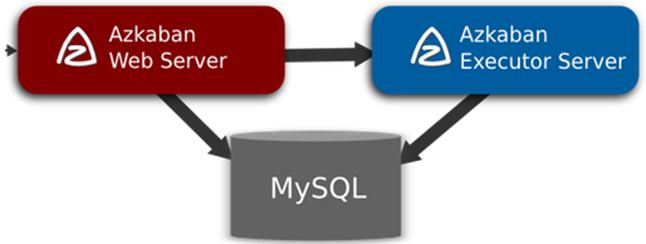

## Azkaban部署模式

**1. solo-server mode（独立服务器模式）**

在独立服务器模式下，使用的数据库是内嵌的H2，并且web server和executor server都在同一进程中运行，通常适用于小规模测试阶段。

**2.** **two server mode（双服务器模式）**

双服务器模式适用于比较复杂的生产环境，它的数据库会由具有主从设置的MySQL实例提供支持。其中，Web服务器和执行服务器应在不同的进程中运行，以便升级和维护过程中不影响用户。

**3. distributed multiple-executor mode（分布式多执行器模式）**

分布式多执行器模式适用于特别复杂的生产环境，理想情况下，Web服务器和执行服务器应在不同的主机中运行，以便升级和维护不影响用户。这种分布式多主机设置的模式为Azkaban带来了强大且可扩展的性能。


## Azkaban资源准备

Azkaban官方并没有提供Linux系统的编译安装包，需要读者根据需求在官网选择指定版本的Azkaban源文件，然后进行编译打包。

1. Azkaban最新源文件地址为https://github.com/azkaban/azkaban，读者可以使用Git工具拉取或者直接下载。


2. 编译Azkaban只需要在进入Azkaban根目录输入./gradlew build -x test指令，系统会自动编译Azkaban源文件。

```
# 解压安装包到当前目录下
tar -zxvf /export/software/azkaban-3.50.0.tar.gz

# 编译前需要安装git命令
yum install -y git

# 是否要安装node呢？

# 编译(联网状态下，下载很多文件，耗时比较长)
./gradlew build -x test
```


3. Azkaban源文件编译成功后，会在解压目录下各自azkaban-*/build/distributions目录下生成基于Windows和Linux的安装包文件。

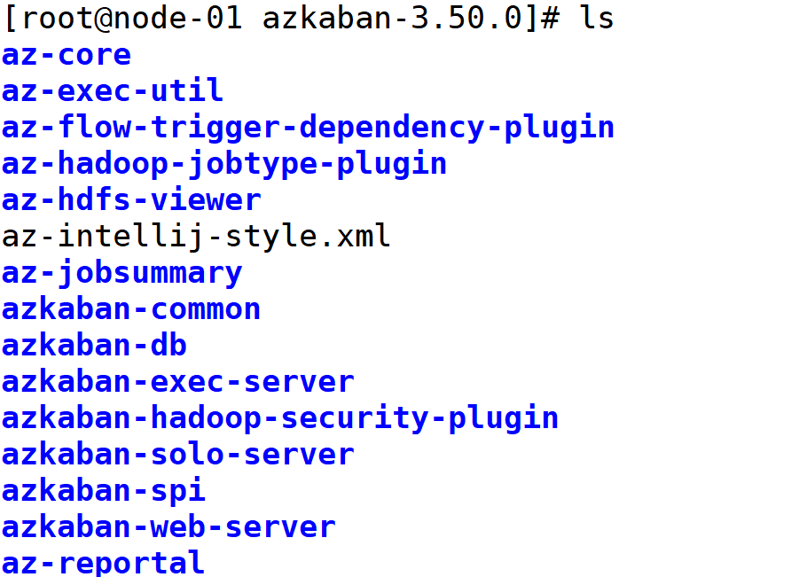


## Azkaban 安装配置

- MySQL安装配置。创建Azkaban数据库及用户，并对数据库表初始化。
- Azkaban Web服务安装配置。
- Azkaban Executor服务安装配置。

## Azkaban 安装部署和启动测试

**MySQL安装配置。创建Azkaban数据库及用户，并对数据库表初始化。**

**1.** **创建数据库 azkaban**

```
# 登录mysql，创建数据库 azkaban
mysql> create database azkaban;
```

**2.设置文件接受包的大小**

```
vi /etc/my.conf
# 添加参数
max_allowed_packet=1024M
# 重新启动mysql，使修改生效
sudo /sbin/service mysqld restart


```

```
#对/export/software/azkaban-3.50.0/azkaban-db/build/distributions/azkaban-db-0.1.0-SNAPSHOT.tar.gz 进行解压
tar -zxvf azkaban-db-0.1.0-SNAPSHOT.tar.gz
```


```
# azkaban数据库表进行初始化
mysql> use azkaban;
mysql> source /export/software/azkaban-3.50.0/azkaban-db/build/distributions/azkaban-db-0.1.0-SNAPSHOT/create-all-sql-0.1.0-SNAPSHOT.sql
mysql> show tables;
```

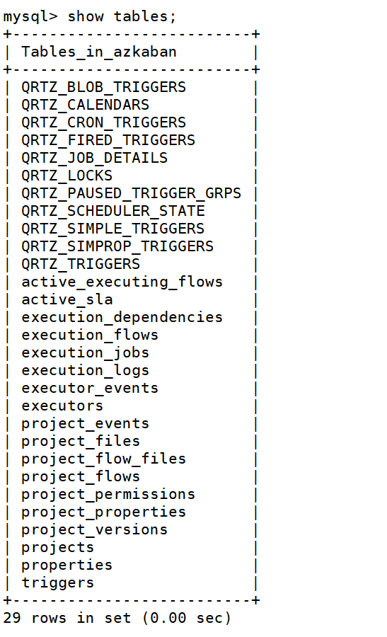


**创建SSL**

```
# 在/export/software下生成密钥文件
$ keytool -keystore keystore -alias jetty -genkey -keyalg RSA

#设置密钥keystore和jetty的密码都是：123456
```


**Azkaban Web服务安装配置**

**将编译好的azkaban web服务器解压到/export/servers/azkaban 目录下**

```
$ tar -zxvf azkaban-web-server-0.1.0-SNAPSHOT.tar.gz -C /export/servers/azkaban
```

**在azkaban-3.5.0下找到azkaban-solo-server/..../distributions，复制其中的conf,plugins**

```bash
cp -r conf/ /export/servers/azkaban/azkaban-web-server-0.1.0-SNAPSHOT/

cp -r plugins/ /export/servers/azkaban/azkaban-web-server-0.1.0-SNAPSHOT/

# 创建extlib 目录
mkdir extlib
```


**打开conf目录下的azkaban.properties配置文件，对时区、MySQL、jetty进行修改配置**

```
# 修改时区
default.timezone.id=Asia/Shanghai
# 对数据库类型和配置进行修改编辑
database.type=mysql
mysql.port=3306
mysql.host=localhost
mysql.database=azkaban
mysql.user=root
mysql.password=wukong
mysql.numconnections=100
# 对jetty进行设置
jetty.use.ssl=true
jetty.maxThreads=25
jetty.port=8081
jetty.ssl.port=8443
# keystore 后续改成绝对路径
jetty.keystore=keystore
jetty.password=123456
jetty.keypassword=123456
# keystore 后续改成绝对路径 
jetty.truststore=keystore
jetty.trustpassword=123456
```

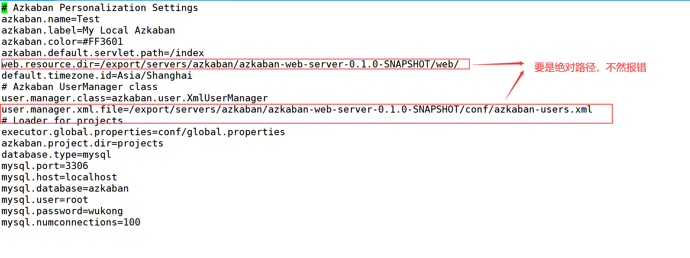

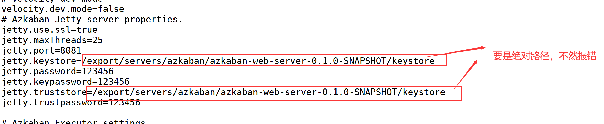

**将密钥文件移入到/export/servers/azkaban/azkaban-web-server-0.1.0-SNAPSHOT目录下**

```
cp /export/software/keystore /export/servers/azkaban/azkaban-web-server-0.1.0-SNAPSHOT
```

**修改azkaban-users.xml配置文件,添加如下**

```
cd conf
<user password="admin" roles="metrics,admin" username="admin"/>
```

**在conf/下配置log4j.properties文件**

```
log4j.rootLogger=INFO,Console
log4j.logger.azkaban=INFO,server

log4j.appender.server=org.apache.log4j.RollingFileAppender
log4j.appender.server.layout=org.apache.log4j.PatternLayout
log4j.appender.server.File=logs/azkaban-server.log
log4j.appender.server.layout.ConversionPattern=\ %d{yyyy-MM-dd HH:mm:ss SSS Z} %p [%c{1}] [Azkaban] %m%n
 
log4j.appender.Console=org.apache.log4j.ConsoleAppender
log4j.appender.Console.layout=org.apache.log4j.PatternLayout
log4j.appender.Console.layout.ConversionPattern=\ %d{yyyy-MM-dd HH:mm:ss SSS Z} %p [%c{1}] [Azkaban] %m%n
 

```

**Azkaban Executor 服务器安装和配置**

找到azkaban-3.5.0/azkaban-exec-server/build/distributions/目录，解压如下文件

```
tar -zxvf azkaban-exec-server-0.1.0.SNAPSHOT.tar.gz -C /export/servers/azkaban

```

进入解压后的目录，发现只有两个目录 bin 和 lib，还缺conf,extlib,plugins, 通过拷贝获得

```bash
cp -r /export/software/azkaban-3.50.0/azkaban-solo-server/build/distributions/azkaban-solo-server-0.1.0-SNAPSHOT/conf ./

mkdir extlib 

cp -r /export/software/azkaban-3.50.0/azkaban-solo-server/build/distributions/azkaban-solo-server-0.1.0-SNAPSHOT/plugins ./
```

修改azkaban.properties文件

```
# 修改jetty为false
jetty.use.ssl=false
# 添加如下
# 设置最大线程数
executor.maxThreads=50
# 设置exequtor端口
executor.port=12321
# 设置流动线程线
executor.flow.threads=30
```

整个azkaban工作流管理器的安装配置已经完成了

**启动**

> 启动时候，如果报错说文件不存在，将azkaban.properties中的相对路径改成绝对路径试试

**1.** **执行bin/start-exec.sh脚本文件，启动Azkaban Executor服务**

```
# 进入Azkaban Executor 主目录下，执行如下
bin/start-exec.sh
# 使用jps查看是否启动成功
jps  # 出现 AzkabanExecutorServer

# 如何关闭呢
bin/shutdown-exec.sh
```


**2.** **执行bin/start-web.sh脚本文件，启动Azkaban Web服务**


```
# 进入Azkaban Web 主目录下，执行如下
bin/start-web.sh
# 使用jps查看是否启动成功
jps  # 出现 AzkabanWebServer

# 如何关闭呢
bin/shutdown-web.sh
```


**3.** **访问Azkaban UI界面**

在azkaban web下的azkaban.properties中，没有启动SSL（jetty.use.ssl=false）时

```
# 访问url
https://主机名：8081
```

在azkaban web下的azkaban.properties中，启动SSL（jetty.use.ssl=true）时

```
# 访问url
https://主机名：8443
```


**4.** **输入Admin的用户名和密码进行登录**

```
admin
admin
```


## Azkaban 工作流相关概念

**1. job任务**

Azkaban是对job调度管理，而每个job任务都编写在一个后缀名为.job的文本文件中，在该文件中可定义job任务类型、将运行的任务、依赖的其他job及job运行的相关参数。

```
# demo.job
type=command
command=echo "Hello World"
```

**job文件常用参数**


**2.** **工作流**

工作流是指具有依赖关系的一组jobs任务，被依赖job任务会先执行。

```
# demo.job
type=command
command=echo "Hello World"
```

```
# demo2.job
type=command
dependencies=demo
command=echo "Hello China"
```


**3.** **嵌入流**

嵌入流是工作流穿插到其他流的某个节点上。

```
# baz.job
type=flow
flow.name=demo2
```


## 案例-依赖任务调度管理

**1.** 创建两个具有依赖关系的job任务文件，即foo.job和bar.job,打包成zip压缩包,命名为bar.zip。

foo.job

```
# foo.job
type=command
command=echo foo
```

bar.job

```
#bar.job
type=command
dependencies=foo
command=echo bar
```


**2.** **利用Web UI界面，创建Azkaban项目并上传bar.zip压缩包**

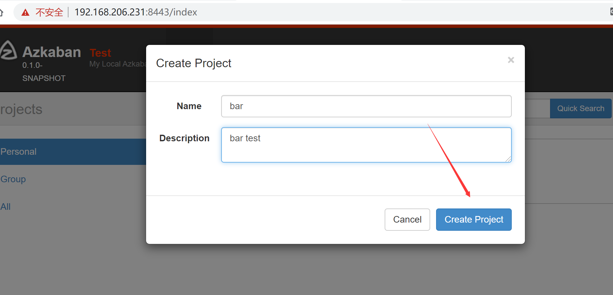


**3. Azkaban项目执行**

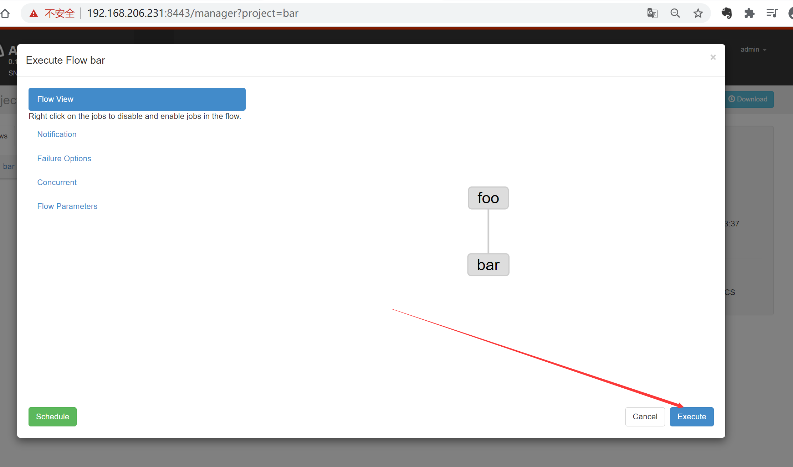


## 案例-MapReduce任务调度管理

**1.** **创建一个名称为wordcount_mr.job的任务文件**

原文件路径和目标文件路径

```
# mr.job
type=command
command=hadoop jar hadoop-mapreduce-examples-2.7.7.jar wordcount \
  hdfs://node-01:9000/wordcount/input/wctest.txt \
  hdfs://node-01:9000/wordcount/output/mrjobresult

```

**2.打成zip包**

将wordcount_mr.job文件和hadoop-mapreduce-examples-2.7.7.jar打成一个zip格式压缩包，命名为wordcount_mr.zip

```
# 将linux文件上传到window系统上
sz hadoop-mapreduce-examples-2.7.7.jar

# 打成zip
```


**3. MapReduce任务调度演示**

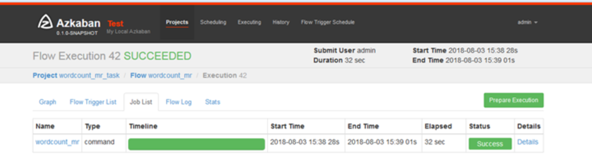


**4.在hadoop系统中查询是否生成统计文件**

## 案例-Hive脚本任务调度管理

**1.** **创建一个名称为hive.job的任务文件**

```
# hive.job
type=command
command=/export/servers/apache-hive-1.2.1-bin/bin/hive -f 'test.sql'

```

**2.** **创建hive.job任务文件需要的test.sql文件**

```
use default;
drop table aztest;
create table aztest(id int,name string) row format delimited fields terminated by ',';
# inpath 是hdfs系统路径 local inpath 是linux系统路径
load data inpath '/aztest/hiveinput' into table aztest;
insert overwrite directory '/aztest/hiveoutput' select count(1) from aztest;

```

/aztest/hiveinput中文件 **aztest.txt** 信息如下

```
1,wukong
2,wukongnot
3,wukongnotnull
```

上传文件到hdfs

```
hadoop fs -mkdir -p /aztest/hiveinput
hadoop fs -put aztest.txt /aztest/hiveinput
```


**3.hive.job和test.sql打包成zip压缩包，命名为hive**


**4. HIVE脚本任务调度演示**

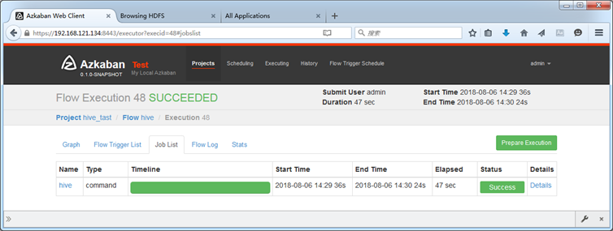


**报错**

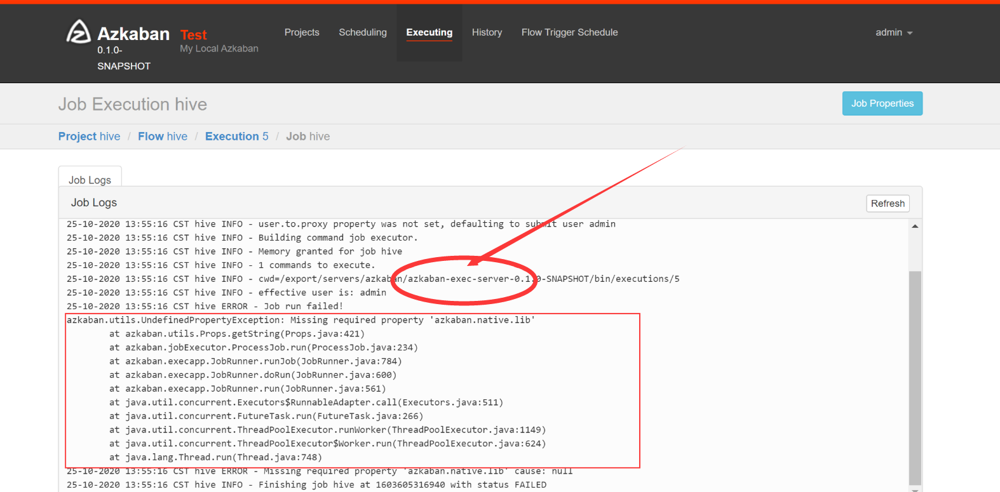


```
azkaban.utils.UndefinedPropertyException: Missing required property 'azkaban.native.lib'
	at azkaban.utils.Props.getString(Props.java:421)
	at azkaban.jobExecutor.ProcessJob.run(ProcessJob.java:234)
	at azkaban.execapp.JobRunner.runJob(JobRunner.java:784)
	at azkaban.execapp.JobRunner.doRun(JobRunner.java:600)
	at azkaban.execapp.JobRunner.run(JobRunner.java:561)
	at java.util.concurrent.Executors$RunnableAdapter.call(Executors.java:511)
	at java.util.concurrent.FutureTask.run(FutureTask.java:266)
	at java.util.concurrent.ThreadPoolExecutor.runWorker(ThreadPoolExecutor.java:1149)
	at java.util.concurrent.ThreadPoolExecutor$Worker.run(ThreadPoolExecutor.java:624)
	at java.lang.Thread.run(Thread.java:748)
25-10-2020 13:55:16 CST hive ERROR - Missing required property 'azkaban.native.lib' cause: null
25-10-2020 13:55:16 CST hive INFO - Finishing job hive at 1603605316940 with status FAILED

```

**解决方法**

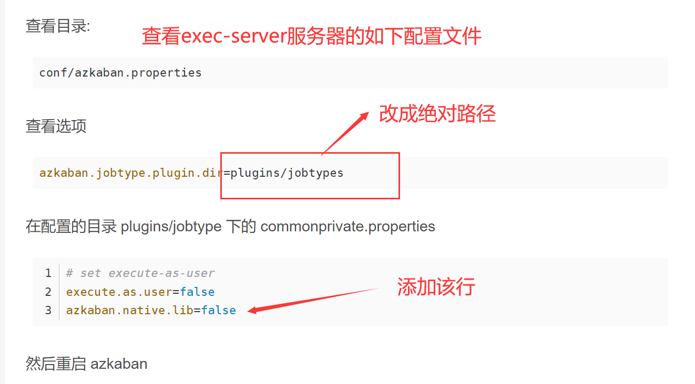


