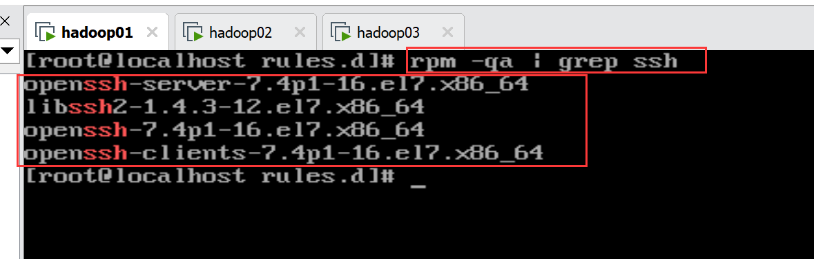
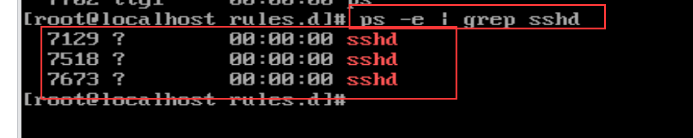
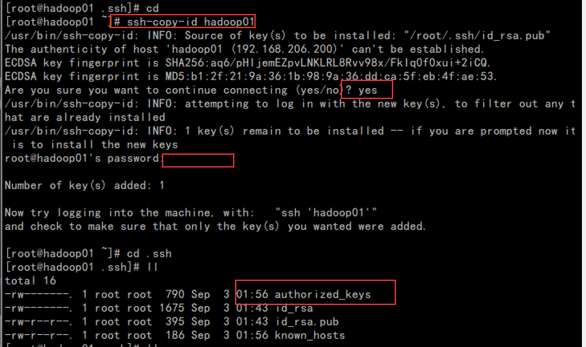
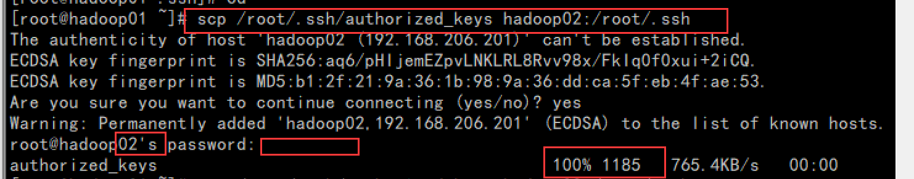
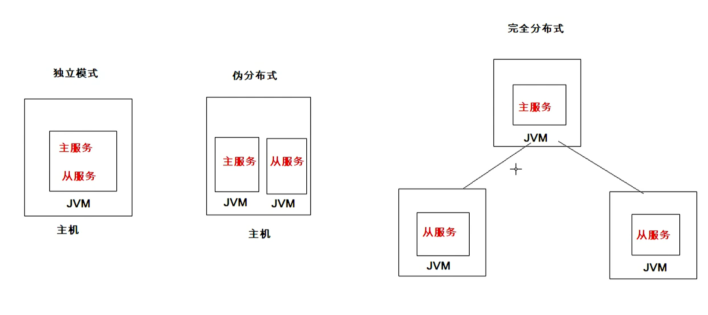
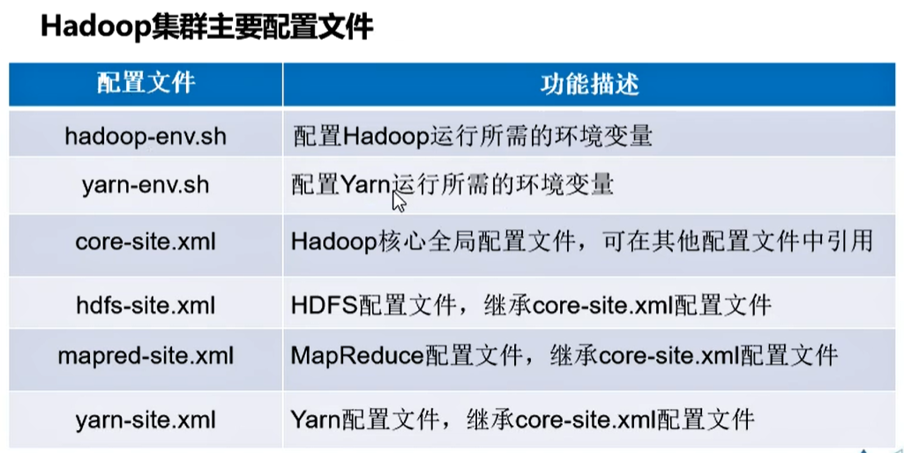

# Hadoop集群构建

## 虚拟机的安装

https://www.bilibili.com/read/cv7450678

## Centos系统安装


https://www.bilibili.com/read/cv7456817

## 安装SecureCRT工具

https://www.bilibili.com/read/cv7457324

## 配置虚拟网络IP

https://www.bilibili.com/read/cv7463717

## 使用SecureCRT远程访问Centos系统

https://www.bilibili.com/read/cv7457324中的后半部有讲解

## 虚拟机的克隆

略（比较简单）

## Linux系统网络配置

**创建3台虚拟机hadoop01,hadoop02,hadoop03，每台虚拟机进行如下操作**

### 1.静态Ip配置

**参考ip可选范围，配置静态IP地址，成功后可以使用SecureCRT工具**

```bash
$ vi /etc/sysconfig/network-scripts/ifcfg-ens33

#举例 ：hodoop01 
TYPE=Ethernet
PROXY_METHOD=none
BROWSER_ONLY=no
BOOTPROTO=static
DEFROUTE=yes
IPV4_FAILURE_FATAL=no
IPV6INIT=yes
IPV6_AUTOCONF=yes
IPV6_DEFROUTE=yes
IPV6_FAILURE_FATAL=no
IPV6_ADDR_GEN_MODE=stable-privacy
NAME=ens33
UUID=ce1e1643-4332-4151-a2a8-86dc56e77b93
DEVICE=ens33
ONBOOT=yes
IPADDR=192.168.206.200
NETMASK=255.255.255.0
GATEWAY=192.168.206.2
DNS1=8.8.8.8
```

**重启网络**

```bash
systemctl restart network
```


### 2.主机名

**（1）配置主机名，具体指令如下。**

针对centos 6.x

```bash
$ vi /etc/sysconfig/network

NETWORKING=yes
HOSTNAME=hadoop01

```

针对 centos 7.x

```
$ vi /etc/hostname

	hadoop01
```


### 3.配置ip的映射

```bash
$ vi /etc/hosts

192.168.206.200 hadoop01
192.168.206.201 hadoop02
192.168.206.202 hadoop03
```

### 4.配置网卡设备的MAC地址

​     centos7 .x 没有该文件,不需要配置

​    centos 6.x版本需要，自行百度

```bash
$ vi /etc/udev/rules.d/70-persistent-net.rules

```

### 5.配置效果验证

```
ping hadoop01
ping hadoop02
ping hadoop03
ping www.baidu.com
```

## SSH服务配置

实际工作中，服务器被放置在机房中，同时受到地域和管理的限制，开发人员通常不会进入机房操作直接上机操作，而是通过远程连接服务器，进行相关操作。

在集群开发中，主节点通常会对集群中各个节点频繁的访问，就需要不断输入目标服务器的用户名和密码，这种操作方式非常麻烦并且还会影响集群服务的连续运行。

为了解决上述问题，我们可以通过配置SSH服务来**实现远程登录**和SSH的**免密登录**功能。

### **1. SSH远程登录功能配置**

**（1）安装并开启SSH服务**

```bash
#查询是否已经安装ssh服务，centos7 默认安装
$ rpm -qa | grep ssh
```



```bash
# 查询ssh服务是否启动,centos7默认启动
$ ps -e | grep sshd
```



```bash
# 如果发现系统中没有安装ssh，怎么办呢
$ yum install openssh-server
```

**（2）创建CRT工具和服务器hadoop01的快速连接**

​	略

见  安装SecureCRT工具
https://www.bilibili.com/read/cv7457324

### **2. SSH免密登录功能配置**


**（1）生成SSH文件（公钥和私钥）**

​          公钥加密，私钥解密

​	hadoop01

```bash
$ ssh-keygen -t rsa
```

和hadoop02和hadoop03同理，不演示了

**（2）拷贝3台机器的公钥到一台机器的某文件，将该文件发送到每台机器上**

```bash
#分别在3台机器上执行该命令，生成某文件为（/root/.ssh/authorized_keys）
$ ssh-copy-id hadoop01
```



**（3）将某文件，发送到hadoop02和hadoop03 机器内**

hadoop01上

```bash
$ scp /root/.ssh/authorized_keys hadoop02:/root/.ssh

$ scp /root/.ssh/authorized_keys hadoop03:/root/.ssh

```




**（4）验证免密登录效果**

```bash
$ ssh hadoop02
$  exit
$ ssh hadoop03
```


## Hadoop集群部署模式

**独立模式**

在独立模式下，所有程序都在单个JVM上执行，调试Hadoop集群的MapReduce程序也非常方便。一般情况下，该模式常用于学习或开发阶段进行调试程序。

**伪分布模式**

在伪分布式模式下， Hadoop程序的守护进程都运行在一台节点上，该模式主要用于调试Hadoop分布式程序的代码，以及程序执行是否正确。伪分布式模式是完全分布式模式的一个特例。

**完全分布式模式**

在完全分布式模式下，Hadoop的守护进程分别运行在由多个主机搭建的集群上，不同节点担任不同的角色，在实际工作应用开发中，通常使用该模式构建企业级Hadoop系统。




## JDK安装

>**参考文档**
>
>https://www.bilibili.com/read/cv7532179

官网下载地址

https://www.oracle.com/java/technologies/oracle-java-archive-downloads.html

1-新建目录专门存放安装包

```bash
mkdir -p /export/software/
cd /export/software/
```

2-使用SecureCRT，安装lrzsz命令，实现将win上文件传输到linux上

**win和linux都需要联网**

```bash
yum install lrzsz -y
```

3-创建目录，存放解压后的文件

```bash
mkdir -p /export/servers/
```

4-将压缩包解压到指定目录

```bash
tar -zxvf jdk-8u161-linux-x64.tar.gz -C /export/servers/
```

5-将解压后包目录，重新命名，方便使用

```bash
mv  jdk1.8.0_161/ jdk/
```

6-配置jdk的系统环境变量

```bash
vi /etc/profile

#添加如下内容
 export JAVA_HOME=/export/servers/jdk
 export PATH=$PATH:$JAVA_HOME/bin
 export CLASSPATH=.:$JAVA_HOME/lib/dt.jar:$JAVA_HOME/bin/tools.jar
```

7- 使修改生效

```bash
source /etc/profile
```

8-检验是否生效

```bash
java -version
```


## Hadoop安装

> 帮助文档
>
> https://www.bilibili.com/read/cv7591643

官网下载地址(贼慢)

https://archive.apache.org/dist/hadoop/common/

hadoop-2.7.7.tar.gz

1-解压并安装

```bash
# hadoop-2.7.7.tar.gz 上传到 /export/software/
cd /export/software/
tar -zxvf hadoop-2.7.7.tar.gz -C /export/servers/
```

2- /etc/profile 中配置hadoop系统环境变量

```bash
export HADOOP_HOME=/export/servers/hadoop-2.7.7
export PATH=:$HADOOP_HOME/bin:$HADOOP_HOME/sbin:$PATH

```

3-使修改生效

```bash
source /etc/profile
```

4-验证

```bash
hadoop version
```


## Hadoop集群配置



1-配置Hadoop集群主节点

1.1 修改hadoop-env.sh文件

```bash
export JAVA_HOME=/export/servers/jdk
```

1.2 修改core-site.xml文件

```xml
<configuration>
	<property>
    	<name>fs.defaultFS</name>
        <value>hdfs://hadoop01:9000</value>
    </property>
    <property>
    	<name>hadoop.tmp.dir</name>
        <value>/export/servers/hadoop-2.7.7/tmp</value>
    </property>
</configuration>
```

1.3 修改hdfs-site.xml文件

```xml
<configuration>
         <property>
                <name>dfs.replication</name>
                <value>3</value>
        </property>
        <property>
                <name>dfs.namenode.secondary.http-address</name>
                <value>hadoop02:50090</value>
        </property>
</configuration>

```

1.4 修改mapred-site.xml 文件（复制mapred-site.xml.template获得）

```xml
<configuration>
	<property>
    	<name>mapreduce.framework.name</name>
        <value>yarn</value>
    </property>
</configuration>
```

1.5 修改 yarn-site.xml文件

```xml
<configuration>
	<property>
    	<name>yarn.resourcemanager.hostname</name>
        <value>hadoop01</value>
    </property>
    <property>
    	<name>yarn.nodemanager.aux-services</name>
        <value>mapreduce_shuffle</value>
    </property>
</configuration>
```

1.6 修改slaves文件(覆盖localhost)

```
hadoop01
hadoop02
hadoop03
```

2 **将集群主节点的配置文件分发到其他子节点**

完成Hadoop集群主节点hadoop01的配置后，还需要将系统环境配置文件、JDK安装目录和Hadoop安装目录分发到其他子节点hadoop02和hadoop03上，具体指令：

```bash
$ scp /etc/profile hadoop02:/etc/profile
$ scp /etc/profile hadoop03:/etc/profile
$ scp -r /export/  hadoop02:/
$ scp -r /export/  hadoop03:/

```

3 在hadoop02和hadoop03上执行,使环境变量生效

```
source /etc/profile
```

## 格式化文件系统

初次启动HDFS集群时，必须对**主节点**进行格式化处理。

格式化文件系统指令如下：

```bash
# 任意目录下输入如下
$ hdfs namenode -format
或者
$ hadoop namenode -format
```


## 启动和关闭Hadoop集群

针对Hadoop集群的启动，需要启动内部包含的HDFS集群和YARN集群两个集群框架。启动方式有两种：一种是单节点逐个启动；另一种是使用脚本一键启动。

1 **单节点逐个启动和关闭**

```bash
    
在主节点上执行指令启动/关闭HDFS NameNode进程；
hadoop-daemon.sh start namenode
在每个从节点上执行指令启动/关闭HDFS DataNode进程；
hadoop-daemon.sh start datanode

在主节点上执行指令启动/关闭YARN ResourceManager进程；
yarn-daemon.sh start resourcemanager
在每个从节点上执行指令启动/关闭YARN nodemanager进程；
yarn-daemon.sh start nodemanager

在节点hadoop02执行指令启动/关闭SecondaryNameNode进程
 hadoop-daemon.sh start secondarynamenode
```

**注意**

hadoop01  有1个主节点 和1个从节点

```bash
hadoop-daemon.sh start namenode
hadoop-daemon.sh start datanode
```

```bash
yarn-daemon.sh start resourcemanager
yarn-daemon.sh start nodemanager
```


hadoop02  有1个从节点

```
hadoop-daemon.sh start datanode
```

```bash
yarn-daemon.sh start nodemanager
```

```bash
hadoop-daemon.sh start secondarynamenode
```


hadoop03  有1个从节点


```
hadoop-daemon.sh start datanode
```

```bash
yarn-daemon.sh start nodemanager
```


2 **脚本一键启动和关闭**

```
在主节点hadoop01上执行指令“start-dfs.sh”或“stop-dfs.sh”启动/关闭所有HDFS服务进程；(注意，不包含 secondarynamenode 进程)

在主节点hadoop01上执行指令“start-yarn.sh”或“stop-yarn.sh”启动/关闭所有YARN服务进程；

在主节点hadoop01上执行“start-all.sh”或“stop-all.sh”指令，直接启动/关闭整个Hadoop集群服务。

```

**3.** **Hadoop测试效果**

Hadoop集群服务启动后，在各个机器上执行“jps”指令查看各节点的服务进程的启动情况，效果如下所示。

``` bash
jps
```


## 通过UI界面查看Hadoop运行状态

Hadoop集群正常启动后，它默认开放了两个端口50070和8088，分别用于监控HDFS集群和YARN集群。通过UI界面可以方便地进行集群的管理和查看，只需要在本地操作系统的浏览器输入集群服务的IP和对应的端口号即可访问。

在Windows系统下，访问http://hadoop01:50070，查看**HDFS集群状态**，且从图中可以看出HDFS集群状态显示正常。

在Windows系统下，访问http://hadoop01:8088，查看**Yarn集群状态**，且从图中可以看出Yarn集群状态显示正常。

**#关闭hadoop01/02/03的防火墙**

```
#关闭
systemctl stop firewalld.service
#查看状态
systemctl status firewalld.service
```

**#在window系统的目录：C:\Windows\System32\drivers\etc\hosts文件中添加**

```
192.168.206.200 hadoop01
192.168.206.201 hadoop02
192.168.206.202 hadoop03
```

**#访问 http://hadoop01:50070**

**#访问 http://hadoop01:8088**

## Hadoop集群初体验

> 参考文档
>
> https://www.bilibili.com/read/cv7598831

**Hadoop经典案例单词统计**

1 打开HDFS的UI界面，查看HDFS中是否有数据文件，默认是没有数据文件。

2 准备文本文件，在Linux系统上编辑一个文本文件，然后上传至HDFS上。

```bash
#在linux系统中创建一个目录，创建一个文件，写点内容
mkdir -p /export/data
cd /export/data
vi word.txt (写点内容)
#将该文件上传到hdfs中目录下： /wordcount/input/
hadoop fs -mkdir -p /wordcount/input
hadoop fs -put /export/data/word.txt /wordcount/input/

```

3 运行hadoop-mapreduce-examples-2.7.4.jar包，实现词频统计。

**重要**

务必要关闭所有机器h01,h02,h03的防护墙，不然执行会报错

```
hadoop jar hadoop-mapreduce-examples-2.7.7.jar  wordcount /wordcount/input /wordcount/output
```

4 查看UI界面，Yarn集群UI界面出现程序运行成功的信息。HDFS集群UI界面出现了结果文件。


