# Flume日志采集系统

## Flume简介

Flume原是Cloudera公司提供的一个高可用的、高可靠的、分布式海量日志采集、聚合和传输系统，而后纳入到了Apache旗下，作为一个顶级开源项目。Apache Flume不仅只限于日志数据的采集，由于Flume采集的数据源是可定制的，因此Flume还可用于传输大量事件数据，包括但不限于网络流量数据、社交媒体生成的数据、电子邮件消息以及几乎任何可能的数据源。

## Flume运行机制

Flume的核心是把数据从数据源（例如Web服务器）通过数据采集器（Source）收集过来，再将收集的数据通过缓冲通道（Channel）汇集到指定的接收器（Sink）。

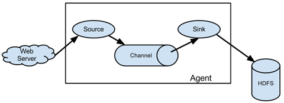

​    Flume基本架构中有一个Agent（代理），它是Flume的核心角色，Flume Agent是一个JVM进程，它承载着数据从外部源流向下一个目标的三个核心组件：Source、Channel和Sink。

1. Flume分布式系统中最***核心的角色是agent***，flume采集系统就是由一个个agent所连接起来形成
2. **每一个agent相当于一个数据传递员，内部有三个组件：**
    1. Source：采集源，用于跟数据源对接，以获取数据
    2. Sink：下沉地，采集数据的传送目的，用于往下一级agent传递数据或者往最终存储系统传递数据
    3. Channel：angent内部的数据传输通道，用于从source将数据传递到sink

## Flume日志采集系统架构

实际开发中， Flume需要采集数据的类型多种多样，同时还会进行不同的中间操作，所以根据具体需求，可以将Flume日志采集系统分为简单结构和复杂结构。

**简单的Flume日志采集系统的结构**

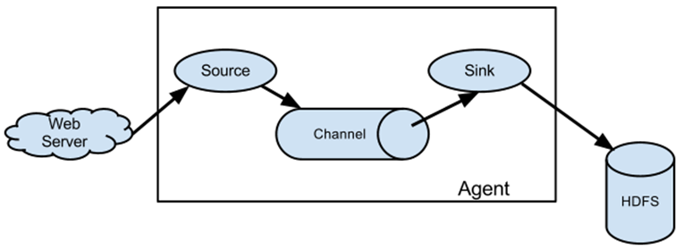

**复杂的Flume日志采集系统的结构**

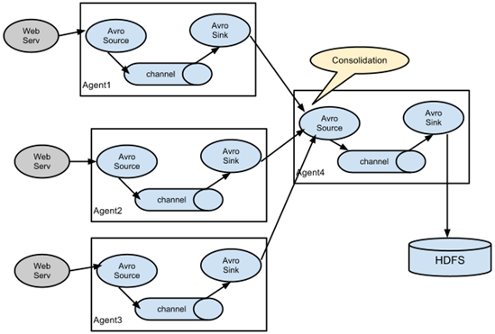


## Flume系统要求

使用Flume进行开发，必须满足一定的系统要求，这里以官方说明为准，具体要求如下。

- 安装Java 1.8或更高版本Java运行环境；

- 为Source（数据采集器）、Channel（缓冲通道）、Sink（接收器）的配置提供足够的内存空间；

- 为Channel（缓冲通道）、Sink（接收器）的配置提供足够的磁盘空间；

- 保证Agent（代理）对要操作的目录有读写权限.。

## Flume安装配置

> 参考文章
>
> https://www.bilibili.com/read/cv8000056
>
> Flume1.8.0安装包资源索取： 搜索公众号：悟空非空也，键盘输入： flume8
>
>

1. 下载 Flume 1.8.0 安装包并解压。

    ```
    解压到该路径下 
    /export/servers
    ```


2. 配置flume-env.sh文件，添加JDK环境变量。

    ```
    cd ...flume主目录/conf
    mv flume-env.sh.template flume-env.sh
    # 在flume-env.sh中添加jdk环境变量
    export JAVA_HOME=/export/servers/jdk
    ```


3. 配置 /etc/profile文件，添加Flume环境变量。

    ```
    vim /etc/profile
    # 添加如下
    export FLUME_HOME=/export/servers/flume
    export PATH=$PATH:$FLUME_HOME/bin:
    # 使其生效
    source /etc/profile
    ```


## Flume入门使用

使用Flume系统，只需要创建一个配置文件，用来配置Flume Source、Flume Channel和Flume Sink三大组件的属性即可。

例如编写一个采集netcat源数据的**采集方案**    netcat-logger.conf

```
# cd /export/servers/flume/conf
# vi netcat-logger.conf
```


```conf
# 定义这个agent中各组件的名字
a1.sources = r1
a1.sinks = k1
a1.channels = c1
 
# 描述和配置source组件：r1
a1.sources.r1.type = netcat
a1.sources.r1.bind = localhost
a1.sources.r1.port = 44444
 
# 描述和配置sink组件：k1
a1.sinks.k1.type = logger
 
# 描述和配置channel组件，此处使用是内存缓存的方式 1000个event
a1.channels.c1.type = memory
a1.channels.c1.capacity = 1000
a1.channels.c1.transactionCapacity = 100
 
# 描述和配置source  channel   sink之间的连接关系
a1.sources.r1.channels = c1
a1.sinks.k1.channel = c1
```


然后输入启动Flume指令，具体效果如下。

```
# 启动flume(在flume主目录下启动，因为紧接的是相对路径)
$  flume/flume-ng agent --conf conf --conf-file conf/netcat-logger.conf --name a1 -Dflume.root.logger=INFO,console
```


启动Flume程序后，在CRT或者Xshell工具中克隆会话窗口，启动telnet 工具

```
 # 使用telnet工具连接flume
$ telnet localhost 44444
# 发送 hello world

```


数据发送完毕后，返回Flume程序，观察采集到的数据，具体效果如下所示。

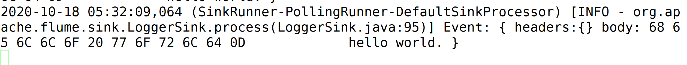


## Flume Sources

在编写Flume采集方案时，首先必须明确采集的数据源类型、出处；接着，根据这些信息与Flume已提供支持的Flume Sources进行匹配，选择对应的数据采集器类型（即sources.type）；再根据选择的数据采集器类型，配置必要和非必要的数据采集器属性，Flume提供并支持的Flume Sources种类如下所示。

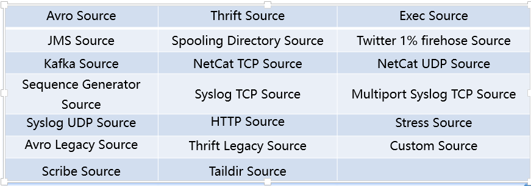

**Avro Source**

监听Avro端口并从外部Avro客户端流中接收event数据，当与另一个Flume Agent上的Avro Sink配对时，可创建分层集合拓扑，利用Avro Source可以实现多级流动、扇出流、扇入流等效果，Avro Source常用配置属性如下。

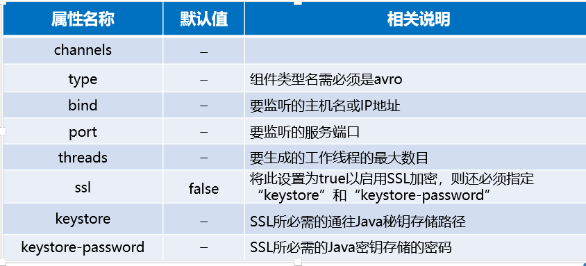

**实例**


**Spolling Dir Source**

•Spooling Directory Source允许对指定磁盘上的文件目录进行监控来提取数据，它将查看文件的指定目录的新增文件，并将文件中的数据读取出来。

•Spooling Directory Source常用配置属性如下表所示。

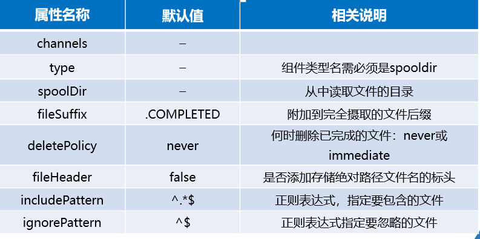

**实例**

```
a1.channels=ch-1
a1.sources=src-1
a1.sources.src-1.type=spooldir
a1.sources.src-1.channels=ch-1
a1.sources.src-1.spoolDir=/var/log/apache/flumeSpool
a1.sources.src-1.fileHeader=true
```


**Taildir Source**

Taildir Source用于观察指定的文件，几乎可以实时监测到添加到每个文件的新行。如果文件正在写入新行，则此采集器将重试采集它们以等待写入完成，Source常用配置属性如下所示。

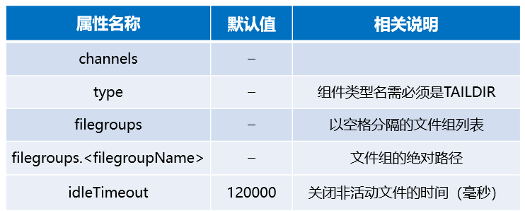

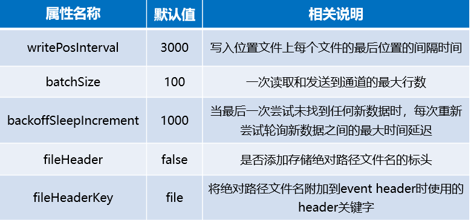

**实例**

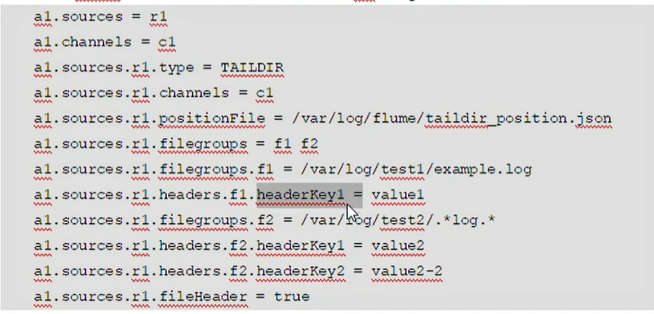


**HTTP SOURCE**

HTTP Source可以通过HTTP POST和GET请求方式接收event数据，GET通常只能用于测试使用，POST请求发送的所有的events都被认为是一个批次，会在一个事务中插入channel，Taildir Source常用配置属性如下所示。

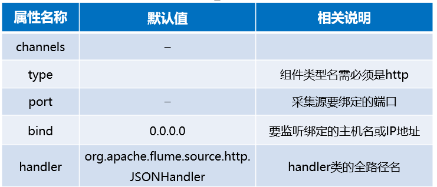

**实例**

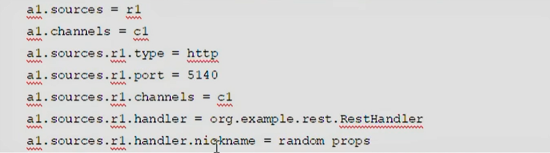


## Flume Channels

​    Channels通道是event在Agent上暂存的存储库，Source向Channel中添加event，Sink在读取完数据后再删除它。在配置Channels时，需要明确的就是将要传输的sources数据源类型；根据这些信息结合开发中的实际需求，选择Flume已提供的支持的Flume Channels；再根据选择的Channel类型，配置必要和非必要的Channel属性，Flume提供并支持的Flume Channels种类如下所示。


**Memory** **Channel**

Memory Channel会将event存储在具有可配置最大尺寸的内存队列中，适用于需要更高吞吐量的流量，但在Agent发生故障时会丢失部分阶段数据，下表为Memory Channel常用配置属性。

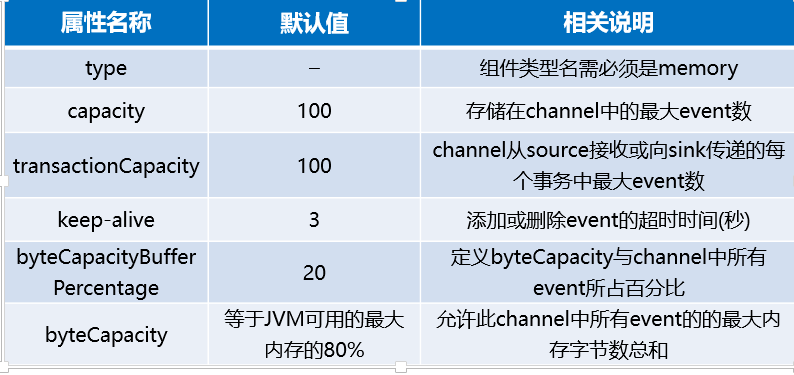

**实例**


**File Channel**

File Channel是Flume的持久通道，它将所有event写入磁盘，因此不会丢失进程或机器关机、崩溃时的数据。File Channel通过在一次事务中提交多个event来提高吞吐量，做到了只要事务被提交，那么数据就不会有丢失，File Channel常用配置属性如下所示。

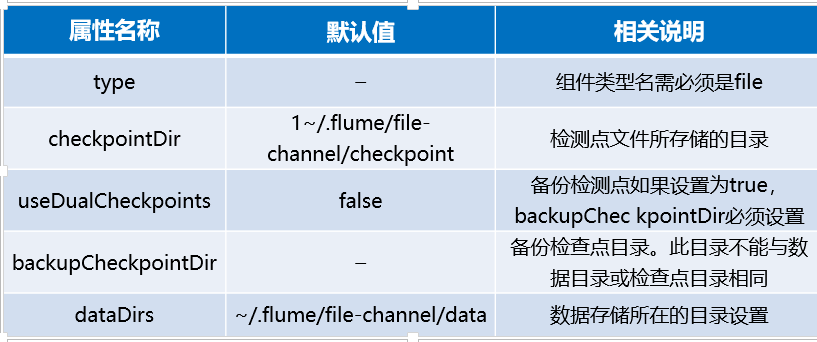

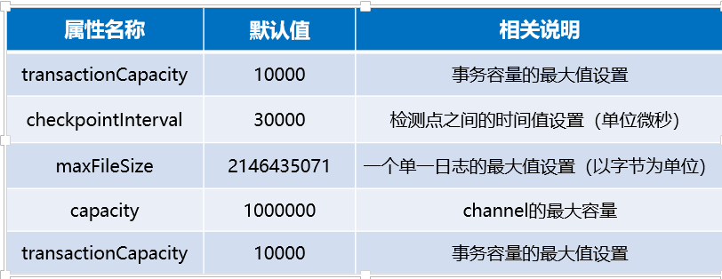

**实例**


## Flume Sinks

Flume Soures采集的数据通过Channels通道流向Sink中，此时Sink类似一个集结的递进中心，它需要根据需求进行配置，从而最终选择发送目的地。

配置Sinks时，明确将要传输的数据目的地、结果类型；然后根据实际需求信息，选择Flume已提供支持的Flume Sinks；再根据选择的Sinks类型，配置必要和非必要的Sinks属性。Flume提供并支持的Flume Sinks种类如下所示。

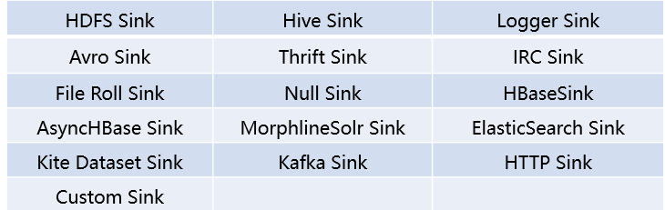

**HDFS Sink**

HDFS Sink将event写入Hadoop分布式文件系统（HDFS），它目前支持创建文本和序列文件，以及两种类型的压缩文件，下表为HDFS Sink常用配置属性。

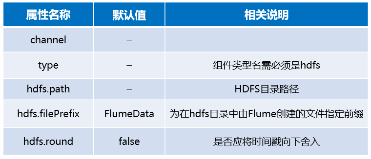

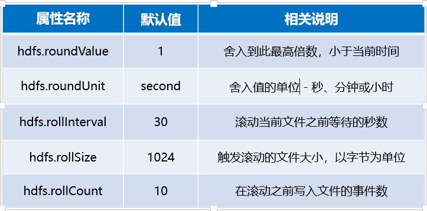

**实例**

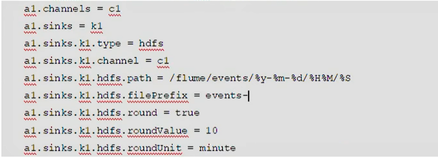


**Logger Sink**

Logger Sink用于记录INFO级别event，它通常用于调试。Logger Sink接收器的不同之处是它不需要在“记录原始数据”部分中说明额外的配置，Logger Sink常用配置属性如下所示。

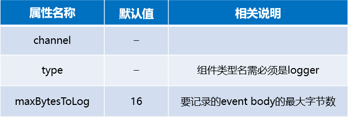

**实例**


**Avro Sink**

Avro Sink形成Flume分层收集支持的一半，发送到此接收器的Flume event转换为Avro event，并发送到对应配置的主机名/端口，event将从配置的channel中批量获取配置的批处理大小，Avro Sink常用配置属性如下所示。

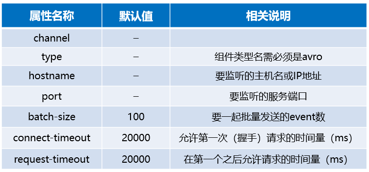

**实例**

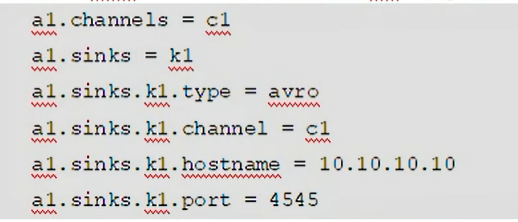

## Flume负载均衡

配置的采集方案是通过唯一一个Sink作为接收器接收后续需要的数据，但会出现当前Sink故障或数据收集请求量较大的情况，这时单一Sink配置可能就无法保证Flume开发的可靠性。因此，Flume 提供Flume Sink Processors解决上述问题。

Sink处理器允许定义Sink groups，将多个sink分组到一个实体中，Sink处理器就可通过组内多个sink为服务提供负载均衡功能。

负载均衡接收器处理器（Load balancing sink processor）提供了在多个sink上进行负载均衡流量的功能，它维护一个活跃的sink索引列表，需在其上分配负载，还支持round_robin（轮询）和random（随机）选择机制进行流量分配，默认选择机制为round_robin。Load balancing sink processor提供的配置属性如下所示。

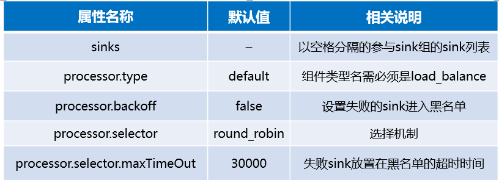

**实例**


**案例**

流程图

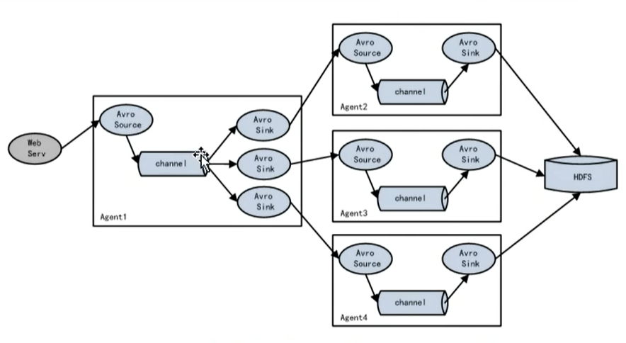

1  搭建并配置Flume机器

启动node-01 node-02 node-03,3台机器分别安装Flume和配置环境变量

```
scp -r /export/servers/flume node-02:/export/servers
scp -r /export/servers/flume node-03:/export/servers

scp /etc/profile node-02:/etc/profile
scp /etc/profile node-03:/etc/profile

#分别 使环境变量生效
source /etc/profile
source /etc/profile
```

2  配置Flume采集方案

（1）在node-01的/export/servers/flume/conf下，编写采集方案exec-avro.conf,内容如下

```
# 配置负载均衡的一级采集方案
a1.sources = r1
a1.channels = c1
a1.sinks = k1 k2

# 描述并配置 sources组件(数据源类型、数据源的应用地址)
a1.sources.r1.channels = c1
a1.sources.r1.type = exec
a1.sources.r1.command = tail -F /root/logs/123.log

#set channel
a1.channels.c1.type = memory
a1.channels.c1.capacity = 1000
a1.channels.c1.transactionCapacity = 100

# set sink1
a1.sinks.k1.channel = c1
a1.sinks.k1.type = avro
a1.sinks.k1.hostname = node-02
a1.sinks.k1.port = 52020

# set sink2
a1.sinks.k2.channel = c1
a1.sinks.k2.type = avro
a1.sinks.k2.hostname = node-03
a1.sinks.k2.port = 52020

# set sink group
a1.sinkgroups = g1
a1.sinkgroups.g1.sinks = k1 k2
# set load-balance
a1.sinkgroups.g1.processor.type = load_balance
# 默认是round_robin，还可以选择random
a1.sinkgroups.g1.processor.selector = round_robin
# 如果backoff被开启，则 sink processor会屏蔽故障的sink
a1.sinkgroups.g1.processor.backoff = true
# 失败放入黑名单的超时时间
a1.sinkgroup2.g1.processor.maxTimeOut = 10000
```


(2)  node-02上 avro-logger.conf文件

```
# 配置负载均衡的二级采集方案
a1.sources = r1
a1.channels = c1
a1.sinks = k1

# 描述并配置 sources组件(数据源类型、数据源的应用地址)
a1.sources.r1.type = avro
a1.sources.r1.bind = node-02
a1.sources.r1.port = 52020


# set sinks (采集后的数据流出的类型)
a1.sinks.k1.type = logger

#set channels
a1.channels.c1.type = memory
a1.channels.c1.capacity = 1000
a1.channels.c1.transactionCapacity = 100

# 将 source和sink 通过同一个channels 连接绑定
a1.sources.r1.channels = c1
a1.sinks.k1.channels = c1
```

(3)  node-03上avro-logger.conf文件

```
# 配置负载均衡的二级采集方案
a1.sources = r1
a1.channels = c1
a1.sinks = k1

# 描述并配置 sources组件(数据源类型、数据源的应用地址)
a1.sources.r1.type = avro
a1.sources.r1.bind = node-03
a1.sources.r1.port = 52020


# set sinks (采集后的数据流出的类型)
a1.sinks.k1.type = logger

#set channels
a1.channels.c1.type = memory
a1.channels.c1.capacity = 1000
a1.channels.c1.transactionCapacity = 100

# 将 source和sink 通过同一个channels 连接绑定
a1.sources.r1.channels = c1
a1.sinks.k1.channels = c1
```

(4) 启动Flume系统

- 分别启动二级机器:node-01和node-02

    ```
    flume-ng --conf conf/ --conf-file conf/avro-logger.conf --name a1 -Dflume.root.logger=INFO.console
    ```

- 启动node-01

        flume-ng --conf conf/ --conf-file conf/exec-avro.conf --name a1 -Dflume.root.logger=INFO.console


(5) 测试
node-01上复制一个新终端,执行如下指令
```
$ while true; do echo "access access ..." >> /root/logs/123.log; sleep 1;done
```


## Flume故障转移

故障转移接收器处理器（Failover Sink Processor）维护一个具有优先级的sink列表，保证在处理event时，只需有一个可用的sink即可。

​    故障转移机制工作原理是将故障的sink降级到故障池中，在池中为它们分配一个冷却期，在重试之前冷却时间会增加，当sink成功发送event后，它将恢复到活跃池中。Failover Sink Processor提供的配置属性如下所示。

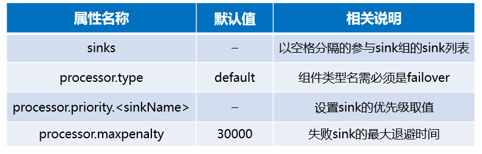

**实例**

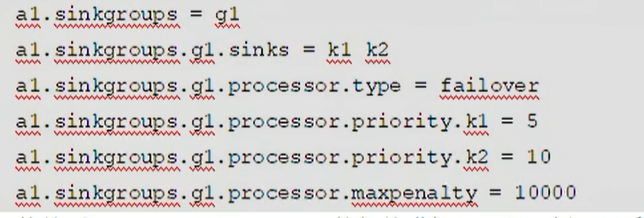

## Flume拦截器

Flume Interceptors（拦截器）用于对Flume系统数据流中event的修改操作。使用Flume拦截器时，只需参考官方配置属性在采集方案中选择性的配置即可，当涉及到配置多个拦截器时，拦截器名称间需用空格分隔，且拦截器配置顺序就是拦截顺序。Flume 1.8.0版本中，Flume提供并支持的拦截器有很多，具体如下所示。

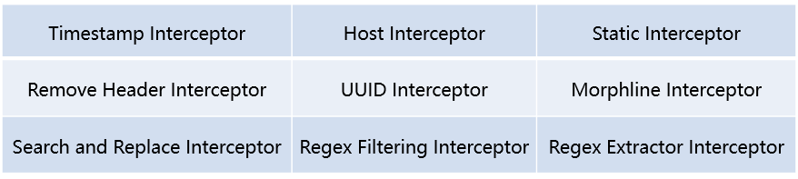

Timestamp Interceptor（时间戳拦截器）将流程执行时间插入到event的header头部，此拦截器插入带有timestamp键的标头，其值为对应时间戳。若配置中已存在时间戳时，此拦截器可保留现有时间戳，Timestamp Interceptor提供的常用配置属性如下所示。

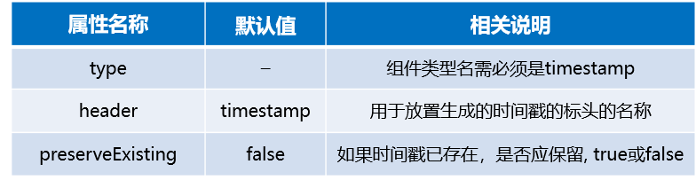

Static Interceptor（静态拦截器）允许用户将具有静态值的静态头附加到所有event。当前不支持一次指定多个header头，但是用户可定义多个Static Interceptor来为每一个拦截器都追加一个header，Static Interceptor提供的常用配置属性如下所示。

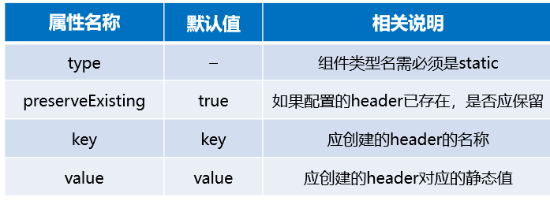


## 案例-日志采集

在实际开发的应用场景中，两台服务器A、B在实时产生日志数据，日志类型主要为access.log、nginx.log和web.log。现需要将A、B两台服务器产生的日志数据access.log、nginx.log和web.log采集汇总到服务器C上，并统一收集并上传到HDFS文件系统进行保存。在HDFS中保存日志数据的文件必须按照以下要求进行归类统计（20201010表示收集日志数据的当前日期）：

l/source/logs/access/20201010/**

l/source/logs/nginx/20201010/**

l/source/logs/web/20201010/**

**日志数据采集流程图**

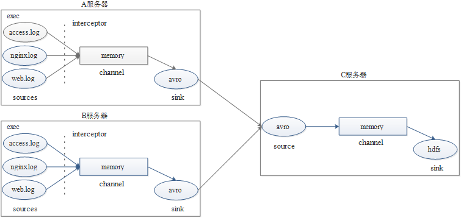


**案例实现**

1  服务系统搭建与配置

根据案例需求启动3台服务器，同时搭建Flume系统和Hadoop集群。此案例将node-02和node-03分别作为A服务器和B服务器进行第一阶段的日志数据采集，将node-01作为C服务器进行日志数据汇总并上传至HDFS。

2 配置采集方案

在node-02和node-03的/flume/conf目录下编写相同日志采集方案exec-avro_logCollection.conf。

```
# 配置agent组件
# 用三个source采集不同的日志类型数据
a1.sources = r1 r2 r3
a1.sinks = k1
a1.channels = c1

# 描述并配置第一个sources组件（包括自带的静态拦截器）
a1.sources.r1.type = exec
a1.sources.r1.command = tail -F /root/logs/access.log
a1.sources.r1.interceptors = i1
a1.sources.r1.interceptors.i1.type = static
#static拦截器的功能就是往采集到的数据的header中插入自己定义的key-value对
a1.sources.r1.interceptors.i1.key = type
a1.sources.r1.interceptors.i1.value = access

# 描述并配置第二个source组件(包括自带的拦截器)
a1.sources.r2.type = exec
a1.sources.r2.command = tail -F /root/logs/nginx.log
a1.sources.r2.interceptors = i2
a1.sources.r2.interceptors.i2.type = static
a1.sources.r2.interceptors.i2.key = type
a1.sources.r2.interceptors.i2.value = nginx

# 描述并配置第三个source组件(包括自带的拦截器)
a1.sources.r3.type = exec
a1.sources.r3.command = tail -F /root/logs/web.log
a1.sources.r3.interceptors = i3
a1.sources.r3.interceptors.i3.type = static
a1.sources.r3.interceptors.i3.key = type
a1.sources.r3.interceptors.i3.value = web

#描述并配置channel
a1.channels.c1.type = memory
a1.channels.c1.capacity = 200000
a1.channels.c1.transactionCapacity = 100000

# 描述并配置sink
a1.sinks.k1.type = avro
a1.sinks.k1.hostname = node-01
a1.sinks.k1.port = 41414


# 3 个组件绑定
a1.sources.r1.channels = c1
a1.sources.r2.channels = c1
a1.sources.r3.channels = c1
a1.sinks.k1.channel = c1

```


在node-01机器的/flume/conf目录下编写第二级日志采集方案avro-hdfs_logCollection.conf

```
#定义agent名， source、channel、sink的名称
a1.sources = r1
a1.sinks = k1
a1.channels = c1

#定义source
a1.sources.r1.type = avro
a1.sources.r1.bind = node-01
a1.sources.r1.port =41414

#添加时间拦截器
a1.sources.r1.interceptors = i1
a1.sources.r1.interceptors.i1.type = timestamp

#定义channels
a1.channels.c1.type = memory
a1.channels.c1.capacity = 20000
a1.channels.c1.transactionCapacity = 10000

#定义sink
a1.sinks.k1.type = hdfs
a1.sinks.k1.hdfs.path=hdfs://node-01:9000/source/logs/%{type}/%Y%m%d
a1.sinks.k1.hdfs.filePrefix =events
a1.sinks.k1.hdfs.fileType = DataStream
a1.sinks.k1.hdfs.writeFormat = Text

#生成的文件不按条数生成
a1.sinks.k1.hdfs.rollCount = 0
#生成的文件不按时间生成
a1.sinks.k1.hdfs.rollInterval = 0
#生成的文件按大小生成
a1.sinks.k1.hdfs.rollSize = 10485760
#批量写入hdfs的个数
a1.sinks.k1.hdfs.batchSize = 20
flume操作hdfs的线程数（包括新建，写入等）
a1.sinks.k1.hdfs.threadsPoolSize=10
#操作hdfs超时时间
a1.sinks.k1.hdfs.callTimeout=30000

#组装source、channel、sink
a1.sources.r1.channels = c1
a1.sinks.k1.channel = c1


```


3 启动日志采集系统

- 在Hadoop集群主节点node-01机器上启动Hadoop集群。

    ```
    start-dfs.sh
    start-yarn.sh
    jps
    ```


- 在node-01、node-02及node-03服务器上分别启动Flume系统

    ```
    # 先启动node-01(flume主目录下执行)
    flume-ng agent -c conf -f conf/avro-hdfs_logCollection.conf --name a1 -Dflume.root.logger=INFO,console
    
    # 再启动node-02 node-03
    flume-ng agent -c conf -f conf/exec-avro_logCollection.conf --name a1 -Dflume.root.logger=INFO,console
    ```


- 查看node-01界面启动Flume效果。

  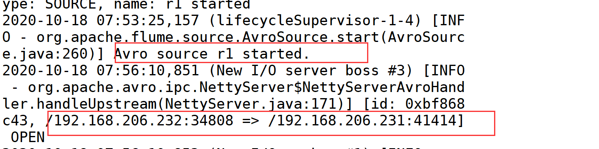

  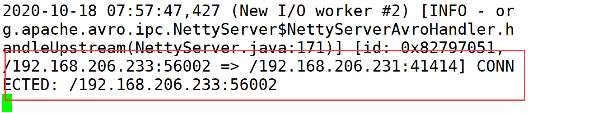


- 在node-02和node-03机器上分别克隆/新建3个会话窗口，生产日志数据。

    ```
    $ while true; do echo "access access ...." >> /root/logs/access.log;sleep 1;done
    
    $ while true; do echo "nginx nginx ...." >> /root/logs/nginx.log;sleep 1;done
    
    $ while true; do echo "web web ...." >> /root/logs/web.log;sleep 1;done
    
    ```


4 日志采集系统测试

（1）查看node-01会话窗口信息。node-01的Flume系统已将node-02和node-03上采集的数据进行汇总并上传至HDFS。


（2）查看Hadoop集群UI界面。Hadoop集群下已新添加一个source目录

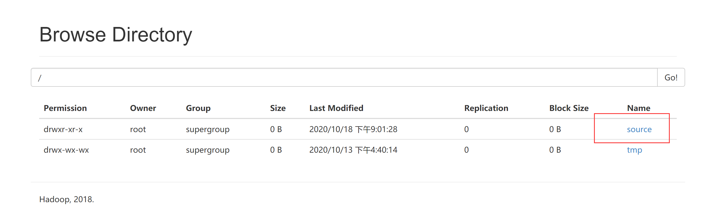


（3）进入source目录，查看其内部文件存储结构，完成日志采集需求。

>
>
>对于高可用集群需要注意的点
>
>主机node-01可能会处于standby状态（待机状态），要是它active
>
>步骤
>
>将 node-02节点的高可用停止，node-01自动active
>
>```
># 对于node-02
>hadoop-daemon.sh stop zkfc 
> 
>```
>
>参考文章
>
>http://www.manongjc.com/detail/15-miehvceeqedzgtp.html


