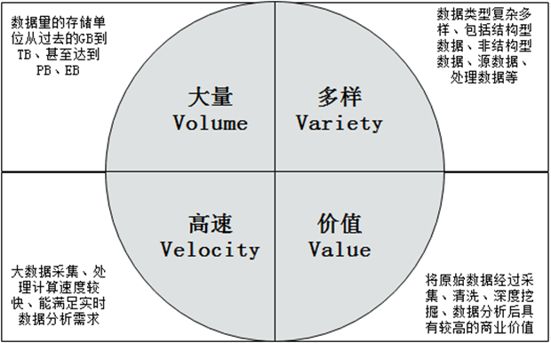
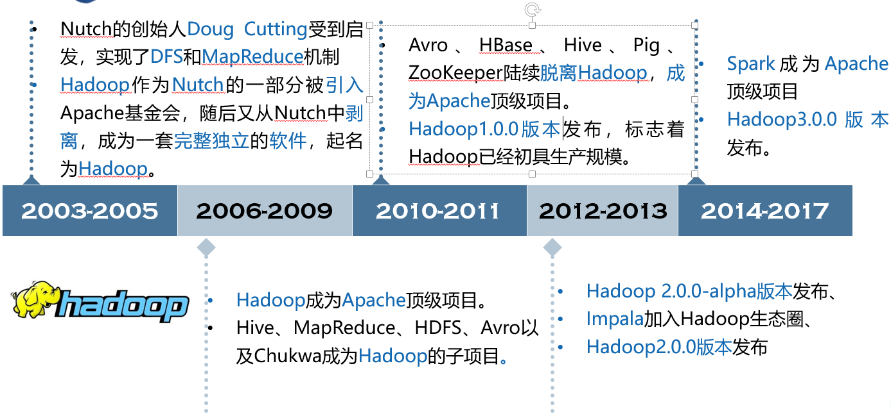
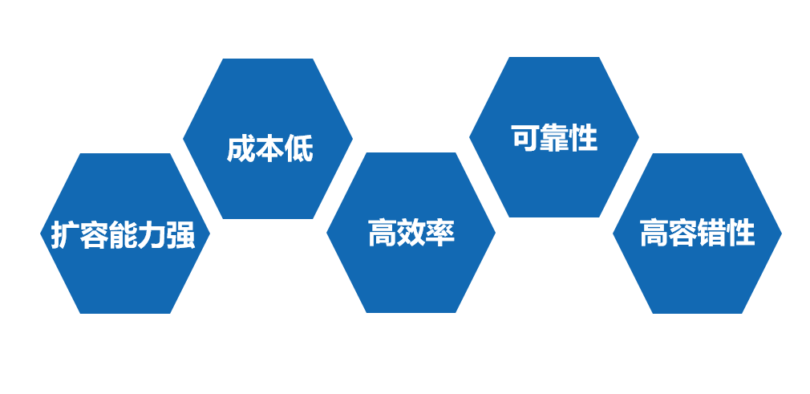
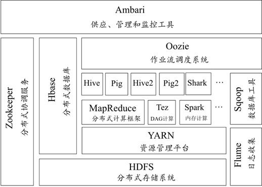
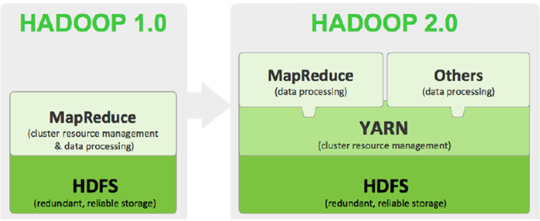

# 初识Hadoop

## 什么是大数据

随着近几年计算机技术和互联网的发展，“大数据”这个词被提及的越来越频繁。与此同时，大数据的快速发展也在无时无刻影响着我们的生活。例如，医疗方面，大数据能够帮助医生预测疾病；电商方面，大数据能够向顾客个性化推荐商品；交通方面，大数据会帮助人们选择最佳出行方案。

Hadoop作为一个能够对大量数据进行分布式处理的软件框架，用户可以利用Hadoop生态体系开发和处理海量数据。由于Hadoop有可靠及高效的处理性能，使得它逐渐成为分析大数据的领先平台。

高速发展的信息时代，新一轮科技革命和变革正在加速推进，技术创新日益成为重塑经济发展模式和促进经济增长的重要驱动力量，而“大数据”无疑是核心推动力。

那么，什么是“大数据”呢？如果从字面意思来看，大数据指的是巨量数据。那么可能有人会问，多大量级的数据才叫大数据？不同的机构或学者有不同的理解，难以有一个非常定量的定义，只能说，大数据的计量单位已经越过TB级别发展到PB、EB、ZB、YB甚至BB来衡量。

最早提出“大数据”这一概念的是全球知名咨询公司麦肯锡，他是这样定义大数据的：一种规模大到在获取、存储、管理、分析方面大大超出了传统数据库软件工具能力范围的数据集合，具有海量的数据规模、快速的数据流转、多样的数据类型以及价值密度四大特征。

研究机构Gartner是这样定义大数据的：“大数据”是需要新处理模式才能具有更强的决策力、洞察发现力和流转优化能力来适应海量、高增长率和多样化的信息资产。

## 大数据的特征

大数据主要具有以下四个方面的典型特征，即大量（Volume）、多样（Varity）、高速（Velocity）和价值（Value），即所谓的“4V”。

## 研究大数据的意义

现在的社会是一个高速发展的社会，科技发达，信息流通，人们之间的交流也越来越密切，生活也越来越便捷，然而大数据就是这个高科技时代的产物。阿里巴巴的创办人马云曾经说过，未来的时代将不是IT时代，而是DT的时代，DT就是Data Technology数据科技，这显示出大数据对于阿里巴巴集团来说是举足轻重的。

有人把数据比喻为蕴藏能量的煤矿。煤炭按照性质有焦煤、无烟煤、肥煤、贫煤等分类，而露天煤矿、深山煤矿的挖掘成本又不一样。与此类似，大数据并不在于“大”，而在于“有用”。数据的价值含量、挖掘成本比数量更为重要。对于很多行业而言，如何利用这些大规模数据，发掘其潜在价值，才是赢得核心竞争力的关键。

研究大数据，最重要的意义是预测。因为数据从根本上讲，是对过去和现在的归纳和总结，其本身不具备趋势和方向性的特征，但是我们可以应用大数据去了解事物发展的客观规律、了解人类行为，并且能够帮助我们改变过去的思维方式，建立新的数据思维模型，从而对未来进行预测和推测。知名互联网公司谷歌对其用户每天频繁搜索的词汇进行数据挖掘，从而进行相关的广告推广和商业研究。

## 大数据的应用场景

**医疗行业的应用**

研究大数据，最重要的意义是预测。因为数据从根本上讲，是对过去和现在的归纳和总结，其本身不具备趋势和方向性的特征，但是我们可以应用大数据去了解事物发展的客观规律、了解人类行为，并且能够帮助我们改变过去的思维方式，建立新的数据思维模型，从而对未来进行预测和推测。知名互联网公司谷歌对其用户每天频繁搜索的词汇进行数据挖掘，从而进行相关的广告推广和商业研究。

大数据让就医、看病更简单。随着大数据在医疗行业的深度融合，大数据平台积累了海量的病例、病例报告、治愈方案、药物报告等信息资源，所有常见的病例、既往病例等都记录在案，医生通过有效、连续的诊疗记录，给病人提供优质、合理的诊疗方案。

**1.** **优化医疗方案，提供最佳治疗方法**

借助于大数据平台，可以搜集不同病人的疾病特征、病例和治疗方案，从而建立医疗行业的病人分类数据库。在医生诊断病人时可以参考病人的疾病特征、化验报告和检测报告，参考疾病数据库来快速帮助病人确诊。在制定治疗方案时，医生可以依据病人的基因特点，调取相似基因、年龄、人种、身体情况相同的有效治疗方案，制定出适合病人的治疗方案，帮助更多人及时进行治疗。

**2.** **有效预防预测疾病**

解决患者的疾病，最为简单的方式就是防患于未然。通过大数据对于群众的人体数据监控，将各自的健康数据、生命体征指标都集合在数据库和健康档案中。群众需要定期去做检查，及时更新数据，以便于通过大数据来预防和预测疾病的发生，做到早治疗、早康复。

**金融行业的应用**

**1.** **精准营销**

互联网时代的银行在互联网的冲击下，迫切的需要掌握更多用户信息，继而构建用户360度立体画像，即可对细分的客户进行精准营销、实时营销等个性化智慧营销。

**2.** **风险管控**

应用大数据平台，可以统一管理金融企业内部多源异构数据和外部征信数据，更好的完善风控体系。内部可保证数据的完整性与安全性，外部可控制用户风险。

**3.** **决策支持**

通过大数据分析方法改善经营决策，为管理层提供可靠的数据支撑，从而使经营决策更高效、敏捷、精准 。

**4.** **服务创新**

通过对大数据的应用，改善与客户之间的交互、增加用户粘性，为个人与政府提供增值服务，不断增强金融企业业务核心竞争力。

**5.** **产品创新**

通过高端数据分析和综合化数据分享，有效对接银行、保险、信托、基金等金融产品，使金融企业能够从其他领域借鉴并创造新的金融产品。

**零售行业的应用**

在美国零售业上有这样一个传奇故事，某家商店将纸尿裤和啤酒并排放在一起销售，结果纸尿裤和啤酒的销量双双增长！为什么看起来风马牛不相及的两种商品搭配在一起，能取到如此惊人的效果呢？后来经过分析发现这些购买者多数是已婚男士，这些男士在为小孩买纸尿裤的同时，也会为自己买一些啤酒。发现这个秘密后，沃尔玛超市就将啤酒摆放在尿不湿旁边，顾客购买会更方便，销量自然也会大幅上升。

**1.** **精准定位零售行业市场**

企业进入或开拓某一区域零售行业市场，首先要进行项目评估和可行性分析，只有通过项目评估和可行性分析才能决定是否适合进入或者开拓这块市场。通常分析这个区域流动人口、消费水平、客户的消费习惯、市场对产品的认知度以及当前的市场供需情况等等，这些问题的背后包含的海量信息构成了零售行业市场调研的大数据，对这些大数据的分析就是零售行业市场精准定位的过程。

**2.** **支撑行业收益管理**

大数据时代的来临，为企业收益管理工作的开展提供了广阔的空间。需求预测、细分市场和敏感度分析对数据需求量很大，而传统的数据分析大多是对企业自身的历史数据进行预测和分析，容易忽视整个零售行业信息，因此预测结果难免会存在偏差。企业在实施收益管理过程中，如果在自有的数据基础上，依靠自动化信息采集软件来收集更多的零售行业数据，以此来了解更多的市场信息，这将会对制订准确的收益策略，取得更高收益起到推进作用。

**3.** **挖掘零售行业新需求**

作为零售行业企业，如果能收集网上零售行业的评论数据，建立网评大数据库，然后再利用分词、聚类、情感分析消费者的消费行为、价值取向、评论中体现的新消费需求和企业产品质量问题，以此来改进和创新产品，量化产品价值，制订合理的价格及提高服务质量，从中获取更大的收益。

## Hadoop的发展历史

## Hadoop的优势

## Hadoop的生态系统

随着Hadoop的不断发展，Hadoop生态体系越来越完善，现如今已经发展成一个庞大的生态体系。

**HDFS分布式文件系统**

HDFS是Hadoop的分布式文件系统，它是Hadoop生态系统中的核心项目之一，是分布式计算中数据存储管理基础。

**MapReduce分布式计算框架**

MapReduce是一种计算模型，用于大规模数据集（大于1TB）的并行运算。

**Yarn资源管理框架**

Yarn（Yet Another Resource Negotiator）是Hadoop 2.0中的资源管理器，它可为上层应用提供统一的资源管理和调度。

**Sqoop数据迁移工具**

Sqoop是一款开源的数据导入导出工具，主要用于在Hadoop与传统的数据库间进行数据的转换。

**Mahout数据挖掘算法库**

Mahout是Apache旗下的一个开源项目，它提供了一些可扩展的机器学习领域经典算法的实现，旨在帮助开发人员方便快捷地创建智能应用程序。

**HBase分布式存储系统**

HBase是Google Bigtable克隆版，它是一个针对结构化数据的可伸缩、高可靠、高性能、分布式和面向列的动态模式数据库。

**Zookeeper分布式协作服务**

Zookeeper是一个分布式的，开放源码的分布式应用程序协调服务，是Google的Chubby一个开源的实现，是Hadoop和HBase的重要组件。

**Hive基于Hadoop的数据仓库**

Hive是基于Hadoop的一个分布式数据仓库工具，可以将结构化的数据文件映射为一张数据库表，将SQL语句转换为MapReduce任务进行运行。

**Flume日志收集工具**

Flume是Cloudera提供的一个高可用的，高可靠的，分布式的海量日志采集、聚合和传输的系统，Flume支持在日志系统中定制各类数据发送方，用于收集数据；同时，Flume提供对数据进行简单处理，并写到各种数据接受方（可定制）的能力。

## Hadoop的版本

•Hadoop发行版本分为开源社区版和商业版。

•社区版是指由Apache软件基金会维护的版本，是官方维护的版本体系。

•商业版Hadoop是指由第三方商业公司在社区版Hadoop基础上进行了一些修改、整合以及各个服务组件兼容性测试而发行的版本。

•Hadoop自诞生以来，主要分为Hadoop1、Hadoop2、Hadoop3三个系列的多个版本，

•目前市场上最主流的是Hadoop2.x版本。

•Hadoop2.x版本指的是第2代Hadoop，它是从Hadoop1.x发展而来的，并且相对于Hadoop1.x来说，有很多改进。

Hadoop1.0内核主要由分布式存储系统HDFS和分布式计算框架MapReduce两个系统组成，而Hadoop2.x版本主要新增了资源管理框架Yarn以及其他工作机制的改变。

