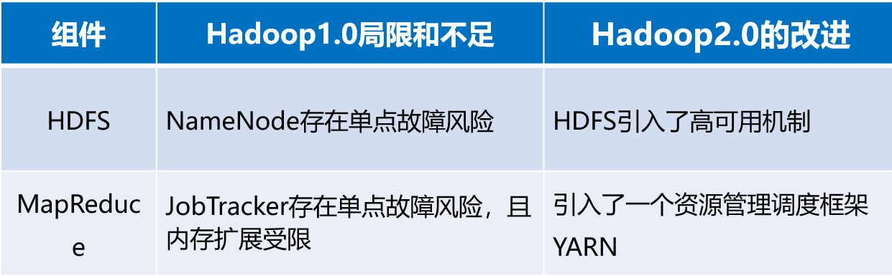
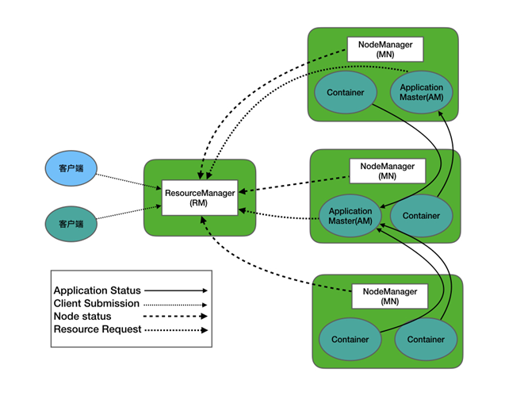
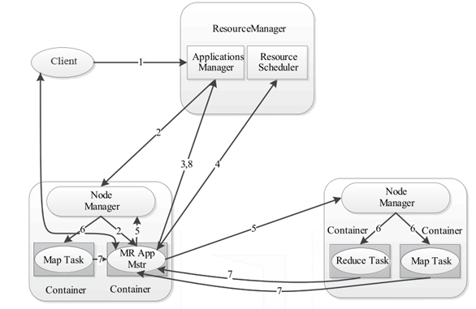
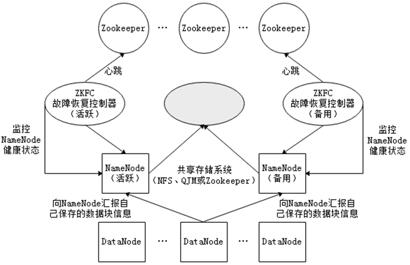
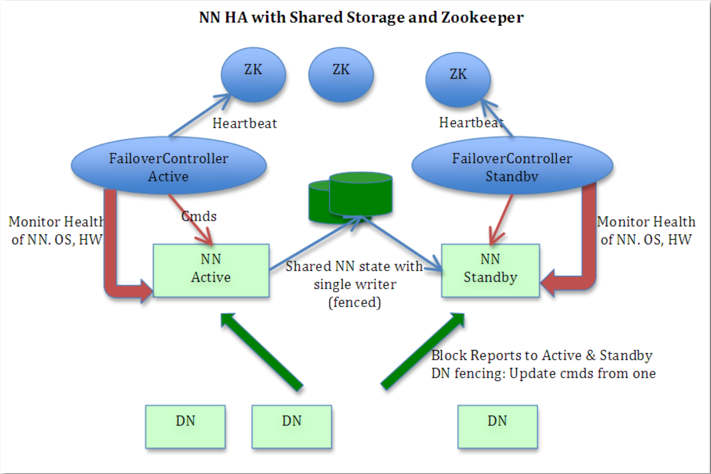
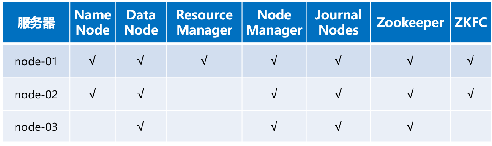

#  Hadoop2.0新特性

## Hadoop2.0 改进与提升

在Hadoop最初诞生时，在架构设计和应用性能方面存在很多不尽人意的地方，在后续发展过程中逐渐得到了改进和完善。相比Hadoop1.0版本，Hadoop2.0的优化改良主要体现在两个方面：一方面是Hadoop自身核心组件架构设计的改进，另一方面是Hadoop集群性能的改进，通过这些优化和提升，Hadoop可以支持更多的应用场景，提高资源利用率。

**Hadoop1.0版本与Hadoop2.0版本的区别**



## Yarn体系结构

YARN（Yet Another Resource Negotiator，另一种资源协调者）是一个通用的资源管理系统和调度平台，它的基本设计思想是将MRv1（Hadoop1.0中MapReduce）中的JobTracker拆分为两个独立任务，这两个任务分别是全局的资源管理器ResourceManager和每个应用程序特有的ApplicationMaster。



**1 .** **ResourceManager**

ResourceManager是一个全局的资源管理系统，它负责的是整个Yarn集群资源的监控、分配和管理工作。

**2 .** **NodeManager**

NodeManager是每个节点上的资源和任务管理器，一方面，它会定时向ResourceManager汇报所在节点资源使用情况；另一方面，它会接收并处理来自ApplicationMaster容器（Container）启动、停止等各种请求。

**3 .** **ApplicationMaster**

ResourceManager是一个全局的资源管理系统，它负责的是整个Yarn集群资源的监控、分配和管理工作。用户提交的每个应用程序都包含一个ApplicationMaster，它负责协调来自ResourceManager的资源，把获得的资源进一步分配给内部的各个任务，从而实现“二次分配”

## Yarn工作流程

YARN的底层工作流程是由核心组件互相协调管理，它们各尽其职，为Hadoop资源调度提供服务，其工作流程图如下所示。



1-用户通过客户端Client向YARN提交应用程序Applicastion。

2-YARN中的ResourceManager接收到客户端请求后，其内部的调度器会为应用程序分配一个容器运行本次程序对应的ApplicationMaster。

3-ApplicationMaster被创建后，首先向ResourceManager注册信息，用户通过ResourceManager查看应用程序的运行状态。

4-ApplicationMaster采用轮询方式通过RPC协议向ResourceManager申请资源。

5-ResourceManager向提出申请的ApplicationMaster分配资源。

6-NodeManager为任务设置好运行环境后，将任务启动命令写到一个脚本中，并通过运行该脚本启动任务。

7-各任务通过RPC协议向ApplicationMaster汇报自己的运行状态，从而在任务失败时，ApplicationMaster可重新启动任务。

8-应用运行结束后，ApplicationMaster向ResourceManager注销并关闭自己。

## HDFS的高可用架构

在HDFS分布式文件系统中，NameNode是系统核心节点，存储各类元数据信息，并负责管理文件系统的命名空间和客户端对文件的访问。若NameNode发生故障，会导致整个Hadoop集群不可用，即单点故障问题。为了解决单点故障，Hadoop2.0中HDFS中增加了对高可用的支持。

在高可用HDFS中，通常有两台或两台以上机器充当NameNode，无论何时，都要保证至少有一台处于活动（Active）状态，一台处于备用（Standby）状态。Zookeeper为HDFS集群提供自动故障转移的服务，给每个NameNode都分配一个故障恢复控制器（简称ZKFC），用于监控NameNode状态。若NameNode发生故障，Zookeeper通知备用NameNode启动，使其成为活动状态处理客户端请求，从而实现高可用。






## HDFS HA 高可用架构的搭建方式

**1.** **部署集群节点**



**2.** **环境准备**

搭建普通Hadoop集群,在搭建Hadoop HA集群时重新安装虚拟机，以此来巩固前面所学知识，并将三台虚拟主机名设置为node-01、node-02和node-03。

**3.** **配置Hadoop高可用集群**

- 修改core-site.xml文件，配置HDFS端口、指定Hadoop的临时目录和Zookeeper集群地址。

  ```xml
  <configuration>
  	<!--指定hdfs的nameservice为ns1-->
      <property>
      	<name>fs.defaultFS</name>
          <value>hdfs://ns1</value>
      </property>
      <!--指定hadoop临时目录-->
      <property>
      	<name>hadoop.tmp.dir</name>
          <value>/export/servers/hadoop-2.7.7/tmp</value>
      </property>
      <!--指定zookeeper地址-->
      <property>
      	<name>ha.zookeeper.quorum</name>
          <value>node-01:2181,node-02:2181,node-03:2181</value>
      </property>   
  </configuration>
  ```


- 修改hdfs-site.xml文件，配置NameNode端口和通信方式，并指定元数据存放位置及开启失败自动切换服务，配置隔离机制方法。

  ```xml
  <configuration>
  	<!--设置副本个数-->
      <property>
          <name>dfs.replication</name>
          <value>2</value>
      </property>
      <!--设置namenode.name目录-->
      <property>
      	<name>dfs.namenode.name.dir</name>
          <value>file:/export/data/hadoop/name</value>
      </property>
      <!--设置datanode.data目录-->
      <property>
      	<name>dfs.datanode.data.dir</name>
          <value>file:/export/data/hadoop/data</value>
      </property>
      <!-- 开启webHDFS-->
      <!-- 在NN和DN上开启WebHDFS（REST API）功能，不是必须-->
      <property>
      	<name>dfs.webhdfs.enabled</name>
          <value>true</value>
      </property>
      <!--指定hdfs的nameservice为ns1,需要和core-site.xml中保持一致-->
      <property>
      	<name>dfs.nameservices</name>
          <value>ns1</value>
      </property>
      <!-- ns1 下面有2个NameNode ，分别是 nn1,nn2-->
  	<property>
      	<name>dfs.ha.namenodes.ns1</name>
          <value>nn1,nn2</value>
      </property>
      <!--nn1的RPC通信地址-->
      <property>
      	<name>dfs.namenode.rpc-address.ns1.nn1</name>
          <value>node-01:9000</value>
      </property>
      <!-- nn1的http通信地址-->
      <property>
      	<name>dfs.namenode.http-address.ns1.nn1</name>
          <value>node-01:50070</value>
      </property>
       <!--nn2的RPC通信地址-->
      <property>
      	<name>dfs.namenode.rpc-address.ns1.nn2</name>
          <value>node-02:9000</value>
      </property>
      <!-- nn2的http通信地址-->
      <property>
      	<name>dfs.namenode.http-address.ns1.nn2</name>
          <value>node-02:50070</value>
      </property>
      <!--指定NameNode的元素据在JournalNode上的存放位置-->
      <property>
      	<name>dfs.namenode.shared.edits.dir</name>
          <value>qjournal://node-01:8485;node-02:8485;node-03:8485/ns1</value>
      </property>
      <!--指定JournalNode在本地磁盘存放数据的位置-->
      <property>
      	<name>dfs.journalnode.edits.dir</name>
          <value>/export/data/hadoop/journaldata</value>
      </property>
      <!--开启NameNode失败自动切换-->
      <property>
      	<name>dfs.ha.automatic-failover.enabled</name>
          <value>true</value>
      </property>
      <!--配置失败自动切换实现方式-->
      <property>
      	<name>dfs.client.failover.proxy.provider.ns1</name>
          <value>org.apache.hadoop.hdfs.server.namenode.ha.ConfiguredFailoverProxyProvider</value>
      </property>
      <!--配置隔离机制方法，多个机制用换行分割，即每个机制暂用一行-->
      <property>
      	<name>dfs.ha.fencing.methods</name>
          <value>
              sshfence
              shell(/bin/true)
          </value>
      </property>
      <!--使用sshfence 隔离机制时 需要ssh免登录-->
      <property>
      	<name>dfs.ha.fencing.ssh.private-key-files</name>
          <value>/root/.ssh/id_rsa</value>
      </property>
      <!-- 配置sshfence 隔离机制超时时间-->
      <property>
      	<name>dfs.ha.fencing.ssh.connect-timeout</name>
          <value>30000</value>
      </property>
  </configuration>
  ```


- 修改mapred-site.xml文件，将MapReduce计算框架指定为yarn方式。

  **mapred-site.xml 从 mapred-site.xml.template复制而来**

  ```xml
  <configuration>
  	<!--指定mapreduce框架为yarn方式-->
      <property>
      	<name>mapreduce.framework.name</name>
          <value>yarn</value>
      </property>
  </configuration>
  ```


- 修改yarn-site.xml文件，开启ResourceManager高可用，指定ResourceManager端口名及其地址，并配置Zookeeper集群地址。

  ```xml
  <configuration>
  	<property>
      	<name>yarn.nodemanager.resource.memory-mb</name>
          <value>2048</value>
      </property>
      <property>
      	<name>yarn.scheduler.maximum-allocation-mb</name>
          <value>2048</value>
      </property>
      <property>
      	<name>yarn.nodemanager.resource.cpu-vcores</name>
          <value>1</value>
      </property>
      <!--开启RM高可用-->
      <property>
      	<name>yarn.resourcemanager.ha.enabled</name>
          <value>true</value>
      </property>
      <!-- 指定RM的cluster id-->
      <property>
      	<name>yarn.resourcemanager.cluster-id</name>
          <value>yrc</value>
      </property>
      <!-- 指定RM的名字-->
      <property>
      	<name>yarn.resourcemanager.ha.rm-ids</name>
          <value>rm1,rm2</value>
      </property>
      <!-- 分别指定RM的地址-->
      <property>
      	<name>yarn.resourcemanager.hostname.rm1</name>
          <value>node-01</value>
      </property>
       <property>
      	<name>yarn.resourcemanager.hostname.rm2</name>
          <value>node-02</value>
      </property>
      <!--指定zk集群地址-->
      <property>
      	<name>yarn.resourcemanager.zk-address</name>
          <value>node-01:2181,node-02:2181,node-03:2181</value>
      </property>
      <property>
      	<name>yarn.nodemanager.aux-services</name>
          <value>mapreduce_shuffle</value>
      </property>
  </configuration>
  ```


- 修改slaves，配置集群主机名称。

  ```xml
  node-01
  node-02
  node-03
  ```


- 修改hadoop-env.sh，配置JDK环境变量，将配置好的文件分发传送给node-02，node-03机器中并进行相关配

  ```xml
  export JAVA_HOME=/export/servers/jdk/
  ```


**4.启动Hadoop高可用集群**

- 启动集群各个节点的Zookeeper服务。

  ```bash
  cd /export/servers/zookeeper-3.4.10/bin
     ./zkServer.sh start
  ```


- 启动集群各个节点监控NameNode的管理日志的JournalNode。

  ```bash
  hadoop-daemon.sh start journalnode
  ```


- 在node-01节点格式化NameNode，并将格式化后的目录拷贝到node-02中。

  ```bash
  $ hadoop namenode -format
  $ scp -r /export/data/hadoop node-02:/export/data/
  ```


- 在node-01上执行 “hdfs zkfc -formatZK”命令，进行格式化ZKFC。

  ```bash
  $ hdfs zkfc -formatZK
  ```


- 在node-01节点上执行“start-dfs.sh”命令启动HDFS。

  ```bash
  $ start-dfs.sh
  ```


- 在node-01节点上执行“start-yarn.sh”命令启动YARN。

  ```bash
  $ start-yarn.sh
  ```

  


