# HDFS分布式文件系统

Hadoop的核心是HDFS和MapReduce。其中，HDFS是解决海量大数据文件存储的问题，是目前应用最广泛的分布式文件系统。

## HDFS的演变

HDFS 源于 Google 在2003年10月份发表的GFS（Google File System）论文，接下来，我们从传统的文件系统入手，开始学习分布式文件系统，以及分布式文件系统是如何演变而来？


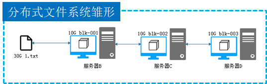

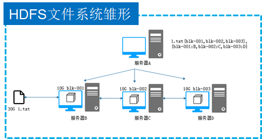

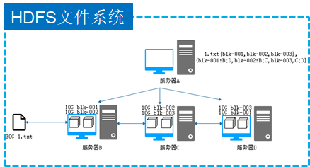


## HDFS的基本概念

HDFS（Hadoop Distributed Filesystem）是一个易于扩展的分布式文件系统，运行在成百上千台低成本的机器上。它与现有的分布式文件系统有许多相似之处，都是用来存储数据的系统工具，而区别于HDFS具有高度容错能力，旨在部署在低成本机器上。HDFS主要用于对海量文件信息进行存储和管理，也就是解决大数据文件（如TB乃至PB级）的存储问题。

**1. NameNode(名称节点)**

NameNode是HDFS集群的主服务器，通常称为名称节点或者主节点。一旦NameNode关闭，就无法访问Hadoop集群。NameNode主要以元数据的形式进行管理和存储，用于维护文件系统名称并管理客户端对文件的访问；NameNode记录对文件系统名称空间或其属性的任何更改操作；HDFS负责整个数据集群的管理，并且在配置文件中可以设置备份数量，这些信息都由NameNode存储。

**2. DataNode(数据节点)**

DataNode是HDFS集群中的从服务器，通常称为数据节点。文件系统存储文件的方式是将文件切分成多个数据块，这些数据块实际上是存储在DataNode节点中的，因此DataNode机器需要配置大量磁盘空间。它与NameNode保持不断的通信，DataNode在客户端或者NameNode的调度下，存储并检索数据块，对数据块进行创建、删除等操作，并且定期向NameNode发送所存储的数据块列表。

**3. Block（数据块）**

每个磁盘都有默认的数据块大小，这是磁盘进行数据读/写的最小单位，HDFS同样也有块（block）的概念，它是抽象的块，而非整个文件作为存储单元，在Hadoop2.x版本下，默认大小是128M，且备份3份，每个块尽可能地存储于不同的DataNode中。按块存储的好处主要是屏蔽了文件的大小，提供数据的容错性和可用性。

**4. Rack（机架）**

Rack是用来存放部署Hadoop集群服务器的机架，不同机架之间的节点通过交换机通信，HDFS通过机架感知策略，使NameNode能够确定每个DataNode所属的机架ID，使用副本存放策略，来改进数据的可靠性、可用性和网络带宽的利用率。

**5. Metadata（元数据）**

元数据从类型上分可分三种信息形式，一是维护HDFS文件系统中文件和目录的信息，例如文件名、目录名、父目录信息、文件大小、创建时间、修改时间等；二是记录文件内容存储相关信息，例如文件分块情况、副本个数、每个副本所在的DataNode信息等；三是用来记录HDFS中所有DataNode的信息，用于DataNode管理。

## HDFS的特点

随着互联网数据规模的不断增大，对文件存储系统提出了更高的要求，需要更大的容量、好更的性能以及安全性更高的文件存储系统，与传统分布式文件系统一样，HDFS分布式文件系统也是通过计算机网络与节点相连，也有传统分布式文件系统的优点和缺点。

**优点**

高容错

流式数据访问

支持超大文件

高数据吞吐量

**缺点**

高延迟

不适合小文件存取

不适合并发写入


## HDFS架构和原理

**HDFS存储架构**

HDFS是一个分布式的文件系统，相比普通的文件系统来说更加复杂，因此在学习HDFS的操作之前有必要先来学习一下HDFS的存储架构。

•HDFS采用主从架构（Master/Slave架构）。

•HDFS集群是由一个NameNode和多个的 DataNode组成。

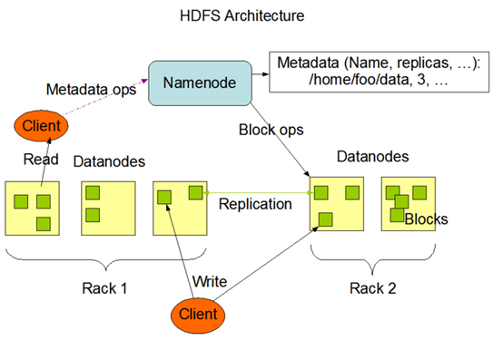

**HDFS写数据原理**

Client从HDFS中存储数据，即为Write（写）数据。

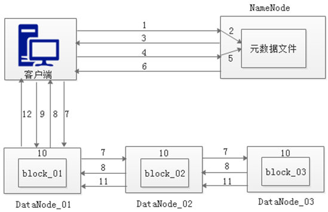

**步骤**

1 客户端发起文件上传请求，通过RPC（远程过程调用）与NameNode建立通讯

2 NameNode检查元数据文件的系统目录树

3 若系统目录树的父目录不存在该文件相关信息，返回客户端可以上传文件

4 客户端请求上传第一个Block数据块以及数据块副本的数量

5 NameNode检测元数据文件中DataNode信息池，找到可用的数据节点

6 NameNode检查元数据文件的系统目录树

7 若系统目录树的父目录不存在该文件相关信息，返回客户端可以上传文件

8 DataNode之间建立Pipeline后，逐个返回建立完毕信息

9 客户端与DataNode建立数据传输流，开始发送数据包

10 客户端向DataNode_01上传第一个Block数据块，当DataNode_01收到一个Packet就会传给DataNode_02，DataNode_02传给DataNode_03，DataNode_01每传送一个Packet都会放入一个应答队列等待应答。

11 数据被分割成一个个Packet数据包在Pipeline上依次传输，而在Pipeline反方向上，将逐个发送Ack，最终由Pipeline中第一个DataNode节点DataNode_01将Pipeline的 Ack信息发送给客户端。

12 DataNode返回给客户端，第一个Block块传输完成。客户端则会再次请求NameNode上传第二个Block块和第三块到服务器上，重复上面的步骤，直到3个Block都上传完毕。

**HDFS读数据原理**

从HDFS中查找数据，即为Read（读）数据。

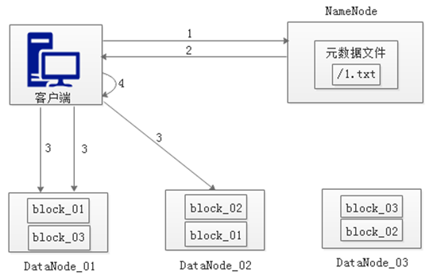

**步骤**

1 客户端向NameNode发起RPC请求，来获取请求文件Block数据块所在的位置。

2 NameNode检测元数据文件，会视情况返回Block块信息或者全部Block块信息，对于每个Block块，NameNode都会返回含有该Block副本的DataNode地址。

3 客户端会选取排序靠前的DataNode来依次读取Block块，每一个Block都会进行CheckSum若文件不完整，则客户端会继续向NameNode获取下一批的Block列表，直到验证读取出来文件是完整的，则Block读取完毕。

4 客户端会把最终读取出来所有的Block块合并成一个完整的最终文件（例如：1.txt）。


## HDFS的shell操作

Shell在计算机科学中俗称“壳”，是提供给使用者使用界面的,进行与系统交互的软件，通过接收用户输入的命令执行相应的操作，Shell分为图形界面Shell和命令行式Shell。

文件系统（FS）Shell包含了各种的类Shell的命令，可以直接与Hadoop分布式文件系统以及其他文件系统进行交互。

```bash
#基本语法结构
hadoop fs <args>
hdfs   dfs  <args>
```


```
# <args>
# 上传文件
-put
# 删除文件/空白文件夹
-help
# 统计目录下所有文件大小
-du
# 等等
```

**应用场景**

**Shell定时采集数据到HDFS**

服务器每天会产生大量日志数据，并且日志文件可能存在于每个应用程序指定的data目录中，在不使用其它工具的情况下，将服务器中的日志文件规范的存放在HDFS中。通过编写简单的Shell脚本，用于每天自动采集服务器上的日志文件，并将海量的日志上传至HDFS中。

**1.** **配置环境变量**

首先在/export/data/logs目录下（如果目录不存在，则需要提前创建）使用vi命令创建upload2HDFS.sh脚本文件，在编写Shell脚本时，需要设置Java环境变量和Hadoop环境变量，这样做是用来提高系统的**可靠性**，保障运行程序的机器在没有配置环境变量的情况下依然能够运行脚本。

upload2HDFS.sh

```bash
#!/bin/bash

#配置java环境变量
export JAVA_HOME=/export/servers/jdk
export JRE_HOME=${JAVA_HOME}/jre
export CLASSPATH=.:${JAVA_HOME}/lib:${JRE_HOME}/lib 
export PATH=${JAVA_HOME}/bin:$PATH

#配置hadoop环境变量
export HADOOP_HOME=/export/servers/hadoop-2.7.7/
export PATH=${HADOOP_HOME}/bin:${HADOOP_HOME}/sbin:$PATH

```


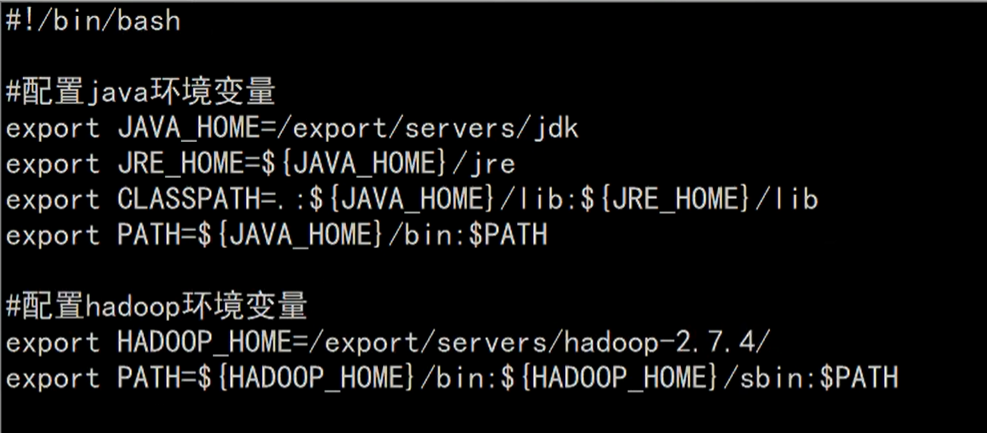

**2.** **准备日志存放目录和待上传文件**

为了让开发者便于控制上传文件的流程，可以在脚本中设置一个日志存放目录和待上传文件目录，若上传过程中发生错误只需要查看该目录就能知道文件的上传进度。

upload2HDFS.sh

```bash
#日志文件存放的目录
log_src_dir=/export/data/logs/log/
#待上传文件存放的目录
log_toupload_dir=/export/data/logs/toupload/
```


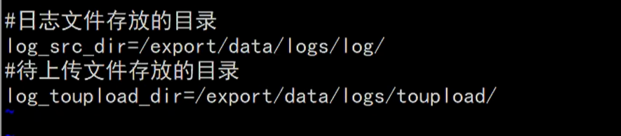

**3.** **设置日志文件上传的路径**

设置上传的HDFS目标路径，命名格式以时间结尾，并且输出打印信息

upload2HDFS.sh

```bash
date1='date -d last-day +%Y_%m_%d'
#日志文件上传到hdfs的根路径
hdfs_root_dir=/data/clickLog/$date1/
#打印环境变量信息
echo "envs: hadoop_home: SHADOOP HOME"
#读取日志文件的目录,判断是否有需要上传的文件
echo "log_src_dir:"$log_src_dir
```

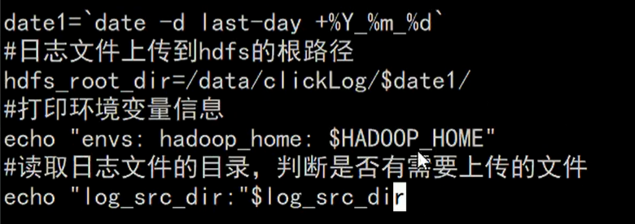


**4.** **实现文件上传**

上传文件的过程就是遍历文件目录的过程，将文件首先移动到待上传目录，再从待上传目录中上传到HDFS中。

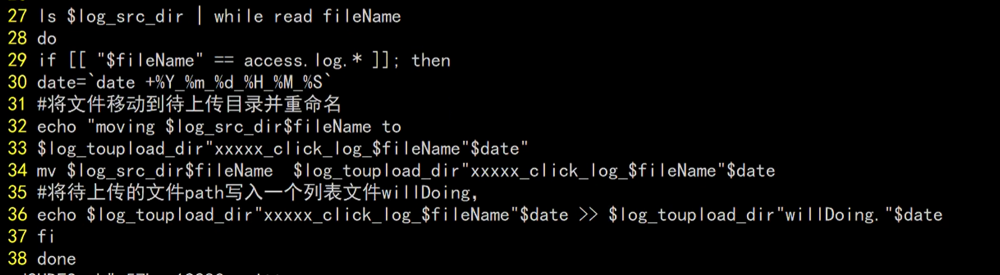


```bash
ls $log_src_dir | while read fileName
do 
	if [[ "$fileName" == access.log.* ]]; then
		date =`date+%Y_%m_%d_%H_%M_%S`
		#将文件移动到待上传目录并重命名
		echo "moving $log_src_dir$flieName to $log_toupload_dir"xxxxx_click_log_$fileName"$date"
		mv $log_src_dir$fileName $log_toupload_dir“xxxxx_click_log_$fileName”$date
		#将待上传的文件path写入一个列表文件willDoing
		echo $log_toupload_dir"xxxxx_click_log_$fileName"$date>>$log_toupload_dir"willDoing."$date
	fi
done
```


将文件从待上传目录传到HDFS中，具体如下

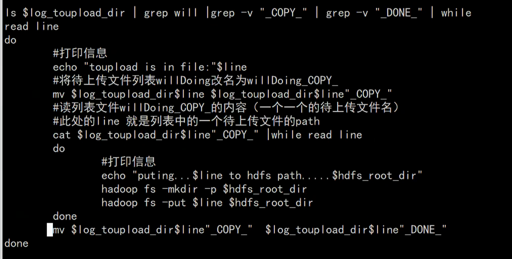


若是在每天12点凌晨执行一次，我们可以使用Linux Crontab表达式执行定时任务


**5.** **执行程序展示运行结果。**

为了模拟生产环境，在日志存放目录/export/data/logs/log/中，手动创建日志文件，access.log表示正在源源不断的产生日志的文件，access.log.1、access.log.2等表示已经滚动完毕的日志文件，即为待上传日志文件。

在upload2HDFS.sh文件路径下运行脚本 sh upload2HDFS.sh，先将日志存放目录log中的日志文件移到待上传toupload目录下，并根据业务需求重命名；然后脚本执行“hadoop put”上传命令，将待上传目录下的所有日志文件上传至HDFS；最后通过HDFS Web界面可看到需要采集的日志文件已按照日期分类，上传至HDFS中。


## HDFS的Java API操作

> 参考文档
>
> https://www.bilibili.com/read/cv7604251

由于Hadoop是使用Java语言编写的，因此可以使用Java API操作Hadoop文件系统。HDFS Shell本质上就是对Java API的应用，通过编程的形式操作HDFS，其核心是使用HDFS提供的Java API构造一个访问客户端对象，然后通过客户端对象对HDFS上的文件进行操作（增、删、改、查）。

**HDFS Java API介绍**

Hadoop整合了众多文件系统，HDFS只是这个文件系统的一个实例。

| **包名**                                | **功能描述**                                                 |
| --------------------------------------- | ------------------------------------------------------------ |
| org.apache.hadoop.fs.FileSystem         | 它是通用文件系统的抽象基类，可以被分布式文件系统继承，它具有许多实现类 |
| org.apache.hadoop.fs.FileStatus         | 它用于向客户端展示系统中文件和目录的元数据                   |
| org.apache.hadoop.fs.FSDataInputStream  | 文件输入流，用于读取Hadoop文件                               |
| org.apache.hadoop.fs.FSDataOutputStream | 文件输出流，用于写Hadoop文件                                 |
| org.apache.hadoop.conf.Configuration    | 访问配置项，默认配置参数在core-site.xml中                    |
| org.apache.hadoop.fs.Path               | 表示Hadoop文件系统中的一个文件或者一个目录的路径             |

在Java中操作HDFS，创建一个客户端实例主要涉及以下两个类：

•Configuration：该类的对象封装了客户端或者服务器的配置，Configuration实例会自动加载HDFS的配置文件core-site.xml，从中获取Hadoop集群的配置信息。

•FileSystem：该类的对象是一个文件系统对象。

FileSystem对象的一些方法可以对文件进行操作，常用方法如下：

| **方法名**                              | **功能描述**               |
| --------------------------------------- | -------------------------- |
| copyFromLocalFile(Path  src，Path  dst) | 类从本地磁盘复制文件到HDFS |
| copyToLocalFile(Path  src，Path  dst)   | 从HDFS复制文件到本地磁盘   |
| mkdirs(Path  f)                         | 建立子目录                 |
| rename(Path  src，Path  dst)            | 重命名文件或文件夹         |
| delete(Path  f)                         | 删除指定文件               |

**案例——使用Java API操作HDFS**

**0.在Window系统下，配置hadoop环境，使用Java开发工具编写代码，相当于Hadoop客户端**

在win系统下不配置hadoop环境，直接运行代码会报错，显示缺少

winutils.exe 和 hadoop.dll 两个文件

**步骤**

1-将hadoop-win-2.7.7文件夹拷贝到一个没有中文没有空格的路径中；

比如

```
D:\Program Files\hadoop-win-2.7.7\bin
```

2-在windows系统，配置hadoop的环境变量: HADOOP_HOME,并将%HADOOP_HOME%\bin添加到path中

3-:把hadoop2.7.7文件夹中bin目录下的hadoop.dll 放到系统盘: C:Windows System32目录

4-关闭windows重启


**1.** **搭建项目环境**

创建一个项目名为“HadoopDemo”，包名为“com.wukong”的Maven项目，并在项目的pom.xml文件中引入hadoop-common、hadoop-hdfs、hadoop-client以及单元测试junit的依赖。

**补充**

使用Idea中自带的maven插件，构建maven项目，比较方便。

创建maven项目时候，选择maven-quickstart 原型。

```
<dependency>
      <groupId>junit</groupId>
      <artifactId>junit</artifactId>
      <version>4.11</version>
    </dependency>
    <dependency>
      <groupId>org.apache.hadoop</groupId>
      <artifactId>hadoop-common</artifactId>
      <version>2.7.7</version>
    </dependency>
    <dependency>
      <groupId>org.apache.hadoop</groupId>
      <artifactId>hadoop-hdfs</artifactId>
      <version>2.7.7</version>
    </dependency>
    <dependency>
      <groupId>org.apache.hadoop</groupId>
      <artifactId>hadoop-client</artifactId>
      <version>2.7.7</version>
    </dependency>
    <dependency>
      <groupId>org.apache.hadoop</groupId>
      <artifactId>hadoop-mapreduce-client-core</artifactId>
      <version>2.7.7</version>
    </dependency>
```


**2.** **初始化客户端对象**

首先在项目src文件夹下创建com.wukong.hdfsdemo包，并在该包下创建HDFS_CRUD.java文件，编写Java测试类，构建Configuration和FileSystem对象，初始化一个客户端实例进行相应的操作。

**3.** **上传文件到HDFS**

由于采用Java测试类来实现JavaApi对HDFS的操作，因此可以在HDFS_CRUD.java文件中添加一个testAddFileToHdfs()方法来演示本地文件上传到HDFS的示例。

**4.** **从HDFS下载文件到本地**

在HDFS_CRUD.java文件中添加一个testDownloadFileToLocal()方法，来实现从HDFS中下载文件到本地系统的功能。

**5.** **目录操作**

在HDFS_CRUD.java文件添加一个testMkdirAndDeleteAndRename()方法，实现目录的创建、删除、重命名的功能。

**6.** **查看目录中的文件信息**

在HDFS_CRUD.java文件中添加一个testListFiles()方法，实现查看目录中所有文件的详细信息的功能。

```java
package com.wukong.hdfsdemo;

import java.io.FileNotFoundException;
import java.io.IOException;

import org.apache.hadoop.conf.Configuration;
import org.apache.hadoop.fs.BlockLocation;
import org.apache.hadoop.fs.FileStatus;
import org.apache.hadoop.fs.FileSystem;
import org.apache.hadoop.fs.LocatedFileStatus;
import org.apache.hadoop.fs.Path;
import org.apache.hadoop.fs.RemoteIterator;
import org.junit.Before;
import org.junit.Test;

public class HDFS_CRUD {
	FileSystem fs = null;

	@Before
	public void init() throws Exception {
		// 构造一个配置参数对象,设置一个参数：我们要访问的hdfs的URI
		Configuration conf = new Configuration();
		// 这里指定使用的是HDFS文件系统
		conf.set("fs.defaultFS", "hdfs://hadoop01:9000");
		// 通过如下的方式进行客户端身份的设置
		System.setProperty("HADOOP_USER_NAME", "root");
		// 通过FileSystem的静态方法获取文件系统客户端对象
		fs = FileSystem.get(conf);
	}

	@Test
	public void testAddFileToHdfs() throws IOException {
		// 要上传的文件所在本地路径
		Path src = new Path("D:/test.txt");
		// 要上传到hdfs的目标路径
		Path dst = new Path("/testFile");
		// 上传文件方法
		fs.copyFromLocalFile(src, dst);
		// 关闭资源
		fs.close();
	}

	// 从hdfs中复制文件到本地文件系统
	@Test
	public void testDownloadFileToLocal() throws IllegalArgumentException, IOException {
		// 下载文件
		fs.copyToLocalFile(new Path("/testFile"), new Path("D:/"));
	}

	// 创建，删除，重命名文件
	@Test
	public void testMkdirAndDeleteAndRename() throws Exception {
		// 创建目录
		fs.mkdirs(new Path("/a/b/c"));
		fs.mkdirs(new Path("/a2/b2/c2"));
		// 重命名文件或文件夹
		fs.rename(new Path("/a"), new Path("/a3"));
		// 删除文件夹，如果是非空文件夹，参数2必须给值true
		fs.delete(new Path("/a2"), true);
	}

	// 查看目录信息，只显示文件
	@Test
	public void testListFiles() throws FileNotFoundException, IllegalArgumentException, IOException {
		// 获取迭代器对象
		RemoteIterator<LocatedFileStatus> listFiles = fs.listFiles(new Path("/"), true);
		while (listFiles.hasNext()) {
			LocatedFileStatus fileStatus = listFiles.next();
			// 打印当前文件名
			System.out.println(fileStatus.getPath().getName());
			// 打印当前文件块大小
			System.out.println(fileStatus.getBlockSize());
			// 打印当前文件权限
			System.out.println(fileStatus.getPermission());
			// 打印当前文件内容长度
			System.out.println(fileStatus.getLen());
			// 获取该文件块信息（包含长度，数据块，datanode的信息）
			BlockLocation[] blockLocations = fileStatus.getBlockLocations();
			for (BlockLocation bl : blockLocations) {
				System.out.println("block-length:" + bl.getLength() + "--" + "block-offset:" + bl.getOffset());
				String[] hosts = bl.getHosts();
				for (String host : hosts) {
					System.out.println(host);
				}
			}
			System.out.println("----------------------------");
		}
	}
    
// 查看文件及文件夹信息
    @Test
    public void testListAll() throws FileNotFoundException, IllegalArgumentException, IOException {
        // 获取HDFS系统中文件和目录的元数据等信息
        FileStatus[] listStatus = fs.listStatus(new Path("/"));

        for (FileStatus fstatus : listStatus) {
            String flag = "d--             ";
            // 判断是文件还是文件夹
            if (fstatus.isFile()) {
                flag = "f--         ";
            }
            System.out.println(flag + fstatus.getPath().getName());
        }
    }
}
```


