# Hive数据仓库

## 数据仓库简介

数据仓库是一个面向主题的、集成的、随时间变化的，但信息本身相对稳定的数据集合，它用于支持企业或组织的决策分析处理，这里对数据仓库的定义，指出了数据仓库的三个特点。

## 数据仓库的结构

数据仓库的结构是由数据源、数据存储及管理、OLAP服务器和前端工具四个部分组成。

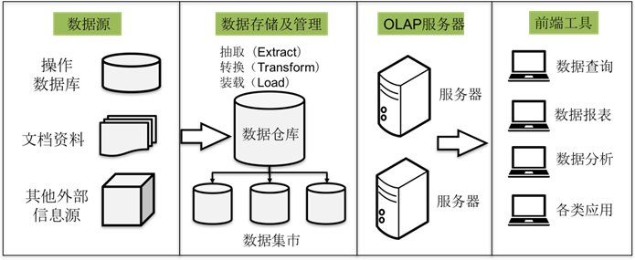

数据源是数据仓库的基础，即系统的数据来源，通常包含企业的各种内部信息和外部信息。

数据存储及管理是整个数据仓库的核心，决定了对外部数据的表现形式，针对系统现有的数据，进行抽取、清理并有效集成，再按照主题进行组织。

OLAP服务器对需要分析的数据按多维数据模型进行重组，以支持用户随时进行多角度、多层次的分析，并发现数据规律和趋势。

前端工具主要包含各种数据分析工具、报表工具、查询工具、数据挖掘工具以及各种基于数据仓库或数据集市开发的应用。


## 数据仓库数据模型

数据模型（Data Model）是数据特征的抽象，在数据仓库建设中，一般围绕**星型模型**和**雪花模型**来设计数据模型。星型模型是以一个事实表和一组维度表组合而成，并以事实表为中心，所有维度表直接与事实表相连。

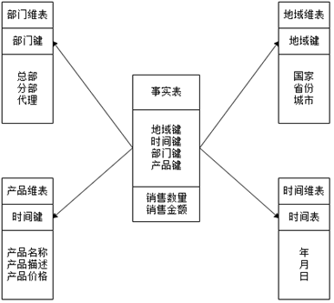

雪花模型是当有一个或多个维表没有直接连到事实表上，而是通过其他维表连到事实表上，其图解像多个雪花连在一起，故称雪花模型。雪花模型是对星型模型的扩展，原有的各维表可被扩展为小的事实表，形成一些局部的 "层次 " 区域，被分解的表都连主维度表而不是事实表。

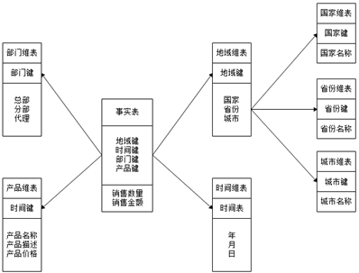


## Hive数据仓库工具简介

Hive起源于Facebook，Facebook公司有着大量的日志数据，而Hadoop是实现了MapReduce模式开源的分布式并行计算的框架，可轻松处理大规模数据。然而MapReduce程序对熟悉Java语言的工程师来说容易开发，但对于其他语言使用者则难度较大。因此Facebook开发团队想设计一种使用**SQL语言**对日志数据查询分析的工具，而Hive就诞生于此，只要懂SQL语言，就能够胜任大数据分析方面的工作，还节省了开发人员的学习成本。

Hive是建立在Hadoop文件系统上的数据仓库工具，它提供了一系列工具，能够对存储在HDFS中的数据进行数据提取、转换和加载（ETL），这是一种可以存储、查询和分析存储在Hadoop中的大规模数据的工具。Hive定义简单的类SQL查询语言（即HQL），可以将结构化的数据文件映射为一张数据表，允许熟悉SQL的用户查询数据，允许熟悉MapReduce的开发者开发mapper和reducer来处理复杂的分析工作，与MapReduce相比较，Hive更具有优势。

Hive采用了类似SQL的查询语言HQL，因此很容易将Hive理解为数据库。其实从结构上来看，Hive和数据库除了拥有类似的查询语言，再无类似之处，MySQL与Hive对比如下所示。

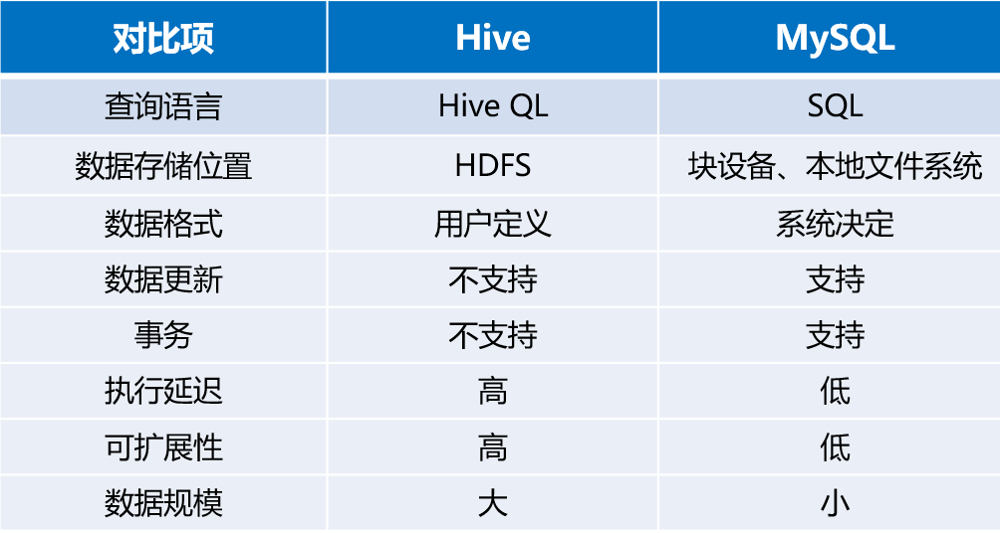


## Hive系统架构

Hive是底层封装了Hadoop的数据仓库处理工具，运行在Hadoop基础上，其系统架构组成主要包含4部分，分别是用户接口、跨语言服务、底层驱动引擎及元数据存储系统。

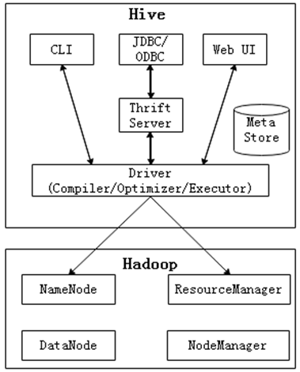


## Hive工作原理

Hive建立在Hadoop系统之上，因此Hive底层工作依赖于Hadoop服务，Hive底层工作原理如下所示。

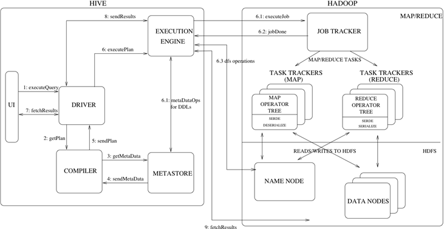


## Hive数据类型

Hive中所有的数据都存储在HDFS中，它包含数据库（Database）、表（Table）、分区表（Partition）和桶表（Bucket）四种数据类型。

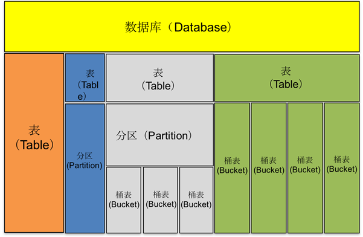


## Hive安装模式

Hive的安装模式分为三种，分别是嵌入模式、本地模式和远程模式。

- 使用内嵌Derby数据库存储元数据，这是Hive的默认安装方式，配置简单，但是一次只能连接一个客户端，适合用来测试，不适合生产环境。

- 采用外部数据库存储元数据，该模式不需要单独开启Metastore服务，因为本地模式使用的是和Hive在同一个进程中的Metastore服务。

- 与本地模式一样，远程模式也是采用外部数据库存储元数据。不同的是，远程模式需要单独开启Metastore服务，然后每个客户端都在配置文件中配置连接该Metastore服务。远程模式中，Metastore服务和Hive运行在不同的进程中。

**第1种：Hive安装之嵌入模式**

- 下载Hive安装包，本次使用1.2.2版本。

- 解压Hive安装包，将压缩包解压至/export/servers文件夹下。

- 在嵌入模式下执行Hive程序，无需对Hive配置文件进行修改，只要启动bin目录下的hive指令即可。

  > 务必先启动hadoop集群，在一台机器上部署hive就可以，不需要每台都部署,主要用于测试。

  ```msql
  bin/hive
  # 进入hive Shell窗口
  show databases;
  # 默认显示 default 数据库
  hive>default
  # 退出
  > exit;
  > quit;
  # 查询所有表
  > show tables;
  # 查询所有内置函数
  > show functions;
  # 清屏
  > !clear;
  
  
  ```


**第2和3种：Hive的安装之本地和远程模式**

> 本地和远程模式安装配置方式大致相同，本质上是将Hive默认的元数据存储介质由自带的Derby数据库替换为MySQL数据库。
>
> 安装MySql8.0数据库的帮助文档
>
> https://www.bilibili.com/read/cv7804287
>


- Hive的配置。修改hive-env.sh配置文件，配置Hadoop环境变量

  > 如果在/etc/profile中已经配置好hadoop的环境变量，
  >
  > 此处可以省略

  ```xml
  cd /export/servers/hive-1.2.2/conf
  
  mv hive-env.sh.template hive-env.sh
  
  vi hive-env.sh
  
  #设置hive指定的hadoop环境变量
  HADOOP_HOME=/export/servers/hadoop-2.7.7
  
  ```


- 添加hive-site.xml配置文件，配置MySQL相关信息。

  ```xml
  cd /export/servers/hive-1.2.2/conf
  
  # 无hive-site.xml文件，创建一个，然后输入如下内容
  
  
  <configuration>
      <property>
          <name>javax.jdo.option.ConnectionURL</name>
          <value>jdbc:mysql://localhost:3306/hive?createDatabaseIfNotExist=true&amp;useSSL=false&amp;allowPublicKeyRetrieval=true&amp;serverTimezone=UTC</value>
          <description>url</description>
      </property>
      <property>
          <name>javax.jdo.option.ConnectionDriverName</name>
          <value>com.mysql.cj.jdbc.Driver</value>
          <description>驱动</description>
      </property>
      <property>
          <name>javax.jdo.option.ConnectionUserName</name>
          <value>root</value>
          <description>用户名</description>
      </property>
      <property>
          <name>javax.jdo.option.ConnectionPassword</name>
          <value>wukong</value>
          <description>密码</description>
      </property>
  </configuration>
  
  
  
  ```


- 拷贝数据库连接驱动包（mysql-connector-java-8.0.11.jar）至Hive的lib目录。

  > 注意，mysql使用的8.0版本，驱动也要使用8.0版本


## Hive的管理（访问）方式

> 保证hadoop和mysql处于启动状态

**Hive的管理之CLI方式（本地访问）**

Hive CLI是Hive的交互工具，输入#<HIVE_HOME>/bin/hive启动Hive客户端，启动效果如下所示。

```bash
# 进入hive程序包,输入如下指令
> /bin/hive
```


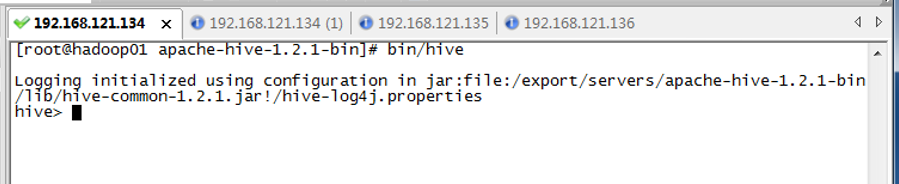

**Hive的管理之远程服务（远程访问，非本地访问）**

由于使用CLI连接方式不能进行多个节点的同时访问，而且会造成服务器阻塞，且出于对服务器安全性的考虑， Hive服务所部署的服务器通常用户是无法直接访问的，因此，必须选用远程服务启动模式，具体启动步骤如下。

> 确保3台机器上都安装了hive服务。

- 在hadoop01服务器的Hive的安装包下启动Hiveserver2服务。

    ```
    # 启动服务
     bin/hiveserver2
    ```

    ```
    # 克隆当前shell窗口，输入jps看是否有Runjar进程？
    ```

  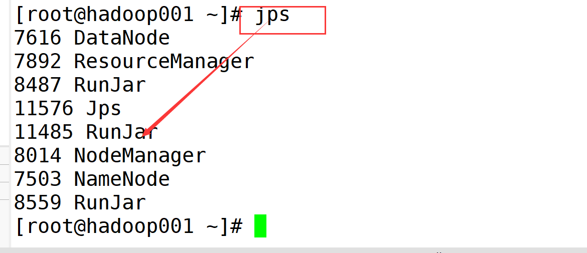

- 在hadoop02服务器的Hive安装包下，通过远程连接命令bin/beeline进行连接。

    ```
    bin/beeline
    beeline> !connect jdbc:hive2://hadoop001:10000
    ```

  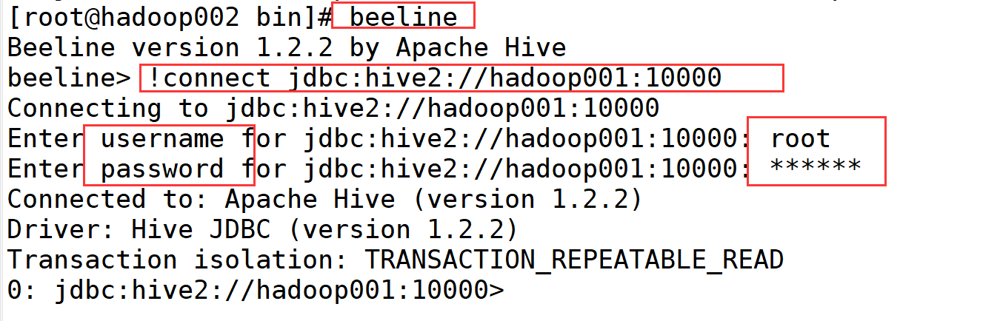

## Hive内置数据类型

Hive的内置数据类型可以分为两大类，分别是基础数据类型和复杂数据类型，Hive基础数据类型如下所示。

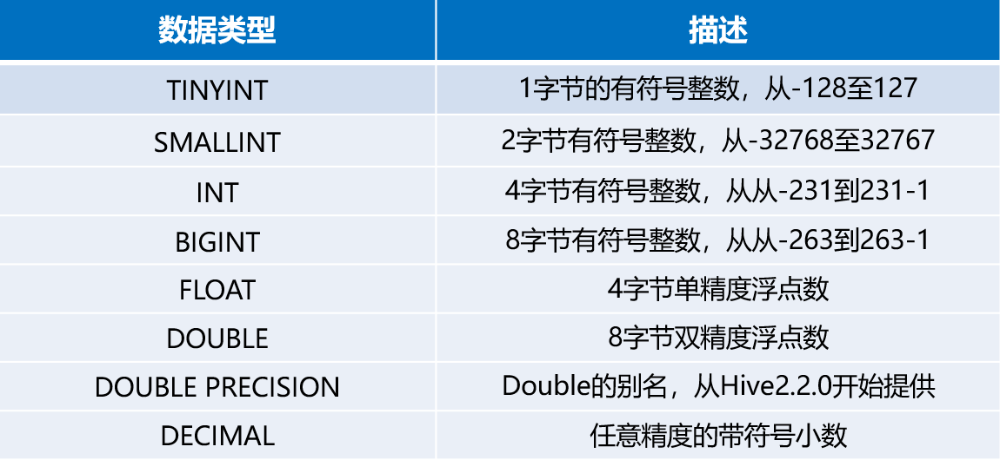

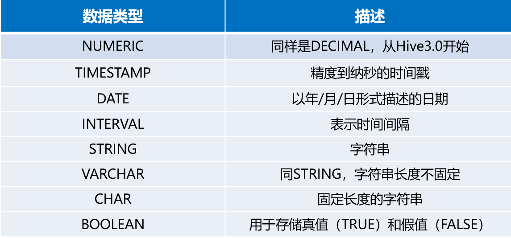

Hive复杂数据类型，具体如下所示。

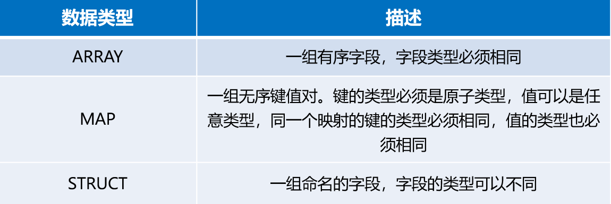

## Hive数据库操作

**1.** **创建数据库**

```sql
CREATE DATABASE|SCHEMA [IF NOT EXISTS] database_name

```

> 创建的新数据库的路径
>
> hdfs://hadoop001:9000/user/hive/warehouse/database_name.db

**2.** **显示数据库**

```sql
SHOW databases；

```


**3.** **查看数据库详情**

```sql
DESC DATABASE|SCHEMA database_name

```


**4.** **切换数据库**

```sql
USE database_name

```


**5.** **修改数据库**

```sql
ALTER (DATABASE|SCHEMA) database_name SET DBPROPERTIES (property_name=property_value，...)

```


**6.** **删除数据库**

> 库中若是有表，先删除表，再删除库

```sql
DROP (DATABASE|SCHEMA) [IF EXISTS] database_name [RESTRICT|CASCADE]；

```

## Hive表操作

**1.** **创建数据表**（默认创建内部表）

```sql
CREATE [TEMPORARY] [EXTERNAL] TABLE [IF NOT EXISTS] table_name 
[(col_name data_type [COMMENT col_comment], ...)] 
[COMMENT table_comment] 
[PARTITIONED BY (col_name data_type [COMMENT col_comment], ...)] 
[CLUSTERED BY (col_name, col_name, ...) 
[SORTED BY (col_name [ASC|DESC], ...)] INTO num_buckets BUCKETS] 
[ROW FORMAT row_format] 
[STORED AS file_format] 
[LOCATION hdfs_path]

```

**2.** **复制数据表**（只复制表结构）

```sql
CREATE [TEMPORARY] [EXTERNAL] TABLE [IF NOT EXISTS] [db_name.]table_name LIKE existing_table_or_view_name [LOCATION hdfs_path]；

```

上述语法只会复制表的结构，不会复制表中的数据。另外，如果创建的表名已经存在，与创建数据仓库一样会抛出异常，用户可以使用“IF NOT EXISTS”选项来忽略这个异常。


## Hive内部表操作

**简单的结构化文件**

在hadoop001机器的/export/data/下创建目录hivedata，该目录下创建user.txt文件，写入

```txt
1,wukong,18
2,wukongnot,19
3,wukongnotnull,20
```

针对结构化文件user.txt，创建对应的内部表t_user(在wukong库中)

```sql
hive> create table t_user(id int,name string,age int)
hive> row format delimited fields terminated by ',';
```

将user.txt文件上传到hdfs中(相当于在t_user表中添加数据)

```
hadoop fs -put  user.txt /user/hive/warehouse/wukong.db/t_user
```

使用hive客户端查询t_user表中是否有数据

```sql
hive>select * from t_user;
```

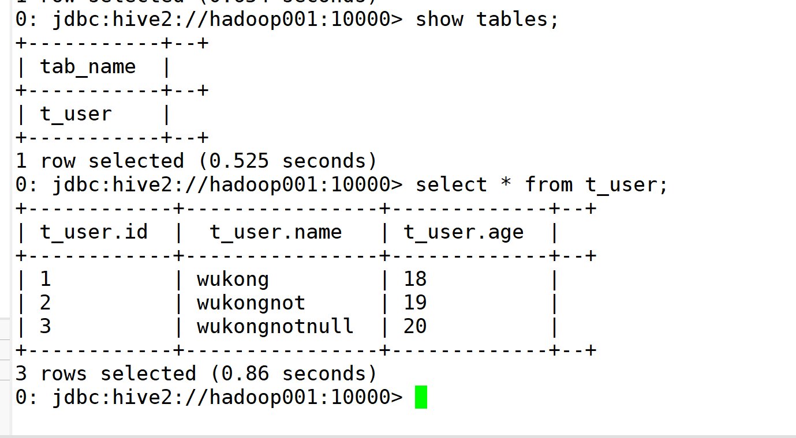

**复杂的结构化文件**

在/export/data/hivedata/student.txt中写入

> , 为英文逗号  ： 为英文状态  - 为英文状态

```
1,wukongxiaohua,唱歌:非常好-跳舞:一般-游泳:一般
2,wukongxiaoqiang,踢足球:非常喜欢-乒乓球:不喜欢
```

创建对应的内部表t_student

```sql
hive>create table t_student(
  id int,name string,hobby map<string,string>)
  row format delimited fields terminated by ','
  collection items terminated by '-'
  map keys terminated by ':';
```

**总结**

1-建内部表必须根据结构化文件内容的格式进行创建，指定匹配的分隔符。

2-内部表添加数据：将结构化文件添加到内部表文件夹下进行映射，才能生成对应的数据。

## Hive外部表操作

> 使用内部表时，结构化的数据文件，需要移动到内部表目录下，进行映射，才能生成对应数据。
>
> 那么， 若是结构化的文件巨大，移动需要耗时耗力，怎么办呢？
>
> 那就不能移动，使用外部表

将结构化文件student.txt文件上传到hdfs系统中/stu下，模拟生产环境下的数据文件

student.txt

```
1,wukong1,男,12,IS
2,wukong2,男,13,IT
3,wukong3,男,14,IS
4,wukong4,男,15,IT
5,wukong5,男,16,IS
6,wukong6,男,17,IT
```


```
# 创建 /stu
hadoop fs -mkdir /stu
# 上传到/stu 下
hadoop fs -put student.txt /stu
```

创建一张外部表student_ext

```
hive> create external table student_ext(
Sno int,Sname string,Ssex string,Sage int,Sdept string)
row format delimited fields terminated by ','
location '/stu';
```

查询操作

```
hive>select * from student_ext;
```

**总结**

删除外部表时候，只删除元数据，不会删除结构化数据。

删除内部表时候，元数据和结构化数据一起删除。

## Hive分区表操作（分文件夹）

分区表是按照属性在文件夹层面给文件更好的管理，实际上就是对应一个HDFS文件系统上的独立文件夹，该文件夹下是该分区所有的数据文件。Hive中的分区就是分目录，把一个大的数据集根据业务需要分割成小的数据集。

结构化文件user_p.txt

```
1,andy
2,tom
3,jack
```


**1.** **创建Hive表**

按照国家进行分区

```sql
hive> create table t_user_p(id int, name string) 
partitioned by (country string) 
row format delimited fields terminated by ',';

```


**2.** **加载数据**

```sql
hive> load data local inpath '/export/data/hivedata/user_p.txt' into table t_user_p partition(country='USA');

```

**报错**

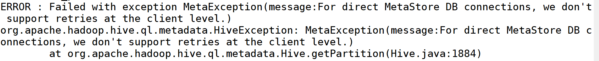

```
ERROR : Failed with exception MetaException(message:For direct MetaStore DB connections, we don't support retries at the client level.)
```

**解决方案**

```
#hive-site.xml文件中添加
  <value>......&amp;serverTimezone=UTC</value>
```

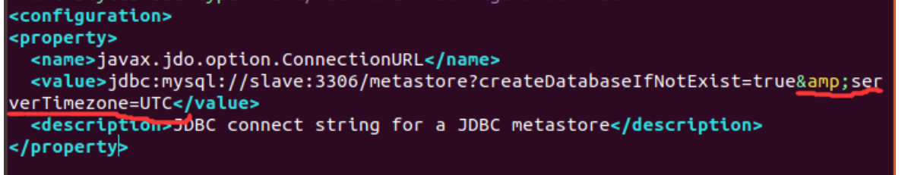

```
# hive的bin目录下执行
./bin/schematool -initSchema -dbType mysql
```


**3.** **新增分区**

```sql
hive> ALTER TABLE t_user_p ADD PARTITION (country='China') location  '/user/hive/warehouse/wukong.db/t_user_p/country=China';

```

**4.** **修改分区**

```sql
hive> ALTER TABLE t_user_p PARTITION (country='China') RENAME TO PARTITION (country='Japan');

```

**5.** **删除分区**

```sql
hive> ALTER TABLE t_user_p DROP IF EXISTS PARTITION (country='Japan');

```

## **Hive动态分区**

在默认情况下，我们加载数据时，需要手动的设置分区字段，并且针对一个分区就要写一个插入语句。如果源数据量很大时（例如，现有许多日志文件，要求按照日期作为分区字段，在插入数据的时候无法手动的添加分区），就可以利用Hive提供的动态分区，可以简化插入数据时的繁琐操作。

**1.** **开启动态分区功能**

```sql
hive> set hive.exec.dynamic.partition=true;
hive> set hive.exec.dynamic.partition.mode=nonstrict;

```


**2.** **实现动态分区语法格式**

```sql
hive> insert overwrite table table_name 
partition (partcol1[=val1], partcol2[=val2] ...) 
select_statement FROM from_statement

```

结构化文件dynamic_partition_table.txt

```
2019-01-01,ip1
2019-01-01,ip2
2019-02-02,ip3
2019-02-02,ip4
2019-03-03,ip5
2019-03-03,ip6
2019-03-04,ip7
2019-03-05,ip8
```

创建原始表（内部表）

```
hive>
create table dynamic_partition_table(day string,ip string)
row format delimited fields terminated by ',';
```

加载文件数据至原始表

```
hive>
load data local inpath
'/export/data/hivedata/dynamic_partition_table.txt'
into table dynamic_partition_table;
```

创建目标表

```
hive>
create table d_p_t(ip string)
partitioned by (month string,day string);
```

依次动态插入原表的查询结果

```
hive>
insert overwrite table d_p_t partition (month,day)
select ip,substr(day,1,7) as month,day
from dynamic_partition_table;
```

查看目标表中的分区数据情况

```
hive>
show partitions d_p_t;
```


## Hive桶表操作（分文件）

为了将表进行更细粒度的范围划分，我们可以创建桶表。桶表，是根据某个属性字段把数据分成几个桶（我们这里设置为4，默认值是-1，可自定义），也就是在文件的层面上把数据分开。

**1.** **开启分桶功能**

```sql
# 开启分桶功能
hive> set hive.enforce.bucketing = true;
# 4 表示分成4个文件
hive> set mapreduce.job.reduces=4;

```

**2.** **创建桶表**

如何分? 使用Sno的哈希值和4取模进行分桶

```sql
hive> create table stu_buck(Sno int,Sname string,
Ssex string,Sage int,Sdept string) 
clustered by(Sno) into 4 buckets 
row format delimited fields terminated by ',';

```

**3.** **创建临时表**

```sql
hive> create table student_tmp(Sno int,Sname string,
Ssex string,Sage int,Sdept string) 
row format delimited 
fields terminated by ',';

```

**4.** **加载数据至临时表**

```sql
hive> load data local inpath '/export/data/hivedata/student.txt' 
into table student_tmp;

```

**5.** **将临时数据表中数据导入桶表**

```sql
hive> insert overwrite table stu_buck 
select * from student_tmp cluster by(Sno);

```

**6.查询分桶情况**

```
hive>select * from stu_buck;
```

或者

```
hadoop fs -cat /user/hive/warehouse/wukong6.db/stu_buck/000000_0
hadoop fs -cat /user/hive/warehouse/wukong6.db/stu_buck/000001_0
hadoop fs -cat /user/hive/warehouse/wukong6.db/stu_buck/000002_0
hadoop fs -cat /user/hive/warehouse/wukong6.db/stu_buck/000003_0
```


## Hive数据操作

Hive数据操作是负责对数据库对象运行数据访问工作的指令集，通俗的讲它的功能就是操作数据，其中包括向数据表加载文件、写查询结果等操作。

> 基本上同mysql的sql语句，略


