# MapReduce分布式计算框架

MapReduce是Hadoop系统核心组件之一，它是一种可用于大数据并行处理的计算模型、框架和平台，主要解决海量数据的计算，是目前分布式计算模型中应用较为广泛的一种。

## MapReduce核心思想

MapReduce的核心思想是“分而治之”。所谓“分而治之”就是把一个复杂的问题，按照一定的“分解”方法分为等价的规模较小的若干部分，然后逐个解决，分别找出各部分的结果，把各部分的结果组成整个问题的结果，这种思想来源于日常生活与工作时的经验，同样也完全适合技术领域。

MapReduce作为一种分布式计算模型，它主要用于解决海量数据的计算问题。使用MapReduce操作海量数据时，每个MapReduce程序被初始化为一个工作任务，每个工作任务可以分为Map和Reduce两个阶段。

Map阶段负责将任务分解，即把复杂的任务分解成若干个“简单的任务”来并行处理，但前提是这些任务没有必然的依赖关系，可以单独执行任务。

Reduce阶段负责将任务合并，即把Map阶段的结果进行全局汇总点击此处输入文字。

MapReduce就是“任务的分解与结果的汇总”。即使用户不懂分布式计算框架的内部运行机制，但是只要能用Map和Reduce思想描述清楚要处理的问题，就能轻松地在Hadoop集群上实现分布式计算功能。

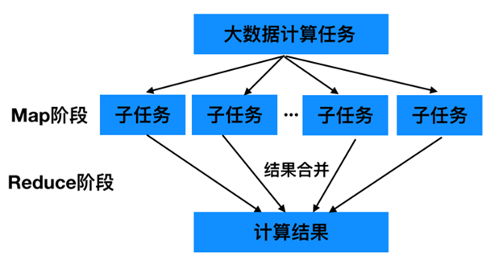

## MapReduce编程模型

MapReduce是一种编程模型，用于处理大规模数据集的并行运算。使用MapReduce执行计算任务的时候，每个任务的执行过程都会被分为两个阶段，分别是Map和Reduce，其中Map阶段用于对原始数据进行处理，Reduce阶段用于对Map阶段的结果进行汇总，得到最终结果。

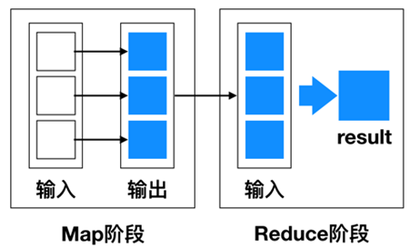


## MapReduce编程实例-词频统计

首先，MapReduce通过默认组件TextInputFormat将待处理的数据文件（如text1.txt和text2.txt），把每一行的数据都转变为<key，value>键值对。

其次，调用Map()方法，将单词进行切割并进行计数，输出键值对作为Reduce阶段的输入键值对。

最后，调用Reduce()方法将单词汇总、排序后，通过TextOutputFormat组件输出到结果文件中。

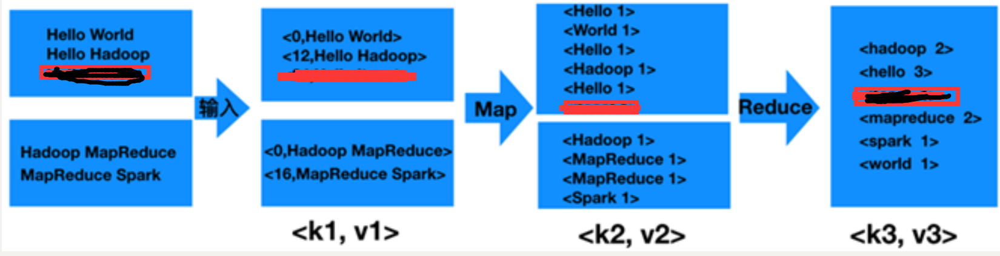

## MapReduce工作过程

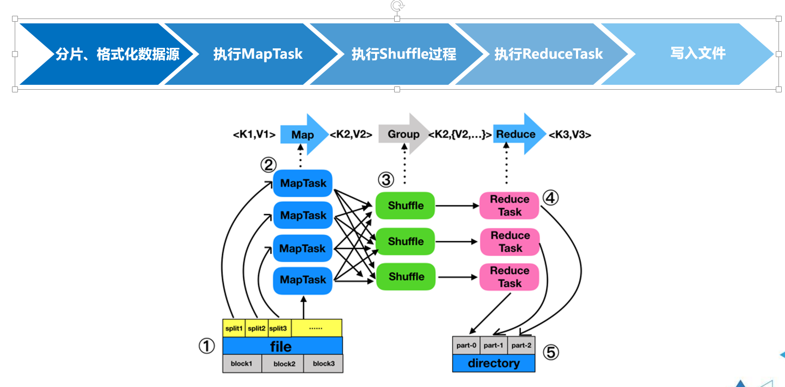

## MapTask工作原理

MapTask作为MapReduce工作流程前半部分，它主要经历5个阶段，分别是Read阶段、Map阶段、Collect阶段、Spill阶段和Combiner阶段。

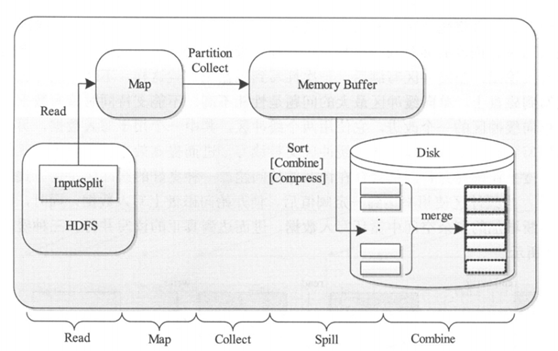

## ReduceTask工作原理

ReduceTask的工作过程主要经历了5个阶段，分别是Copy阶段、Merge阶段、Sort阶段、Reduce阶段和Write阶段。

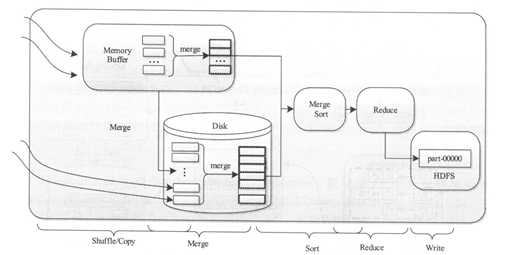

## Shuffle工作原理

Shuffle是MapReduce的核心，它用来确保每个reducer的输入都是按键排序的。它的性能高低直接决定了整个MapReduce程序的性能高低，map和reduce阶段都涉及到了shuffle机制。

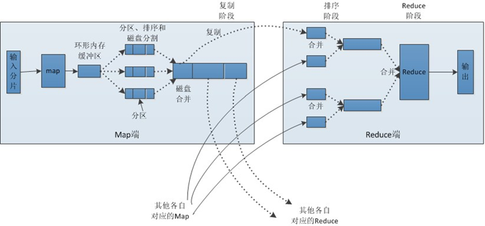

## MapReduce 编程组件

**InputFormat组件**

主要用于描述输入数据的格式，它提供两个功能，分别是数据拆分和为Mapper提供输入数据。

**Mapper组件**

Hadoop提供的Mapper类是实现Map任务的一个抽象基类，该基类提供了一个map()方法。

**Reducer组件**

Map过程输出的键值对，将由Reducer组件进行合并处理，最终的某种形式的结果输出

**Partitioner组件**

Partitioner组件可以让Map对Key进行分区，从而可以根据不同的key分发到不同的Reduce中去处理，其目的就是将key均匀分布在ReduceTask上

**Combiner组件**

Combiner组件的作用就是对Map阶段的输出的重复数据先做一次合并计算，然后把新的（key，value）作为Reduce阶段的输入。

**OutputFormat组件**

OutputFormat是一个用于描述MapReduce程序输出格式和规范的抽象类。


## MapReduce 运行模式

**本地运行模式**

在当前的开发环境模拟MapReduce执行环境，处理的数据及输出结果在本地操作系统。

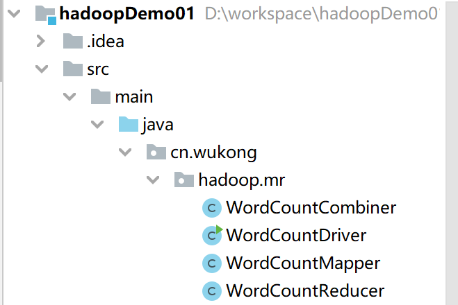

### WordCountCombiner.java

```java
package cn.wukong.hadoop.mr;

import java.io.IOException;

import org.apache.hadoop.io.IntWritable;
import org.apache.hadoop.io.Text;
import org.apache.hadoop.mapreduce.Reducer;

public class WordCountCombiner extends Reducer<Text, IntWritable, Text, IntWritable> {

	@Override
	protected void reduce(Text key, Iterable<IntWritable> values,
			Context context) throws IOException, InterruptedException {
		// 1.局部汇总
		int count = 0;
		for (IntWritable v : values) {
			count += v.get();
		}
		context.write(key, new IntWritable(count));
	}
}

```


### WordCountDriver.java

```java
package cn.wukong.hadoop.mr;

import org.apache.hadoop.conf.Configuration;
import org.apache.hadoop.fs.Path;
import org.apache.hadoop.io.IntWritable;
import org.apache.hadoop.io.Text;
import org.apache.hadoop.mapreduce.Job;
import org.apache.hadoop.mapreduce.lib.input.FileInputFormat;
import org.apache.hadoop.mapreduce.lib.output.FileOutputFormat;

/**
 * Driver类就是MR程序运行的主类，本类中组装了一些程序运行时所需要的信息
 * 比如：使用的Mapper类是什么，Reducer类，数据在什么地方，输出在哪里
 * 
 * @author wukong
 *
 */
public class WordCountDriver {

	public static void main(String[] args) throws Exception {
		// 通过Job来封装本次MR的相关信息
		Configuration conf = new Configuration();

		Job wcjob = Job.getInstance(conf);

		// 指定MR Job jar包运行主类
		wcjob.setJarByClass(WordCountDriver.class);
		// 指定本次MR所有的Mapper Reducer类
		wcjob.setMapperClass(WordCountMapper.class);
		wcjob.setReducerClass(WordCountReducer.class);

		// 设置我们的业务逻辑 Mapper类的输出 key和 value的数据类型
		wcjob.setMapOutputKeyClass(Text.class);
		wcjob.setMapOutputValueClass(IntWritable.class);

		// 设置我们的业务逻辑 Reducer类的输出 key和 value的数据类型
		wcjob.setOutputKeyClass(Text.class);
		wcjob.setOutputValueClass(IntWritable.class);
		
		//设置Combiner组件
		wcjob.setCombinerClass(WordCountCombiner.class);
		

		// 指定要处理的数据所在的位置
		FileInputFormat.setInputPaths(wcjob, "D:/mr/input"); 
		// 指定处理完成之后的结果所保存的位置
		FileOutputFormat.setOutputPath(wcjob, new Path("D:/mr/output"));

		// 提交程序并且监控打印程序执行情况
		boolean res = wcjob.waitForCompletion(true);
		System.exit(res ? 0 : 1);
	}
}

```


### WordCountMapper.java

```java
package cn.wukong.hadoop.mr;

import java.io.IOException;

import org.apache.hadoop.io.IntWritable;
import org.apache.hadoop.io.LongWritable;
import org.apache.hadoop.io.Text;
import org.apache.hadoop.mapreduce.Mapper;

/**
 * 
 * 这里就是MapReduce程序 Map阶段业务逻辑实现的类 Mapper<KEYIN, VALUEIN, KEYOUT, VALUEOUT>
 * 
 * KEYIN:表示mapper数据输入时key的数据类型，在默认读取数据组件下，叫作ImportFormat,它的行为是每行读取待处理的数据
 * 读取一行，就返回一行给MR程序，这种情况下 KEYIN就表示每一行的起始偏移，因此数据类型是Long
 * 
 * VALUEIN:表示mapper数据输入的时候Value的数据类型，在默认读取数据组件下，valueIN就表示读取的一行内容 因此数据类型是String
 * 
 * KEYOUT:表示mapper阶段数据输出的时候key的数据类型，在本案例中输出的key是单词，因此数据类型是String
 * ValueOUT:表示mapper阶段数据输出的时候value的数据类型，在本案例中输出的value是单次的此书，因此数据类型是Integer
 * 
 * 这里所说的数据类型String,Long都是JDK的自带的类型，数据在分布式系统中跨网络传输就需要将数据序列化，默认JDK序列化时效率低下，因此
 * 使用Hadoop封装的序列化类型。 
 long--LongWritable 
 String --Text 
 Integer intWritable ....
 *
 * @author wukong
 *
 */
public class WordCountMapper extends Mapper<LongWritable, Text, Text, IntWritable> {
	/**
	 * 这里就是mapper阶段具体业务逻辑实现的方法 该方法的调用取决于读取数据的组件有没有给MR传入数据
	 * 如果有数据传入，每一个<k,v>对，map就会被调用一次
	 */
	@Override
	protected void map(LongWritable key, Text value, Context context)
			throws IOException, InterruptedException {
		// 拿到传入进来的一行内容，把数据类型转换为String
		String line = value.toString();
		// 将这行内容按照分隔符切割
		String[] words = line.split(" ");
		// 遍历数组，每出现一个单词就标记一个数组1 例如：<单词,1>
		for (String word : words) {
			// 使用MR上下文context，把Map阶段处理的数据发送给Reduce阶段作为输入数据
			context.write(new Text(word), new IntWritable(1));
			//第一行 hadoop hadoop spark  发送出去的是<hadoop,1><hadoop,1><spark,1> 
		}
	}
}

```


### WordCountReducer.java

```java
package cn.wukong.hadoop.mr;

import java.io.IOException;

import org.apache.hadoop.io.IntWritable;
import org.apache.hadoop.io.Text;
import org.apache.hadoop.mapreduce.Reducer;

//都要继承Reducer 这就是我们所说的变成模型，只需要套模板就行了
/**
 * 这里是MR程序 reducer阶段处理的类
 * 
 * KEYIN：就是Reducer阶段输入的数据key类型，对应Mapper阶段输出KEY类型 ，在本案例中就是单词
 * 
 * VALUEIN：就是Reducer阶段输入的数据value类型，对应Mapper阶段输出VALUE类型 ，在本案例中就是个数
 * 
 * KEYOUT:就是Reducer阶段输出的数据key类型，在本案例中，就是单词 Text
 * 
 * VALUEOUT:reducer阶段输出的数据value类型，在本案例中，就是单词的总次数
 * 
 * @author wukong
 *
 */
public class WordCountReducer extends Reducer<Text, IntWritable, Text, IntWritable> {

	/**
	 * 这里是REDUCE阶段具体业务类的实现方法
	 * 第一行 hadoop hadoop spark  发送出去的是<hadoop,1><hadoop,1><spark,1> 
	 * reduce接受所有来自Map阶段处理的数据之后，按照Key的字典序进行排序
	 * 按照key是否相同作一组去调用reduce方法
	 * 本方法的key就是这一组相同的kv对 共同的Key
	 * 把这一组的所有v作为一个迭代器传入我们的reduce方法
	 * 
	 * 迭代器：<hadoop,[1,1]>
	 * 
	 */
	@Override
	protected void reduce(Text key, Iterable<IntWritable> value,
			Context context) throws IOException, InterruptedException {
		//定义一个计数器
		int count = 0;
		//遍历一组迭代器，把每一个数量1累加起来就构成了单词的总次数
		
		//
		for (IntWritable iw : value) {
			count += iw.get();
		}
        //<hello,3>
		context.write(key, new IntWritable(count));
	}
}

```


**集群运行模式**

把MapReduce程序打成一个Jar包，提交至Yarn集群上去运行任务。由于Yarn集群负责资源管理和任务调度，程序会被框架分发到集群中的节点上并发的执行，因此处理的数据和输出结果都在HDFS文件系统中。

## MapReduce性能优化策略

使用Hadoop进行大数据运算，当数据量极其大时，那么对MapReduce性能的调优重要性不言而喻，尤其是Shuffle过程中的参数配置对作业的总执行时间影响特别大，我们可以从五个方面对MapReduce程序进行性能调优，分别是数据输入、Map阶段、Reduce阶段、Shuffle阶段和其他调优属性方面。

数据输入

**在执行MapReduce任务前，将小文件进行合并，大量小文件会产生大量的map任务，增大map任务装载次数，而任务装载较耗时，从而导致MapReduce运行速度较慢。因此采用****CombineTextInputFormat**来作为输入，解决输入端大量的小文件场景。**

**Map阶段**

•减少溢写（spill）次数

•减少合并（merge）次数

•在map之后，不影响业务逻辑前提下，先进行combine处理，减少 **I/O**

**Reduce阶段**

•合理设置map和reduce数

•设置map、reduce共存

•规避使用reduce

•合理设置reduce端的buffer

**Shuffle阶段**

Shuffle阶段的调优就是给Shuffle过程尽量多地提供内存空间，以防止出现内存溢出现象，可以由参数mapred.child.java.opts来设置，任务节点上的内存大小应尽量大。

**其他调优属性**

MapReduce还有一些基本的资源属性的配置，这些配置的相关参数都位于mapred-default.xml文件中，我们可以合理配置这些属性提高MapReduce性能，例如合理设置MapTask、ReduceTask等参数

## MapReduce 经典案例：倒排索引

**1.** **倒排索引介绍**

倒排索引是文档检索系统中最常用的数据结构，被广泛应用于全文搜索引擎。倒排索引主要用来存储某个单词（或词组）在一组文档中的存储位置的映射，提供了可以根据内容来查找文档的方式，而不是根据文档来确定内容，因此称为倒排索引（Inverted Index）。带有倒排索引的文件我们称为倒排索引文件，简称倒排文件(Inverted File)。

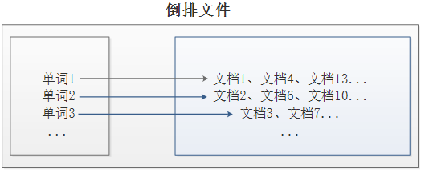

**2.** **案例需求及分析**

现假设有三个源文件file1.txt、file2.txt和file3.txt，需要使用倒排索引的方式对这三个源文件内容实现倒排索引，并将最后的倒排索引文件输出。

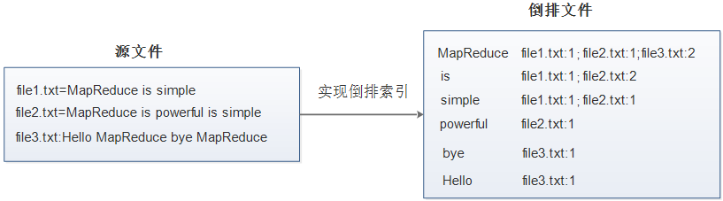

首先，使用默认的TextInputFormat类对每个输入文件进行处理，得到文本中每行的偏移量及其内容。Map过程首先分析输入的<key，value>键值对，经过处理可以得到倒排索引中需要的三个信息：单词、文档名称和词频。

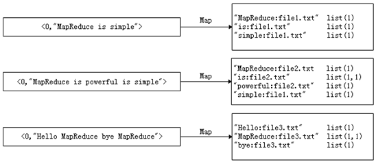

经过Map阶段数据转换后，同一个文档中相同的单词会出现多个的情况，而单纯依靠后续Reduce阶段无法同时完成词频统计和生成文档列表，所以必须增加一个Combine阶段，先完成每一个文档的词频统计。

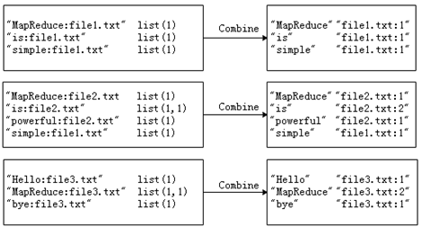

经过上述两个阶段的处理后，Reduce阶段只需将所有文件中相同key值的value值进行统计，并组合成倒排索引文件所需的格式即可。

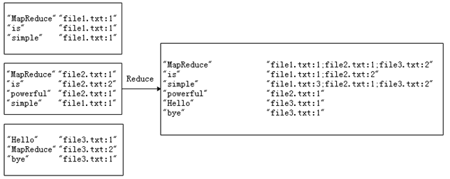

**1. Map阶段实现**

首先，使用开发工具打开之前创建的Maven项目HadoopDemo，并且新创建cn.wukong.mr.invertedIndex包，在该路径下编写自定义Mapper类InvertedIndexMapper，主要用于将文本中的单词按照空格进行切割，并以冒号拼接，“单词：文档名称”作为key，单词次数作为value，都以文本方式输出至Combine阶段。
### InvertedIndexMapper.java

```java
package cn.wukong.mr.InvertedIndex;
import java.io.IOException;
import org.apache.commons.lang.StringUtils;
import org.apache.hadoop.io.LongWritable;
import org.apache.hadoop.io.Text;
import org.apache.hadoop.mapreduce.Mapper;
import org.apache.hadoop.mapreduce.lib.input.FileSplit;
/**
 * @author 悟空非空也
 * B站/CSDN/公众号：悟空非空也
 */
public class InvertedIndexMapper extends Mapper<LongWritable, Text, Text, Text> {

	private static Text keyInfo = new Text();// 存储单词和 URL 组合
	private static final Text valueInfo = new Text("1");// 存储词频,初始化为1

	@Override
	protected void map(LongWritable key, Text value, Context context) throws IOException, InterruptedException {
		String line = value.toString();
		String[] fields = StringUtils.split(line, " ");// 得到字段数组
		FileSplit fileSplit = (FileSplit) context.getInputSplit();// 得到这行数据所在的文件切片
		String fileName = fileSplit.getPath().getName();// 根据文件切片得到文件名
		for (String field : fields) {
			// key值由单词和URL组成，如“MapReduce:file1   ，1”
			keyInfo.set(field + ":" + fileName);
			context.write(keyInfo, valueInfo);
		}
	}
}
```

**2. Combine阶段实现**

根据Map阶段的输出结果形式，在cn.wukong.mr.InvertedIndex包下，自定义实现Combine阶段的类InvertedIndexCombiner，对每个文档的单词进行词频统计。
### InvertedIndexCombiner.java

```java
package cn.wukong.mr.InvertedIndex;

import java.io.IOException;
import org.apache.hadoop.io.Text;
import org.apache.hadoop.mapreduce.Reducer;
/**
 *  @author 悟空非空也
 *   B站/CSDN/公众号：悟空非空也
 *
 */
public class InvertedIndexCombiner extends Reducer<Text, Text, Text, Text> {

	private static Text info = new Text();

	// 输入： <MapReduce:file3 {1,1,...}>
	// 输出：<MapReduce file3:2>
	@Override
	protected void reduce(Text key, Iterable<Text> values, Context context) throws IOException, InterruptedException {
		int sum = 0;// 统计词频
		for (Text value : values) {
			sum += Integer.parseInt(value.toString());
		}
		int splitIndex = key.toString().indexOf(":");
		// 重新设置 value 值由 URL 和词频组成
		info.set(key.toString().substring(splitIndex + 1) + ":" + sum);
		// 重新设置 key 值为单词
		key.set(key.toString().substring(0, splitIndex));
		context.write(key, info);
	}
}
```


**3. Reduce阶段实现**

根据Combine阶段的输出结果形式，同样在cn.wukong.mr.InvertedIndex包下，自定义Reducer类InvertedIndexMapper，主要用于接收Combine阶段输出的数据，并最终案例倒排索引文件需求的样式，将单词作为key，多个文档名称和词频连接作为value，输出到目标目录。
### InvertedIndexReducer.java

```java
package cn.wukong.mr.InvertedIndex;

/**
 * @author 悟空非空也
 * B站/CSDN/公众号：悟空非空也
 */

import java.io.IOException;

import org.apache.hadoop.io.Text;
import org.apache.hadoop.mapreduce.Reducer;

public class InvertedIndexReducer extends Reducer<Text, Text, Text, Text> {  
	  
    private static Text result = new Text();  
  
    // 输入：<MapReduce file3:2>  
    // 输出：<MapReduce file1:1;file2:1;file3:2;>  
    @Override  
    protected void reduce(Text key, Iterable<Text> values, Context context)  
            throws IOException, InterruptedException {  
        // 生成文档列表  
        String fileList = new String();  
        for (Text value : values) {  
            fileList += value.toString() + ";";  
        }  
  
        result.set(fileList);  
        context.write(key, result);  
    }  
}  
```

**4. Driver程序主类实现**

编写MapReduce程序运行主类InvertedIndexDriver，主要用于设置MapReduce工作任务的相关参数，由于本次演示的数据量较小，为了方便、快速进行案例演示，本案例采用了本地运行模式，指定的本地D:\\InvertedIndex\\input目录下的源文件（需要提前准备）实现倒排索引，并将结果输入到本地D:\\InvertedIndex\\output目录下。
### InvertedIndexRunner.java

```java
package cn.wukong.mr.InvertedIndex;
import java.io.IOException;
import org.apache.hadoop.conf.Configuration;
import org.apache.hadoop.fs.Path;
import org.apache.hadoop.io.Text;
import org.apache.hadoop.mapreduce.Job;
import org.apache.hadoop.mapreduce.lib.input.FileInputFormat;
import org.apache.hadoop.mapreduce.lib.output.FileOutputFormat;
/**
 *
 * @author 悟空非空也
 * B站/CSDN/公众号：悟空非空也
 */
public class InvertedIndexRunner {  
    public static void main(String[] args) throws IOException,  
            ClassNotFoundException, InterruptedException {  
        Configuration conf = new Configuration();  
        Job job = Job.getInstance(conf);  
  
        job.setJarByClass(InvertedIndexRunner.class);  
  
        job.setMapperClass(InvertedIndexMapper.class);  
        job.setCombinerClass(InvertedIndexCombiner.class);  
        job.setReducerClass(InvertedIndexReducer.class);  
  
        job.setOutputKeyClass(Text.class);  
        job.setOutputValueClass(Text.class);  
  
        FileInputFormat.setInputPaths(job, new Path("D:\\InvertedIndex\\input"));
        // 指定处理完成之后的结果所保存的位置
        FileOutputFormat.setOutputPath(job, new Path("D:\\InvertedIndex\\output")); 
        
        // 向 yarn 集群提交这个 job
        boolean res = job.waitForCompletion(true);
        System.exit(res ? 0 : 1);
    }  
}  
```

**5.** **效果测试**

为了保证MapReduce程序正常执行，需要先在本地D:\\InvertedIndex\\input目录下创建file1.txt、file2.txt和file3.txt；然后执行MapReduce程序的程序入口InvertedIndexDriver类，正常执行完成后，会在指定的D:\\InvertedIndex\\output下生成结果文件。


## MapReduce 经典案例：数据去重

**1.** **数据去重介绍**

数据去重主要是为了掌握利用并行化思想来对数据进行有意义的筛选，数据去重指去除重复数据的操作。

**2.** **案例需求及分析**

文件file1.txt本身包含重复数据，并且与file2.txt同样出现重复数据，现要求使用Hadoop大数据相关技术对以上2个文件进行去重操作，并最终将结果汇总到一个文件中。

(1) 编写MapReduce程序，在Map阶段采用Hadoop默认作业输入方式后，将key设置为需要去重的数据，而输出的value可以任意设置为空。

(2) 在Reduce阶段，不需要考虑每一个key有多少个value，可以直接将输入的key复制为输出的key，而输出的value可以任意设置为空，这样就会使用MapReduce默认机制对key（也就是文件中的每行内容）自动去重。

**1. Map阶段实现**

使用开发工具打开之前创建的Maven项目HadoopDemo，并且新创建cn.wukong.mr.dedup包，在该路径下编写自定义Mapper类DedupMapper，主要用于读取数据集文件将TextInputFormat默认组件解析的类似<0，2018-3-1 a >键值对修改为<2018-3-1 a，null>。

### DedupMapper.java

```java
package cn.wukong.mr.dedup;

import java.io.IOException;

import org.apache.hadoop.io.LongWritable;
import org.apache.hadoop.io.NullWritable;
import org.apache.hadoop.io.Text;
import org.apache.hadoop.mapreduce.Mapper;

/**
 * @author 悟空非空也
 * B站/CSDN/公众号：悟空非空也
 */
public class DedupMapper extends Mapper<LongWritable, Text, Text, NullWritable> {

	private static Text field = new Text();
	// <0,2018-3-3 c><11,2018-3-4 d>
	@Override
	protected void map(LongWritable key, Text value, Context context) throws IOException,
			InterruptedException {
		field = value;
		context.write(field, NullWritable.get());
	}
	// <2018-3-3 c,null> <2018-3-4 d,null>
}

```


**2. Reduce阶段实现**

根据Map阶段的输出结果形式，同样在cn.wukong.mr.dedup包下，自定义Reducer类DedupReducer，主要用于接受Map阶段传递来的数据，根据**Shuffle工作原理**，键值key相同的数据就会被合并，因此输出数据就不会出现重复数据了。

### DedupReducer.java

```java
package cn.wukong.mr.dedup;

import java.io.IOException;

import org.apache.hadoop.io.NullWritable;
import org.apache.hadoop.io.Text;
import org.apache.hadoop.mapreduce.Reducer;

/**
 * @author 悟空非空也
 * B站/CSDN/公众号：悟空非空也
 */
public class DedupReducer extends Reducer<Text, NullWritable, Text, NullWritable> {
	//  <2018-3-3 c,null><2018-3-4 d,null><2018-3-4 d,null>
	@Override
	protected void reduce(Text key, Iterable<NullWritable> values, Context context)
			throws IOException, InterruptedException {
		context.write(key, NullWritable.get());
	}
}

```


**3. Driver程序主类实现**

编写MapReduce程序运行主类DedupDriver，主要用于设置MapReduce工作任务的相关参数。由于本次演示的数据量较小，为了方便、快速地进行案例演示，本案例采用了本地运行模式，对指定的本地D:\\Dedup\\input目录下的源文件（需要提前准备）实现数据去重，并将结果输入到本地D:\\Dedup\\output目录下。

### DedupRunner.java

```java
package cn.wukong.mr.dedup;

import java.io.IOException;

import org.apache.hadoop.conf.Configuration;
import org.apache.hadoop.fs.Path;
import org.apache.hadoop.io.NullWritable;
import org.apache.hadoop.io.Text;
import org.apache.hadoop.mapreduce.Job;
import org.apache.hadoop.mapreduce.lib.input.FileInputFormat;
import org.apache.hadoop.mapreduce.lib.output.FileOutputFormat;

/**
 * @author 悟空非空也
 * B站/CSDN/公众号：悟空非空也
 */
public class DedupRunner {
	public static void main(String[] args) throws IOException, ClassNotFoundException, InterruptedException {
		Configuration conf = new Configuration();
		Job job = Job.getInstance(conf);

		job.setJarByClass(DedupRunner.class);

		job.setMapperClass(DedupMapper.class);
		job.setReducerClass(DedupReducer.class);

		job.setOutputKeyClass(Text.class);
		job.setOutputValueClass(NullWritable.class);

		FileInputFormat.setInputPaths(job, new Path("D:\\Dedup\\input"));
		// 指定处理完成之后的结果所保存的位置
		FileOutputFormat.setOutputPath(job, new Path("D:\\Dedup\\output"));

		job.waitForCompletion(true);

	}
}

```


**4.** **效果测试**

为了保证MapReduce程序正常执行，需要先在本地D:\\Dedup\\input目录下创建文件file1.txt和file2.txt；然后，执行MapReduce程序的程序入口DedupDriver类，正常执行完成后，在指定的D:\\Dedup\\output目录下生成结果文件。


## MapReduce 经典案例：TopN

**1. TopN分析法介绍**

TopN分析法是指从研究对象中按照某一个指标进行倒序或正序排列，取其中所需的N个数据，并对这N个数据进行重点分析的方法。

**2.** **案例需求及分析**

现假设有数据文件num.txt，现要求使用MapReduce技术提取上述文本中最大的5个数据，并最终将结果汇总到一个文件中。

(1) 先设置MapReduce分区为1，即ReduceTask个数一定只有一个。我们需要提取TopN，即全局的前N条数据，不管中间有几个Map、Reduce，最终只能有一个用来汇总数据。

(2) 在Map阶段，使用TreeMap数据结构保存TopN的数据，TreeMap默认会根据其键的自然顺序进行排序，也可根据创建映射时提供的 Comparator进行排序，其firstKey()方法用于返回当前集合最小值的键。

(3) 在Reduce阶段，将Map阶段输出数据进行汇总，选出其中的TopN数据，即可满足需求。这里需要注意的是，TreeMap默认采取正序排列，需求是提取5个最大的数据，因此要重写Comparator类的排序方法进行倒序排序。

**1. Map阶段实现**

使用开发工具打开之前创建的Maven项目HadoopDemo，并且新建cn.wukong.mr.topN包，在该路径下编写自定义Mapper类TopNMapper，主要用于将文件中的每行数据进行切割提取，并把数据保存到TreeMap中，判断TreeMap是否大于5，如果大于5就需要移除最小的数据。TreeMap保存了当前文件最大5条数据后，再输出到Reduce阶段。

### TopNMapper.java

```java
package cn.wukong.mr.topn;

import java.util.TreeMap;

import org.apache.hadoop.io.IntWritable;
import org.apache.hadoop.io.LongWritable;
import org.apache.hadoop.io.NullWritable;
import org.apache.hadoop.io.Text;
import org.apache.hadoop.mapreduce.Mapper;

/**
 * @author 悟空非空也
 * B站/CSDN/公众号：悟空非空也
 */
public class TopNMapper extends Mapper<LongWritable, Text, NullWritable, IntWritable> {

	private TreeMap<Integer, String> repToRecordMap = new TreeMap<Integer, String>();

	// <0,10 3 8 7 6 5 1 2 9 4>
	// <xx,11 12 17 14 15 20>
	@Override
	public void map(LongWritable key, Text value, Context context) {
		String line = value.toString();
		String[] nums = line.split(" ");
		for (String num : nums) {
			repToRecordMap.put(Integer.parseInt(num), " ");
			if (repToRecordMap.size() > 5) {
				repToRecordMap.remove(repToRecordMap.firstKey());
			}
		}
	}
	@Override
	protected void cleanup(Context context) {
		for (Integer i : repToRecordMap.keySet()) {
			try {
				context.write(NullWritable.get(), new IntWritable(i));
			} catch (Exception e) {
				e.printStackTrace();
			}
		}
	}
}

```


**2. Reduce阶段实现**

根据Map阶段的输出结果形式，同样在cn.wukong.mr.topN包下，自定义Reducer类TopNReducer，主要用于编写TreeMap自定义排序规则，当需求取最大值时，只需要在compare()方法中返回正数即可满足倒序排列，reduce()方法依然是要满足时刻判断TreeMap中存放数据是前五个数，并最终遍历输出最大的5个数。

### TopNReducer.java

```java
package cn.wukong.mr.topn;

import java.io.IOException;
import java.util.Comparator;
import java.util.TreeMap;

import org.apache.hadoop.io.IntWritable;
import org.apache.hadoop.io.NullWritable;
import org.apache.hadoop.mapreduce.Reducer;

/**
 * @author 悟空非空也
 * B站/CSDN/公众号：悟空非空也
 */
public class TopNReducer extends Reducer<NullWritable, IntWritable, NullWritable, IntWritable> {
	
	private TreeMap<Integer, String> repToRecordMap = new TreeMap<Integer, String>(new Comparator<Integer>() {
		
		//返回一个基本类型的整型,谁大谁排后面.
		//返回负数表示：o1 小于o2
		//返回0表示:表示：o1和o2相等
		//返回正数表示：o1大于o2。
		public int compare(Integer a, Integer b) {
			return b - a;
		}
	});
	public void reduce(NullWritable key, Iterable<IntWritable> values, Context context)
			throws IOException, InterruptedException {
		for (IntWritable value : values) {
			repToRecordMap.put(value.get(), " ");
			if (repToRecordMap.size() > 5) {
				repToRecordMap.remove(repToRecordMap.firstKey());
			}
		}
		for (Integer i : repToRecordMap.keySet()) {
			context.write(NullWritable.get(), new IntWritable(i));
		}
	}
}

```


**3. Driver程序主类实现**

编写MapReduce程序运行主类TopNDriver，主要用于对指定的本地D:\\topN\\input目录下的源文件（需要提前准备）实现TopN分析，得到文件中最大的5个数，并将结果输入到本地D:\\topN\\output目录下。

### TopNRunner.java

```java
package cn.wukong.mr.topn;

import org.apache.hadoop.conf.Configuration;
import org.apache.hadoop.fs.Path;
import org.apache.hadoop.io.IntWritable;
import org.apache.hadoop.io.NullWritable;
import org.apache.hadoop.mapreduce.Job;
import org.apache.hadoop.mapreduce.lib.input.FileInputFormat;
import org.apache.hadoop.mapreduce.lib.output.FileOutputFormat;

/**
 * @author 悟空非空也
 * B站/CSDN/公众号：悟空非空也
 */
public class TopNRunner {
	public static void main(String[] args) throws Exception {
		Configuration conf = new Configuration();

		Job job = Job.getInstance(conf);

		job.setJarByClass(TopNRunner.class);
		job.setMapperClass(TopNMapper.class);
		job.setReducerClass(TopNReducer.class);

		job.setNumReduceTasks(1);

		job.setMapOutputKeyClass(NullWritable.class);// map阶段的输出的key
		job.setMapOutputValueClass(IntWritable.class);// map阶段的输出的value

		job.setOutputKeyClass(NullWritable.class);// reduce阶段的输出的key
		job.setOutputValueClass(IntWritable.class);// reduce阶段的输出的value

		FileInputFormat.setInputPaths(job, new Path("D:\\topN\\input"));
		FileOutputFormat.setOutputPath(job, new Path("D:\\topN\\output"));

		boolean res = job.waitForCompletion(true);
		System.exit(res ? 0 : 1);
	}
}

```

**4.** **效果测试**

为了保证MapReduce程序正常执行，需要先在本地D:\\topN\\input目录下创建文件num.txt；然后，执行MapReduce程序的程序入口TopNDriver类，正常执行完成后，在指定的D:\\topN\\output目录下生成结果文件。


