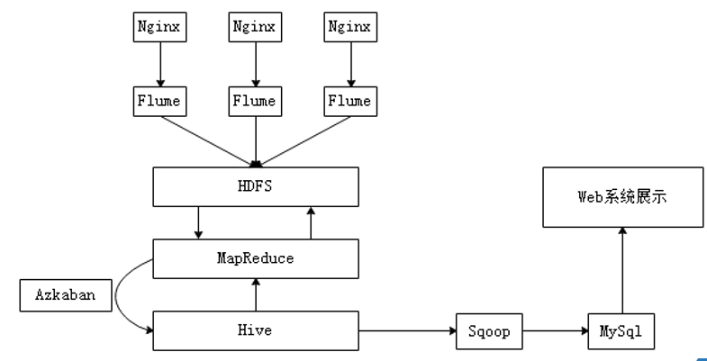
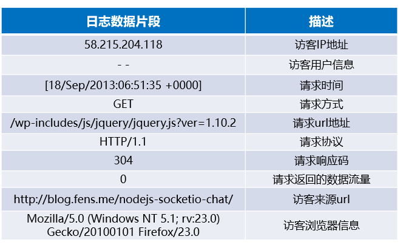
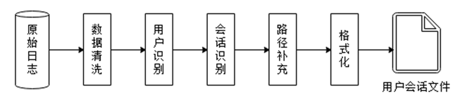
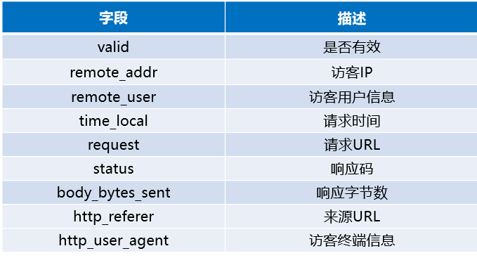
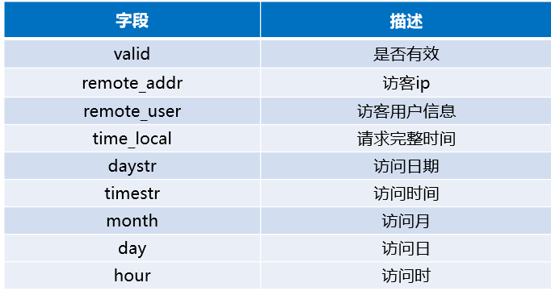
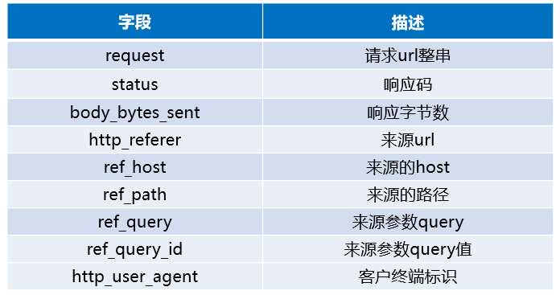
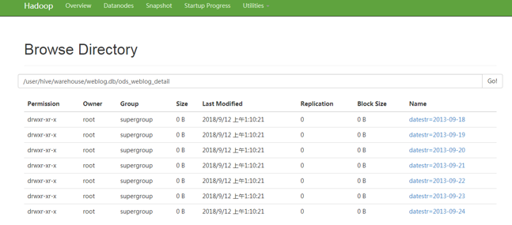
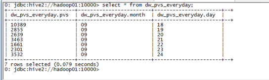
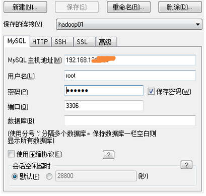
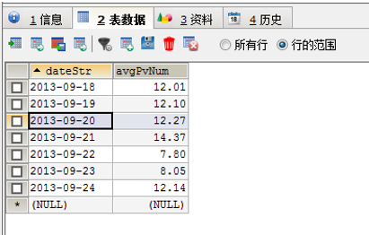

# 综合项目-网站日志数据分析系统

## 系统背景介绍

近年来，随着社会的不断发展，人们对于海量数据的挖掘和运用越来越重视，大数据的统计分析可以为企业决策者提供充实的依据。例如，通过对某网站日志数据统计分析，可以得出网站的日访问量，从而得出网站的欢迎程度；通过对移动APP的下载数据量进行统计分析，可得出应用程序的受欢迎程度，可通过不同维度进行更深层次的数据分析，为运营分析与推广决策提供可靠的数据依据。

## 系统架构设计及效果预览



1. 将Nginx服务器所产生的日志文件通过Flume采集到HDFS中.
2. 根据原始日志文件及规定数据格式开发MapReduce程序进行数据预处理.
3. 通过Hive进行最为重要的数据分析
4. 将分析的结果通过Sqoop工具导出到关系型数据库MySQL中
5. 通过WEB系统，实现数据可视化

## 使用Flume搭建日志采集系统

- 部署Flume的agent节点

```
a1.sources = r1
a1.sources.r1.type = TAILDIR
a1.sources.r1.channels = c1
a1.sources.r1.positionFile = /var/log/flume/taildir_position.json
a1.sources.r1.filegroups = f1 f2
a1.sources.r1.filegroups.f1 = /var/log/test1/example.log
a1.sources.r1.filegroups.f2 = /var/log/test2/.*log.*

```

- 采集到数据：网站流量日志数据的内容

```
58.115.204.118 - - [18/Sep/2020:06:51:35 +0000] "GET /wp-includes/js/jquery/jquery.js?ver=1.10.2 HTTP/1.1" 304 0 "http://blog.csdn.me/nodejs-socketio-chat/" "Mozilla/5.0 (Windows NT 5.1; rv:23.0) Gecko/20100101 Firefox/23.0"
194.127.142.21 - - [18/Sep/2021:06:49:18 +0000] "GET /wp-content/uploads/2013/07/rstudio-git3.png HTTP/1.1" 304 0 "-" "Mozilla/4.0 (compatible;)"
......
.....
```


## 日志信息说明




## 分析预处理的数据

**数据预处理流程**

在数据预处理阶段，主要目的就是对收集的原始数据进行清洗和筛选，因此使用前面学习的MapReduce技术就可以轻松实现。在实际开发中，数据预处理过程通常不会直接将不合法的数据直接删除，而是对每条数据添加标识字段，从而避免其他业务使用时丢失数据。




## 实现数据的预处理

- [ ] 创建Maven项目，添加相关依赖。

- [ ] ```
    	<dependencies>
        		<dependency>
        			<groupId>org.apache.hadoop</groupId>
        			<artifactId>hadoop-common</artifactId>
        			<version>2.7.7</version>
        		</dependency>
        		<dependency>
        			<groupId>org.apache.hadoop</groupId>
        			<artifactId>hadoop-hdfs</artifactId>
        			<version>2.7.7</version>
        		</dependency>
        		<dependency>
        			<groupId>org.apache.hadoop</groupId>
        			<artifactId>hadoop-client</artifactId>
        			<version>2.7.7</version>
        		</dependency>
        		<dependency>
        			<groupId>org.apache.hadoop</groupId>
        			<artifactId>hadoop-mapreduce-client-core</artifactId>
        			<version>2.7.7</version>
        		</dependency>
        	</dependencies>
    ```

- [ ] 

- [ ] 创建JavaBean对象，封装日志记录。

    ```java
    
    package cn.wukong.mr.weblog.bean;
    
    import org.apache.hadoop.io.Writable;
    
    import java.io.DataInput;
    import java.io.DataOutput;
    import java.io.IOException;
    
    /**
     * @author 悟空非空也
     * B站/CSDN/公众号：悟空非空也
     */
    public class WebLogBean implements Writable {
    
        private boolean valid = true;// 判断数据是否合法
        private String remote_addr;// 记录客户端的ip地址
        private String remote_user;// 记录客户端用户名称,忽略属性"-"
        private String time_local;// 记录访问时间与时区
        private String request;// 记录请求的url与http协议
        private String status;// 记录请求状态；成功是200
        private String body_bytes_sent;// 记录发送给客户端文件主体内容大小
        private String http_referer;// 用来记录从那个页面链接访问过来的
        private String http_user_agent;// 记录客户浏览器的相关信息
    
        //设置属性值
        public void set(boolean valid,
                        String remote_addr,
                        String remote_user,
                        String time_local,
                        String request,
                        String status,
                        String body_bytes_sent,
                        String http_referer,
                        String http_user_agent)
        {
            this.valid = valid;
            this.remote_addr = remote_addr;
            this.remote_user = remote_user;
            this.time_local = time_local;
            this.request = request;
            this.status = status;
            this.body_bytes_sent = body_bytes_sent;
            this.http_referer = http_referer;
            this.http_user_agent = http_user_agent;
        }
    
        public boolean getValid() {
            return valid;
        }
        public void setValid(Boolean valid){
            this.valid = valid;
        }
    
        public String getRemote_addr() {
            return remote_addr;
        }
    
        public void setRemote_addr(String remote_addr) {
            this.remote_addr = remote_addr;
        }
    
        public String getRemote_user() {
            return remote_user;
        }
    
        public void setRemote_user(String remote_user) {
            this.remote_user = remote_user;
        }
    
        public String getTime_local() {
            return time_local;
        }
    
        public void setTime_local(String time_local) {
            this.time_local = time_local;
        }
    
        public String getRequest() {
            return request;
        }
    
        public void setRequest(String request) {
            this.request = request;
        }
    
        public String getStatus() {
            return status;
        }
    
        public void setStatus(String status) {
            this.status = status;
        }
    
        public String getBody_bytes_sent() {
            return body_bytes_sent;
        }
    
        public void setBody_bytes_sent(String body_bytes_sent) {
            this.body_bytes_sent = body_bytes_sent;
        }
    
        public String getHttp_referer() {
            return http_referer;
        }
    
        public void setHttp_referer(String http_referer) {
            this.http_referer = http_referer;
        }
    
        public String getHttp_user_agent() {
            return http_user_agent;
        }
    
        public void setHttp_user_agent(String http_user_agent) {
            this.http_user_agent = http_user_agent;
        }
    
        /**
         * 重写toString()方法
         * 使用hive默认分隔符进行分割
         *
         */
        @Override
        public String toString() {
            StringBuilder stringBuilder=new StringBuilder();
            stringBuilder.append(this.valid);
    
            stringBuilder.append("\001").append(this.getRemote_addr());
            stringBuilder.append("\001").append(this.getRemote_user());
            stringBuilder.append("\001").append(this.getTime_local());
            stringBuilder.append("\001").append(this.getRequest());
            stringBuilder.append("\001").append(this.getStatus());
            stringBuilder.append("\001").append(this.getBody_bytes_sent());
            stringBuilder.append("\001").append(this.getHttp_referer());
            stringBuilder.append("\001").append(this.getHttp_user_agent());
    
            return stringBuilder.toString();
        }
    
    
        /**
         * 序列化
         * @param in
         * @throws IOException
         */
        @Override
        public void readFields(DataInput in) throws IOException {
            this.valid = in.readBoolean();
            this.remote_addr = in.readUTF();
            this.remote_user = in.readUTF();
            this.time_local = in.readUTF();
            this.request = in.readUTF();
            this.status = in.readUTF();
            this.body_bytes_sent = in.readUTF();
            this.http_referer = in.readUTF();
            this.http_user_agent = in.readUTF();
        }
    
        /**
         *反序列比
         * @param out
         * @throws IOException
         */
        @Override
        public void write(DataOutput out) throws IOException {
            out.writeBoolean(this.valid);
            out.writeUTF(null==remote_addr?"":remote_addr);
            out.writeUTF(null==remote_user?"":remote_user);
            out.writeUTF(null==time_local?"":time_local);
            out.writeUTF(null==request?"":request);
            out.writeUTF(null==status?"":status);
            out.writeUTF(null==body_bytes_sent?"":body_bytes_sent);
            out.writeUTF(null==http_referer?"":http_referer);
            out.writeUTF(null==http_user_agent?"":http_user_agent);
        }
    }
    
    ```


- [ ] 编写MapReduce程序，执行数据预处理。

- [ ] ```java
    package cn.wukong.mr.weblog.preprocess;
    import cn.wukong.mr.weblog.bean.WebLogBean;
    import java.text.SimpleDateFormat;
    import java.util.Locale;
    import java.util.Set;
    
    /**
     * @author 悟空非空也
     * B站/CSDN/公众号：悟空非空也
     */
    public class WebLogParser {
    
        //定义时间格式
        public static SimpleDateFormat simpleDateFormat1 =
                new SimpleDateFormat("dd/MMM/yyyy:HH:mm:ss", Locale.US);
        public static SimpleDateFormat simpleDateFormat2 =
                new SimpleDateFormat("yy-MM-dd HH:mm:ss", Locale.US);
    
        //格式化时间
        public static  String formatDate(String time_local){
            try{
                return simpleDateFormat2.format(simpleDateFormat1.parse(time_local));
            }catch (Exception e){
                return null;
            }
        }
    
        //对数据进行解析
        public static WebLogBean parser(String line)
        {
            //创建bean对象
            WebLogBean webLogBean = new WebLogBean();
            //把一行数据以空格拆分并存入数字中
            String[] arr = line.split(" ");
            // 数值长度小于等于11,说明数据不完整
            if(arr.length>11){
                //数值元素赋值给WebLogBean对象
                webLogBean.setRemote_addr(arr[0]);
                webLogBean.setRemote_user(arr[1]);
                String time_local = formatDate(arr[3].substring(1));
                if(null == time_local || "".equals(time_local))
                {
                    time_local="-invalid_time-";
                }
                webLogBean.setTime_local(time_local);
                /**
                 * 58.115.204.118 - - [18/Sep/2020:06:51:35 +0000] "GET /wp-includes/js/jquery/jquery.js?ver=1.10.2 HTTP/1.1" 304 0 "http://blog.csdn.me/nodejs-socketio-chat/" "Mozilla/5.0 (Windows NT 5.1; rv:23.0) Gecko/20100101 Firefox/23.0"
                 */
                webLogBean.setRequest(arr[6]);
                webLogBean.setStatus(arr[8]);
                webLogBean.setBody_bytes_sent(arr[9]);
                webLogBean.setHttp_referer(arr[10]);
                // 若是数据记录中 useragent 元素比较长
                if (arr.length>12){
                    StringBuilder stringBuilder = new StringBuilder();
                    for(int i=11;i<arr.length;i++){
                        stringBuilder.append(arr[i]);
                    }
                    webLogBean.setHttp_user_agent(stringBuilder.toString());
    
                }else {
                    webLogBean.setHttp_user_agent(arr[11]);
                }
    
                if(Integer.parseInt(webLogBean.getStatus())>=400){
                    //请求响应值大于400 说明请求失败,此条记录无效
                    webLogBean.setValid(false);
                }
                if("-invalid_time-".equals(webLogBean.getTime_local())){
                    webLogBean.setValid(false);
                }
    
    
    
            } else {
                webLogBean = null;
            }
            return webLogBean;
        }
    
        //过滤css js 图片 等静态资源
        public static void filterStaticResource(WebLogBean webLogBean, Set<String> pages) {
            if(!pages.contains(webLogBean.getRequest())){
                webLogBean.setValid(false);
            }
        }
    
    }
    
    ```

- [ ] **WebLogPreProcess.java**

- [ ] ```java
    package cn.wukong.mr.weblog.preprocess;
    
    import cn.wukong.mr.weblog.bean.WebLogBean;
    import org.apache.hadoop.conf.Configuration;
    import org.apache.hadoop.fs.Path;
    import org.apache.hadoop.io.LongWritable;
    import org.apache.hadoop.io.NullWritable;
    import org.apache.hadoop.io.Text;
    
    import org.apache.hadoop.mapreduce.Job;
    import org.apache.hadoop.mapreduce.Mapper;
    import org.apache.hadoop.mapreduce.lib.input.FileInputFormat;
    import org.apache.hadoop.mapreduce.lib.output.FileOutputFormat;
    
    import java.io.IOException;
    import java.util.HashSet;
    import java.util.Set;
    
    
    /**
     * @author 悟空非空也
     * B站/CSDN/公众号：悟空非空也
     */
    public class WebLogPreProcess {
    
         public static void main(String[] args) throws IOException, ClassNotFoundException, InterruptedException {
             Configuration configuration=new Configuration();
             Job job = Job.getInstance(configuration);
             job.setJarByClass(WebLogPreProcess.class);
             job.setMapperClass(WeblogPreProcessMapper.class);
             job.setOutputKeyClass(Text.class);
             job.setOutputValueClass(NullWritable.class);
             FileInputFormat.setInputPaths(job,new Path("D:\\weblog\\input"));
             FileOutputFormat.setOutputPath(job,new Path("D:\\weblog\\output"));
             job.setNumReduceTasks(0);
             boolean res = job.waitForCompletion(true);
             System.exit(res ? 0:1);
    
         }
    
        //预处理
        public  static class WeblogPreProcessMapper extends Mapper<LongWritable, Text, Text, NullWritable> {
    
            //存储网站url分类数据
           Set<String> pages= new HashSet<String>();
            Text k = new Text();
            NullWritable v= NullWritable.get();
    
    
            /**设置初始化方法，加载原始数据，存储到
             * mapTask的内存中，用于对日志数据进行过滤
             * 判断数据是否合法？
             */
            @Override
            protected void setup(Context context) throws IOException, InterruptedException {
                pages.add("/about");
                pages.add("black-ip-list/");
                pages.add("/cassandra-clustor/");
                pages.add("/finance-rhive-repurchase/");
                pages.add("/hadoop-family-roadmap/");
                pages.add("/hadoop-hive-intro/");
                pages.add("/hadoop-zookeeper-intro/");
                pages.add("/hadoop-mahout-roadmap/");
            }
    
            @Override
            protected void map(LongWritable key, Text value, Context context) throws IOException, InterruptedException {
               //获取一行数据
                String line = value.toString();
                //调用解析类WebLogParser解析日志数据，
                // 最后封装为webLogBean对象
                WebLogBean webLogBean = WebLogParser.parser(line);
                if(webLogBean != null)
                {
                //过滤js 图片 css等资源
                    WebLogParser.filterStaticResource(webLogBean,pages);
                    k.set(webLogBean.toString());
                    context.write(k,v);
                }
    
            }
        }
    
    }
    
    
    
    ```

- [ ] 


## 设计数据仓库

数据预处理完成后，就需要将MapReduce程序的输出结果文件上传至HDFS中，并使用Hive建立相应的表结构与上传的输出结果文件产生映射关系。在创建Hive数据表之前，需要根据业务，分析并设计出需要创建的表结构。

**表ods_weblog_origin的结构（窄表）**



**表dw_weblog_detail的结构（宽表）**



**表dw_weblog_detail的结构（宽表）**



**表t_avgpv_num的结构（维度表）**


表t_avgpv_num的结构简单，只设计了日期和平均PV值两个字段，读者可根据相关业务设计多个字段，例如根据IP分析用户所在地域制定访客地域维度、根据客户终端标识制定访客终端维度等多角度进行分析数据。


## 实现数据仓库

本项目的数据分析过程是在Hadoop集群上实现，主要通过Hive数据仓库工具，因此需要将采集的日志数据经过预处理后，加载到Hive数据仓库中，从而进行后续的分析过程。先启动Hadoop集群，然后在主节点node-01上启动Hive服务端，再在任意一台从节点使用beeline远程连接至Hive服务端，创建名为“weblog”的数据仓库。

**1.** **创建数据仓库**

```
hive > create database weblog;
 
```

**2.** **创建表**

```
hive > create table ods_weblog_origin(
           valid string, --有效标识
           remote_addr string, --来源IP
           remote_user string, --用户标识
           time_local string, --访问完整时间
           request string, --请求的url
           status string, --响应码
           body_bytes_sent string, --传输字节数
           http_referer string, --来源url
           http_user_agent string --客户终端标识
           )
           partitioned by (datestr string)
           row format delimited
           fields terminated by '\001';

```


**查看是否创建成功**

```
hive> show tables;

```


**3.导入数据**

```
# 将生成的结果文件上传至HDFS
$ hadoop fs -mkdir -p /weblog/preprocessed
$ hadoop fs -put part-m-00000 /weblog/preprocessed
# 加载数据
hive > load data inpath '/weblog/preprocessed/' overwrite into table 
ods_weblog_origin partition(datestr='20130918');

```

**4.** **生成明细宽表**

```
# 创建明细表ods_weblog_detail
hive > create table ods_weblog_detail(
           valid           string, --有效标识
           remote_addr     string, --来源IP
           remote_user     string, --用户标识
           time_local      string, --访问完整时间
           daystr          string, --访问日期
           timestr         string, --访问时间
           month           string, --访问月
           day             string, --访问日
           hour            string, --访问时
           request         string, --请求的url
           status          string, --响应码 
           body_bytes_sent string, --传输字节数
           http_referer   string, --来源url
           ref_host       string, --来源的host
           ref_path       string, --来源的路径
           ref_query      string, --来源参数query
           ref_query_id   string, --来源参数query值
           http_user_agent string --客户终端标识
           )
           partitioned by(datestr string);
           
# 通过select方式创建临时中间表t_ods_tmp_referurl
hive > create table t_ods_tmp_referurl as SELECT a.*,b.*
           FROM ods_weblog_origin a LATERAL VIEW 
           parse_url_tuple(regexp_replace(http_referer, "\"", ""),
           'HOST', 'PATH','QUERY', 'QUERY:id') b as host, path, query, query_id;
           
# 通过select方式创建临时中间表t_ods_tmp_detail
hive > create table t_ods_tmp_detail as select b.*,substring(time_local,1,8) as daystr,
           substring(time_local,10,8) as tmstr,
           substring(time_local,4,2) as month,
           substring(time_local,7,2) as day,
           substring(time_local,10,2) as hour
           from t_ods_tmp_referurl b;

# 动态分区
  hive > set hive.exec.dynamic.partition=true;
  hive > set hive.exec.dynamic.partition.mode=nonstrict;

```

Hive默认情况下是无法进行动态分区的，因此在加载数据之前，需要修改默认动态分区的参数。

```
# 向ods_weblog_detail表，加载数据
hive > insert overwrite table ods_weblog_detail partition(datestr)
           select distinct otd.valid,otd.remote_addr,otd.remote_user,
           otd.time_local,otd.daystr,otd.tmstr,otd.month,otd.day,otd.hour,
           otr.request,otr.status,otr.body_bytes_sent,
           otr.http_referer,otr.host,otr.path,
           otr.query,otr.query_id,otr.http_user_agent,otd.daystr
           from t_ods_tmp_detail as otd,t_ods_tmp_referurl as otr 
           where otd.remote_addr=otr.remote_addr 
           and otd.time_local=otr.time_local 
           and otd.body_bytes_sent=otr.body_bytes_sent 
           and otd.request=otr.request;

```

**查看HDFS的WEB UI界面的ods_weblog_detail文件夹**




## 流量分析

流量分析有一个重要指标PV（PageView），PV指页面点击量，是衡量网站质量的主要指标，PV值是指所有访问者在指定时间内游览网页的次数，在日志记录中，一条数据就代表了一次点击量。

**统计每一天的PV量**

```
#  创建表dw_pvs_everyday
 hive > create table dw_pvs_everyday(pvs bigint,month string,day string);
 # 提取“day”字段
 hive >insert into table dw_pvs_everyday 
           select count(*) as pvs,owd.month as month,owd.day as day 
           from ods_weblog_detail owd
           group by owd.month,owd.day;  

```

**查看表dw_pvs_everyday中的数据**

```
hive> select * from dw_pvs_everyday;

```





## 人均浏览量分析

人均浏览量通常被称为人均浏览页面数，该指标具体反应了网站对用户的粘性程度，简单的说是用户对该网站的兴趣程度，页面信息越吸引用户，那么用户就会跳转更多的页面。计算人均浏览量是通过总页面请求数量除以去重人数得出。

**实现人均浏览量**

```
# 创建维度表dw_avgpv_user_everyday
hive > create table dw_avgpv_user_everyday( day string,avgpv string);
# 向表dw_avgpv_user_everyday中插入数据
hive > insert into table dw_avgpv_user_everyday 
           select '13-09-18',sum(b.pvs)/count(b.remote_addr) from 
           (select remote_addr,count(1) as pvs from ods_weblog_detail where 
           datestr='13-09-18' group by remote_addr) b;
           
# 13-09-19
insert into table dw_avgpv_user_everyday 
           select '13-09-19',sum(b.pvs)/count(b.remote_addr) from 
           (select remote_addr,count(1) as pvs from ods_weblog_detail where 
           datestr='13-09-19' group by remote_addr) b;
           
# 13-09-20
insert into table dw_avgpv_user_everyday 
           select '13-09-20',sum(b.pvs)/count(b.remote_addr) from 
           (select remote_addr,count(1) as pvs from ods_weblog_detail where 
           datestr='13-09-20' group by remote_addr) b;
           
# 13-09-21
insert into table dw_avgpv_user_everyday 
           select '13-09-21',sum(b.pvs)/count(b.remote_addr) from 
           (select remote_addr,count(1) as pvs from ods_weblog_detail where 
           datestr='13-09-21' group by remote_addr) b;
           

# 13-09-22
insert into table dw_avgpv_user_everyday 
           select '13-09-22',sum(b.pvs)/count(b.remote_addr) from 
           (select remote_addr,count(1) as pvs from ods_weblog_detail where 
           datestr='13-09-22' group by remote_addr) b;
           

# 13-09-23
insert into table dw_avgpv_user_everyday 
           select '13-09-23',sum(b.pvs)/count(b.remote_addr) from 
           (select remote_addr,count(1) as pvs from ods_weblog_detail where 
           datestr='13-09-23' group by remote_addr) b;
           

# 13-09-24
insert into table dw_avgpv_user_everyday 
           select '13-09-24',sum(b.pvs)/count(b.remote_addr) from 
           (select remote_addr,count(1) as pvs from ods_weblog_detail where 
           datestr='13-09-24' group by remote_addr) b;

```


**查看表dw_avgpv_user_everyday中的数据**

```
hive>select * from dw_avgpv_user_everyday;

```


## 模块开发-数据导出

**1.通过SQLyog工具远程连接node-01服务器的MySQL服务**



>
>
>或者使用  mysql -uroot -p  访问node-01 主节点

**2.创建七日人均浏览量表t_avgpv_num**

```
mysql > create table `t_avgpv_num` (
    	`dateStr` varchar(255) DEFAULT NULL,
    	`avgPvNum` decimal(6,2) DEFAULT NULL
    	) ENGINE=MyISAM DEFAULT CHARSET=utf8;


```

**3.Sqoop导出数据**

```
  $ bin/sqoop export \
  --connect jdbc:mysql://node-01:3306/weblog_mysql?zeroDateTimeBehavior=CONVERT_TO_NULL \
  --username root \
  --password wukong \
  --table t_avgpv_num \
  --columns "dateStr,avgPvNum" \
  --fields-terminated-by '\001' \
  --export-dir \
  /user/hive/warehouse/weblog.db/dw_avgpv_user_everyday

```

**4.查看表t_avgpv_num的数据**

dateStr avgPvNum




## 通过WEB系统，实现数据可视化

> 略


## 搭建日志分析系统

创建Maven项目，添加相关依赖。


编写SSM框架所需的配置文件。


编写数据库配置参数文件。


编写web.xml文件和SqlMapConfig.xml文件。


将项目运行所需的CSS、assets、图片、JS文件及JSP页面引入项目中。


## 实现报表展示功能

创建持久类。


实现DAO层。


实现Service层。


实现Controller层。


实现前端页面功能。

