# Sqoop数据迁移

## Sqoop 简介

Sqoop是Apache的一款开源工具，Sqoop主要用于在Hadoop和关系数据库或大型机之间传输数据，可以使用Sqoop工具将数据从关系数据库管理系统导入（import）到Hadoop分布式文件系统中，或者将Hadoop中的数据转换导出（export）到关系数据库管理系统。

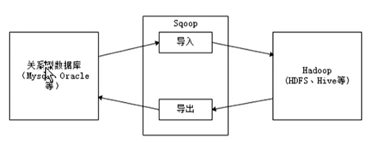


## Sqoop 原理

Sqoop是传统关系型数据库服务器与Hadoop间进行数据同步的工具，其底层利用MapReduce并行计算模型以批处理方式加快数据传输速度，并且具有较好的容错性功能，工作流程如下所示。

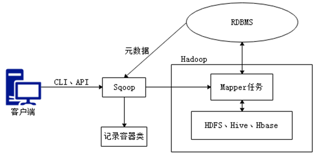

Sqoop是关系型数据库与Hadoop之间的数据桥梁，这个桥梁的重要组件是Sqoop连接器，它用于实现与各种关系型数据库的连接，从而实现数据的导入和导出操作。

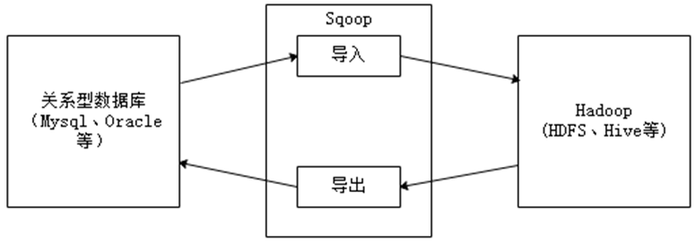

**1.** **导入原理**

在导入数据之前，Sqoop使用JDBC检查导入的数据表，检索出表中的所有列以及列的SQL数据类型，并将这些SQL类型映射为Java数据类型，在转换后的MapReduce应用中使用这些对应的Java类型来保存字段的值，Sqoop的代码生成器使用这些信息来创建对应表的类，用于保存从表中抽取的记录。

**2.** **导出原理**

在导出数据前，Sqoop会根据目标表的定义生成一个Java类，这个生成的类能够从文本中解析出记录数据，并能够向表中插入类型合适的值，启动一个MapReduce作业，从HDFS中读取源数据文件，使用生成的类解析出记录，并且执行选定的导出方法。


## Sqoop 安装配置

**版本问题**

版本1.4.x属于sqoop1

版本1.99.x属于sqoop2

相互不兼容

**1. Sqoop的下载安装**

使用稳定版本Sqoop-1.4.6来讲解Sqoop的安装配置。

```
cd /export/software/
# rz 上传安装包
# 解压
tar -zxvf sqoop....   -C /export/servers/
cd /export/servers/
# 重命名 sqoop-1.4.6
```


**2. Sqoop的配置**

```
通过sqoop-env-template.sh复制出sqoop-env.sh配置文件
cp sqoop-env-template.sh sqoop-env.sh
# 添加Hadoop环境
export HADOOP_COMMON_HOME=/export/servers/hadoop-2.7.7
export HADOOP_MAPRED_HOME=/export/servers/hadoop-2.7.7
export HIVE_HOME=/export/servers/apache-hive-1.2.2-bin

```

```
修改profile文件，添加Sqoop环境
export SQOOP_HOME=/export/servers/sqoop-1.4.6
export PATH=$PATH:$SQOOP_HOME/bin:

# 记得source 使修改生效
source /etc/profile
```

```
找到hive的lib下面的驱动包mysql-connector-java-.jar
将mysql-connector-java-.jar包上传至Sqoop解压包目录的lib目录下

cp mysql-connector-java-8.0.11.jar /export/servers/sqoop-1.4.6/lib
```

**3. Sqoop的效果测试**

```
执行Sqoop相关指令来验证Sqoop的执行效果
sqoop list-databases -connect jdbc:mysql://localhost:3306/ --username root \
					           --password wukong

```

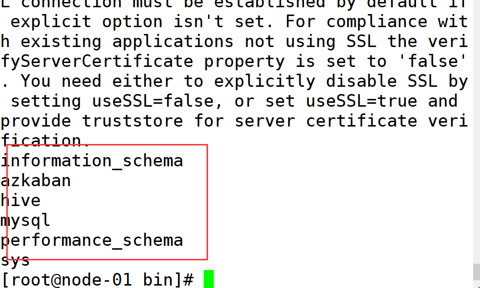


## Sqoop 指令介绍

Sqoop作为一款工具，开发者只需掌握工具的使用方式，它提供了一系列的工具指令，来进行数据的导入、导出操作等，开发人员只需输入”sqoop help“帮助指令查看帮助文档，如下所示。

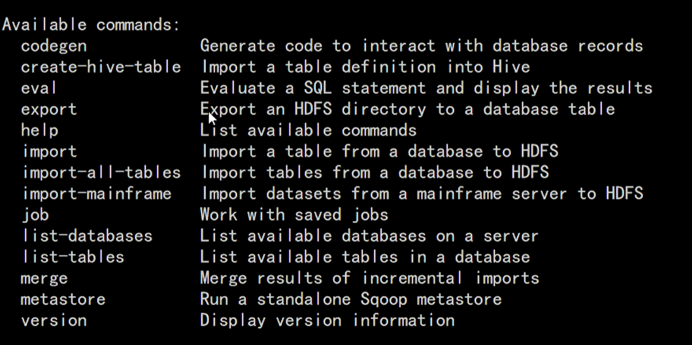


执行Sqoop相关指令时，需要指定各种指令参数，可以使用“sqoop help command”指令来进行查看。例如查看数据导入import指令使用方式，可以使用“sqoop help import”指令进行查看，如下图所示。

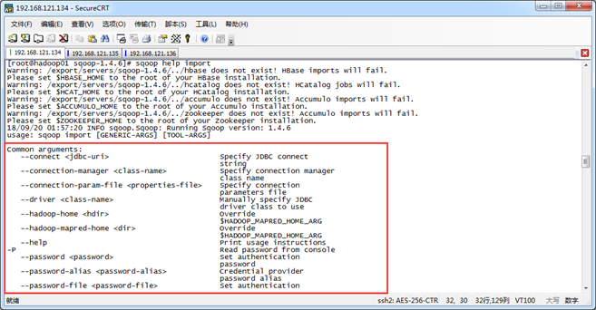


## MySql表数据导入HDFS

Sqoop数据导入（import）是将关系型数据库中的单个表数据导入到HDFS、Hive等具有Hadoop分布式存储结构的文件系统中，表中的每一行都被视为一条记录，所有记录默认以文本文件格式进行逐行存储，还可以以二进制形式存储，例如Avro文件格式、序列文件格式（SequenceFile）。

```
# 创建数据库，设置utf8编码格式
create database userdb character set utf8 collate utf8_general_ci;
```


**1.** **创建MySQL数据表emp**

```
  use userdb;
  
  DROP TABLE IF EXISTS `emp`;
  CREATE TABLE `emp` (
     `id` int(11) NOT NULL,
     `name` varchar(100) DEFAULT NULL,
     `deg` varchar(100) DEFAULT NULL,
     `salary` int(11) DEFAULT NULL,
     `dept` varchar(10) DEFAULT NULL,
      PRIMARY KEY (`id`)
  );

```

**2.** **向MySQL数据表emp插入数据**

```
  INSERT INTO `emp` VALUES ('1201', 'gopal', 'manager', '50000', 'TP');
  INSERT INTO `emp` VALUES ('1202', 'manisha', 'Proof reader', '50000', 'TP');
  INSERT INTO `emp` VALUES ('1203', 'khalil', 'php dev', '30000', 'AC');
  INSERT INTO `emp` VALUES ('1204', 'prasanth', 'php dev', '30000', 'AC');
  INSERT INTO `emp` VALUES ('1205', 'kranthi', 'admin', '20000', 'TP');

```

**3.** **创建MySQL数据表emp_add**

```
  DROP TABLE IF EXISTS `emp_add`;
  CREATE TABLE `emp_add` (
     `id` int(11) NOT NULL,
     `hno` varchar(100) DEFAULT NULL,
     `street` varchar(100) DEFAULT NULL,
     `city` varchar(100) DEFAULT NULL,
     PRIMARY KEY (`id`)
  );

```

**4.** **向MySQL数据表emp_add插入数据**

```
  INSERT INTO `emp_add` VALUES ('1201', '288A', 'vgiri', 'jublee');
  INSERT INTO `emp_add` VALUES ('1202', '108I', 'aoc', 'sec-bad');
  INSERT INTO `emp_add` VALUES ('1203', '144Z', 'pgutta', 'hyd');
  INSERT INTO `emp_add` VALUES ('1204', '78B', 'old city', 'sec-bad');
  INSERT INTO `emp_add` VALUES ('1205', '720X', 'hitec', 'sec-bad');

```


**5.** **将表emp的数据导入到HDFS文件系统**

target-dir   指定hdfs中的目标路径，不存在的话，可以自动生成

```
sqoop import \
--connect jdbc:mysql://node-01:3306/userdb?zeroDateTimeBehavior=CONVERT_TO_NULL \
--username root \
--password wukong \
--target-dir /sqoopresult \
--table emp \
--num-mappers 1

```

**导入成功标志**

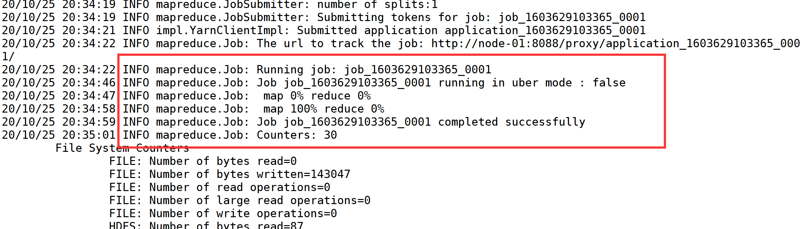


**可能报错原因**

```
1  这里使用的是高可用集群，可能node-01是standby,只读，没有办法写入，需要将node-02的节点DFSZKFailoverController进行kill掉；

2  连接mysql8.0的时候缺参数zeroDateTimeBehavior=CONVERT_TO_NULL ，需要添加
```


**6.** **通过HDFS UI界面查看数据结果文件**

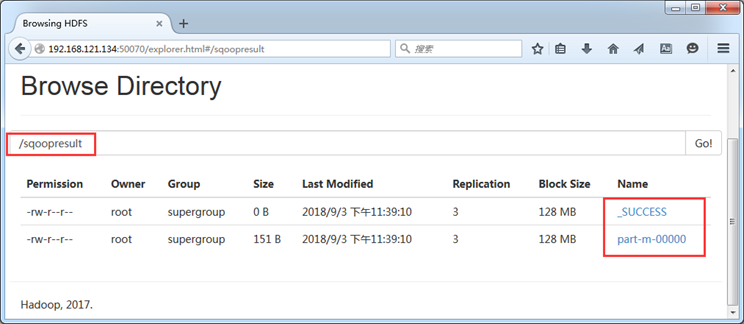

**7.** **使用相关指令，查看导入后的文件内容**

```
hadoop fs -cat /sqoopresult/part-m-00000
```

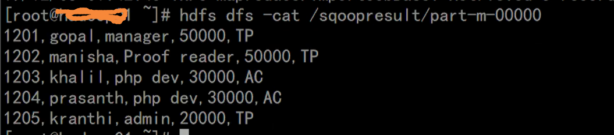


## 增量导入

当MySQL表中的数据发生新增或修改变化，需要更新HDFS上对应的数据时，就可以使用Sqoop的增量导入功能，Sqoop目前支持两种增量导入模式：append模式和lastmodified模式。

**1. append模式**

主要针对INSERT新增数据的增量导入。

**2. lastmodified模式**

主要针对UPDATE修改数据的增量导入。


**append模式案例**

**在emp表中插入一条新数据**

```
mysql>use userdb;
mysql>insert into `emp` values('1206','wukong','java dev','50000','AC');
```


**1.** **向数据表emp进行增量导入（append模式）**

​	check-colume id    表示检查id

​	last-value  1205      表示上次导入数据的最后一条记录id为	           1205

```
$ sqoop import \
  --connect jdbc:mysql://node-01:3306/userdb?zeroDateTimeBehavior=CONVERT_TO_NULL \
  --username root \
  --password wukong \
  --target-dir /sqoopresult \
  --table emp \
  --num-mappers 1 \
  --incremental append \
  --check-column id \
  --last-value 1205

```

**2.** **从HDFS UI界面查看增量导入结果**

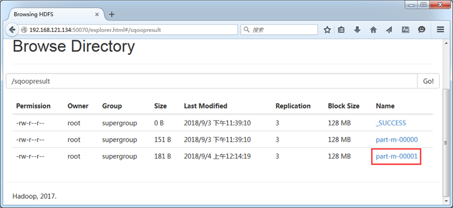

**3.** **执行“hadoop fs –cat”命令查看结果数据**

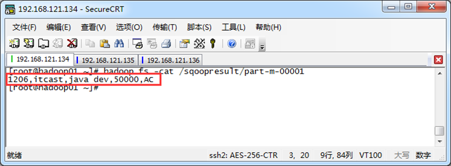


## MySql表数据导入Hive

**1.** **将表emp_add中的数据导入Hive**

--hive-table wukong.emp_add_sp  表示指定导入到hive中的wukong库中的emp_add_sp表

wukong库必须手动创建

emp_add_sp表系统自动创建

```
$ sqoop import \
  --connect jdbc:mysql://node-01:3306/userdb?zeroDateTimeBehavior=CONVERT_TO_NULL \
  --username root \
  --password wukong \
  --table emp_add \
  --hive-table wukong.emp_add_sp \
  --create-hive-table \
  --hive-import \
  --num-mappers 1

```

**2.** **从Hive客户端查看Hive数据仓库表数据**

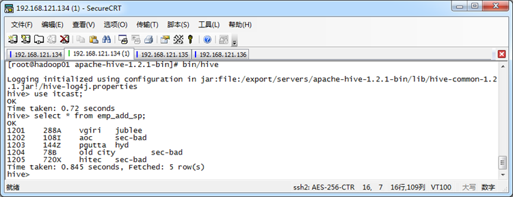

**3.** **从HDFS UI界面查看结果文件**

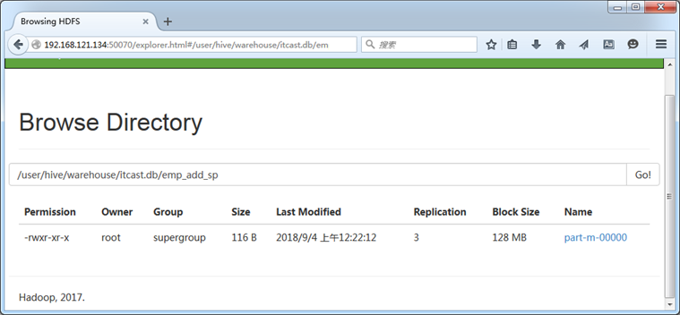


## Mysql 表数据子集导入

在实际业务中，有时候开发人员可能需要只针对部分数据进行导入操作。针对上述需求，可以使用Sqoop提供的“--where”和“--query”参数，先进行数据过滤，然后再将满足条件的数据进行导入。

**1.** **“--where”参数对表emp_add的数据进行过滤**

```
$ sqoop import \
  --connect jdbc:mysql://node-01:3306/userdb?zeroDateTimeBehavior=CONVERT_TO_NULL \
  --username root \
  --password wukong \
  --where "city ='sec-bad'" \
  --target-dir /wherequery \
  --table emp_add \
  --num-mappers 1 

```

**2.** **执行“hadoop fs -cat”指令，查看结果文件**

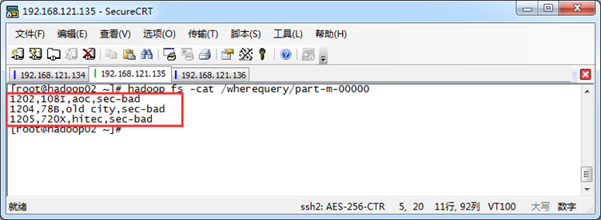

**3. “--query”参数对表emp的数据进行过滤**

--query 的结尾必须要加： AND $CONDITIONS

```
$ sqoop import \
--connect jdbc:mysql://node-01:3306/userdb?zeroDateTimeBehavior=CONVERT_TO_NULL \
--username root \
--password wukong \
--target-dir /wherequery2 \
--query 'SELECT id,name,deg FROM emp WHERE id>1203 AND $CONDITIONS' \
--num-mappers 1

```

**4.** **执行“hadoop fs -cat”指令，查看结果文件**

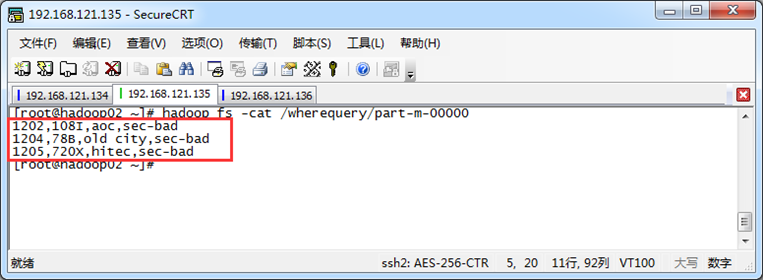


## Sqoop数据导出

Sqoop导出与导入是相反的操作，也就是将HDFS、Hive、Hbase等文件系统或数据仓库中的数据导出到关系型数据库中，在导出操作之前，目标表必须存在于目标数据库中，否则在执行导出操作时会失败。

**1.** **创建MySQL数据表**

```
  DROP TABLE IF EXISTS `emp_export`;
  CREATE TABLE `emp_export` (
     `id` int(11) NOT NULL,
     `name` varchar(100) DEFAULT NULL,
     `deg` varchar(100) DEFAULT NULL,
     `salary` int(11) DEFAULT NULL,
     `dept` varchar(10) DEFAULT NULL,
      PRIMARY KEY (`id`)
   );

```

**2.** **将part-m-00000文件进行导出操作**

```
  $ sqoop export \
--connect jdbc:mysql://node-01:3306/userdb?zeroDateTimeBehavior=CONVERT_TO_NULL \
--username root \
--password wukong \
--table emp_export \
--export-dir /sqoopresult

```

**3.** **查看MySQL数据表**

```sql
use userdb;
select * from emp_export;
```


