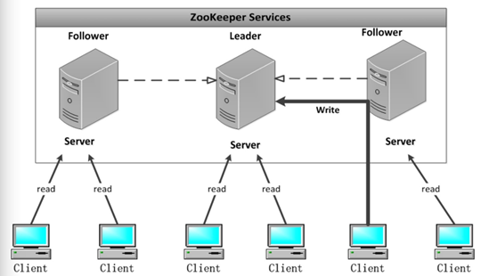
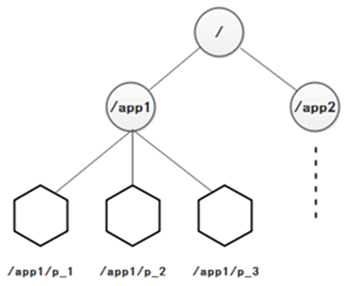
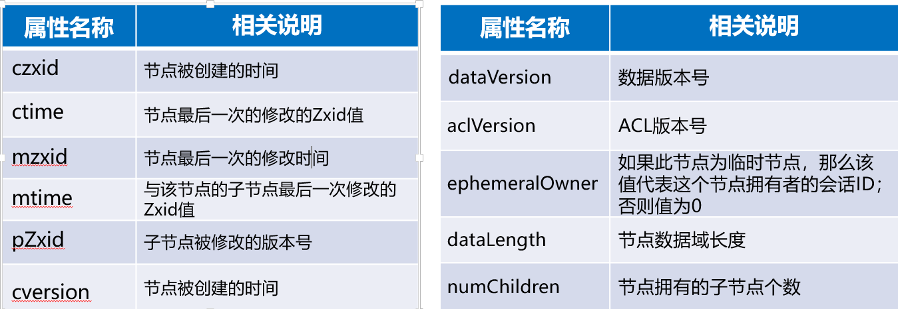
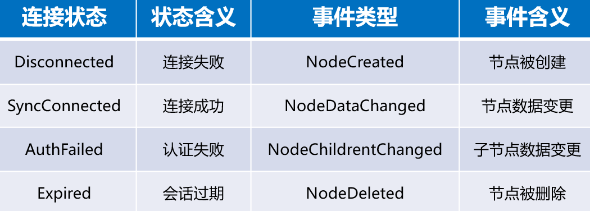
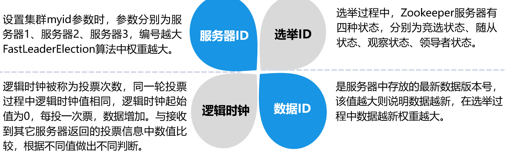
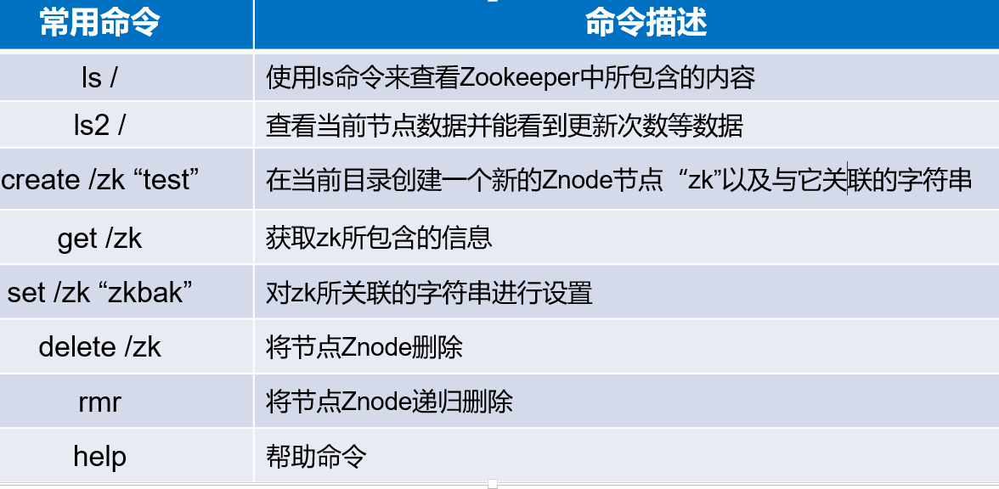
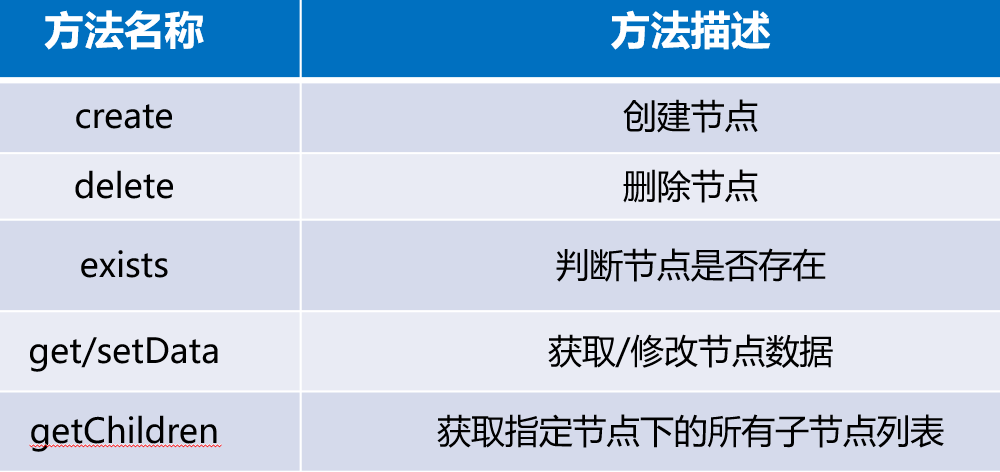

# Zookeeper分布式协调服务

## Zookeeper的简介

Zookeeper是一个分布式协调服务的开源框架，它是由Google的Chubby开源实现。Zookeeper主要用来解决分布式集群中应用系统的一致性问题和单点故障问题，例如如何避免同时操作同一数据造成脏读的一致性问题等。

## Zookeeper的特征

Zookeeper具有全局数据一致性、可靠性、顺序性、原子性以及实时性，可以说Zookeeper的其他特性都是为满足Zookeeper全局数据一致性这一特性。

## Zookeeper的集群角色

Zookeeper集群是一个主从集群，它一般是由一个Leader（领导者）和多个Follower（跟随者）组成。此外，针对访问量比较大的Zookeeper集群，还可新增Observer（观察者）。Zookeeper集群中的三种角色各司其职，共同完成分布式协调服务。



Leader是Zookeeper集群工作的核心，也是事务性请求（写操作）的唯一调度和处理者，保证集群事务处理的顺序性，同时负责进行投票的发起和决议，以及更新系统状态。

Follower负责处理客户端的非事务（读操作）请求，如果接收到客户端发来的事务性请求，则会转发给Leader，让Leader进行处理，同时还负责在Leader选举过程中参与投票。

Observer负责观察Zookeeper集群的最新状态的变化，并且将这些状态进行同步。对于非事务性请求可进行独立处理；对于事务性请求，则会转发给Leader服务器进行处理。它不参与任何形式的投票，只提供非事务性的服务。

## Zookeeper的数据模型

Zookeeper的数据存储结构和标准文件系统非常类似，拥有一个层次命名空间，用斜杠进行分割，都采用树形层次结构，那Zookeeper是由什么组成树呢？

Zookeeper是由节点组成的树，树中的每个节点被称为—Znode。每个节点都可以拥有子节点。每一个Znode默认能够存储1MB的数据，每个Znode都可以通过其路径唯一标识，如图中第三层的第一个Znode,，它的路径是/app1/p_1。Zookeeper数据模型中每个Znode都是由三部分组成，分别是stat、data、children。



**Znode的类型**

Znode的类型在创建时被指定，一旦创建就无法改变。

Znode有两种类型，分别是临时节点和永久节点。

**临时节点**

该生命周期依赖于创建它们的会话，一旦会话结束，临时节点将会被自动删除，也可以手动删除。虽然每个临时的Znode都会绑定一个客户端，但它们对所有的客户端还是可见的。需要注意的是临时节点不允许拥有子节点。

**永久节点**

该生命周期不依赖于会话，并且只有在客户端显示执行删除操作的时候，它们才能被删除。

**Znode的属性**

Zookeeper中的每个Znode都包含了一系列的属性，具体属性如下所示。



## Zookeeper的Watch机制

在ZooKeeper中，引入了Watch机制来实现这种分布式的**通知功能**。ZooKeeper允许客户端向服务端注册一个Watch监听，当服务端的一些事件触发了这个Watch，那么就会向指定客户端发送一个事件通知，来实现分布式的通知功能。

**Watch机制的特点**

一次性触发

事件封装

异步发送

先注册后触发

**Watch机制的通知状态和事件类型**

同一个事件类型在不同的连接状态中代表的含义有所不同。

常见的连接状态和事件类型如下所示。



## Zookeeper的选举机制

Zookeeper为了保证各节点的协同工作，在工作时需要一个Leader角色，而Zookeeper默认采用FastLeaderElection算法，且投票数大于半数则胜出的机制。



**选举机制的类型**

Zookeeper选举机制有两种类型，分别为全新集群选举和非全新集群选举。全新集群选举是新搭建起来的，没有数据ID和逻辑时钟的数据影响集群的选举；非全新集群选举时是优中选优，保证Leader是Zookeeper集群中数据最完整、最可靠的一台服务器。

1.全新集群选举

**假设有5台编号分别是1~5的服务器，全新集群选举过程如下：**

步骤1

服务器1启动，先给自己投票；其次，发投票信息，由于其它机器还没有启动所以它无法接收到投票的反馈信息，因此服务器1的状态一直属于竞选状态。

步骤2

服务器2启动，先给自己投票；其次，在集群中启动Zookeeper服务的机器发起投票对比，它会与服务器1交换结果，由于服务器2编号大，服务器2胜出，服务器1会将票投给服务器2，此时服务器2的投票数并没有大于集群半数，两个服务器状态依旧是竞选状态。

步骤3

服务器3启动，先给自己投票；其次，与之前启动的服务器1、2交换信息，服务器3的编号最大，服务器3胜出，服务器1、2会将票投给服务器3，此时投票数正好大于半数，所以服务器3成为领导者状态，服务器1、2成为追随者状态。

步骤4

服务器4启动，先给自己投票；其次，与之前启动的服务器1、2、3交换信息，尽管服务器4的编号大，但是服务器3已经胜，所以服务器4只能成为追随者状态。

步骤5

服务器5启动，同服务器4一样，均成为追随者状态。

2 **非全新集群选举**

步骤1

统计逻辑时钟是否相同，逻辑时钟小，则说明途中可能存在宕机问题，因此数据不完整，那么该选举结果被忽略，重新投票选举。

步骤2

统一逻辑时钟后，对比数据ID值，数据ID反应数据的新旧程度，因此数据ID大的胜出。

步骤3

如果逻辑时钟和数据ID都相同的情况下，那么比较服务器ID（编号），值大则胜出。

## Zookeeper的分布式集群部署

> 参考文档
>
> https://www.bilibili.com/read/cv7790999
>
>

Zookeeper分布式集群部署指的是ZooKeeper分布式模式安装。Zookeeper集群搭建通常是由2n+1台服务器组成，这是为了保证 Leader 选举（基于Paxos算法的实现）能够通过半数以上台服务器选举支持，因此，ZooKeeper集群的数量一般为奇数台。

**Zookeeper安装包的下载安装**

> 如何在linux下安装jdk？
> https://www.bilibili.com/read/cv7532179

由于Zookeeper集群运行需要Java环境支持，所以要提前安装JDK（对于jdk的下载安装这里不作赘述）。Zookeeper安装包的下载安装，具体步骤如下：

••下载Zookeeper安装包。Zookeeper的使用版本：zookeeper-3.4.10。

••上传Zookeeper安装包。将下载完毕的Zookeeper安装包上传至Linux系统/export/software/目录下。

••解压安装Zookeeper安装包。

**Zookeeper相关配置**

- 修改Zookeeper的配置文件。先将zoo_sample.cfg配置文件重命名为zoo.cfg，然后指定dataDir目录、配置服务器编号与主机名映射关系、设置与主机连接的心跳端口和选举端口。

  ```bash
  mv zoo_sample.cfg  zoo.cfg
  vi zoo.cfg
  
  #datDir 指定为 /export/data/zookeeper/zkdata
  # the directory where the snapshot is stored.
  # do not use /tmp for storage, /tmp here is just
  # example sakes.
  dataDir=/export/data/zookeeper/zkdata
  
  # 配置服务器编号与主机名映射关系、
  # 设置与主机连接的心跳端口和选举端口
  server.1=hadoop01:2888:3888
  server.2=hadoop02:2888:3888
  server.3=hadoop03:2888:3888
  
  ```


- 创建myid文件。根据配置文件zoo.cfg设置的dataDir目录，创建zkdata文件夹并创建myid文件，该文件里面的内容就是服务器编号。

  ```bash
  mkdir -p /export/data/zookeeper/zkdata
  cd /export/data/zookeeper/zkdata
  echo 1 > myid
  ```


- 配置环境变量。执行命令vi /etc/profile对profile文件进行修改，添加Zookeeper的环境变量分发Zookeeper相关文件至其他服务器。

  ```bash
  export ZK_HOME=/export/servers/zookeeper-3.4.10
  export PATH=$PATH:$JAVA_HOME/bin:$HADOOP_HOME/bin:$HADOOP_HOME/sbin:$ZK_HOME/bin
  ```


- 先将Zookeeper安装目录、myid文件以及profile文件分发至hadoop02、hadoop03服务器上，并且修改myid的文件内容，依次对应服务器号进行设置，分别为2、3。

  ```bash
  scp -r /export/servers/zookeeper-3.4.10 hadoop02:/export/servers/
  scp -r /export/servers/zookeeper-3.4.10 hadoop03:/export/servers/
  
  scp /export/data/zookeeper/zkdata/myid hadoop02:/export/data/zkdata/myid
  scp /export/data/zookeeper/zkdata/myid hadoop03:/export/data/zkdata/myid
  # 在hadoop02 和hadoop03中修改myid分别为2和3
  echo 2 > myid
  echo 3 > myid
  
  scp /etc/profile hadoop02:/etc/profile
  scp /etc/profile hadoop03:/etc/profile
  
  ```


- 环境变量生效。分别在hadoop01、hadoop02、hadoop03服务器上刷新profile配置文件，使环境变量生效

  ```bash
  source /etc/profile
  ```


**Zookeeper服务的启动和关闭**

> 必须要  ：关闭防火墙，否则报错
>
> systemctl status firewalld.service
>
> systemctl stop firewalld.service
>
> systemctl disable firewalld.service

1. 启动Zookeeper服务
   在hadoop01、hadoop02、hadoop03服务器上依次启动Zookeeper服务。

    ```bash
    zkServer.sh start
    ```

2. 关闭Zookeeper服务
   在hadoop01、hadoop02、hadoop03服务器上执行zkServer.sh stop关闭Zookeeper服务。

    ```bash
    zkServer.sh stop
    ```

3. 执行命令“zkServer.sh status”查看该节点Zookpeer的角色。

    ```bash
    zkServer.sh status
    ```


## Zookeeper的Shell操作

•Zookeeper命令行工具类似于Linux的Shell环境，能够简单地实现对Zookeeper进行访问、数据创建、数据修改等的一系列操作。



**通过Shell命令操作Zookeeper**

•启动Zookeeper，并连接Zookeeper服务，系统会输出Zookeeper集群的相关配置信息，并在屏幕输出“welcome to Zookeeper!”等信息。

```bash
zkCli.sh -server localhost:2181
```

**1.** **显示所有操作命令**

在客户端输入help，屏幕会输出所有可用的Shell命令。

**2.** **查看当前Zookeeper中所包含的内容**

在客户端输入ls /，屏幕会输出Zookeeper中所包含的内容。

**3.** **查看当前节点数据**

在客户端输入ls2 /，屏幕会输出当前节点数据并且能看到更新次数等数据。

**4.** **创建节点**

在命令行输入创建节点的命令，来创建一个临时节点。

**5.** **获取节点**

在命令行输入获取节点的命令，来获取Zookeeper指定节点的数据内容以及属性信息。

**6.** **修改节点**

在命令行输入修改节点的命令，对前面创建的临时节点testnode-temp进行修改，使得节点内容变成“123”的操作。

**7.** **监听节点**

监听节点就是监听节点变化，概括为三个过程。客户端向服务端注册Watch、服务端事件发生触发Watch、客户端回调Watch得到触发事件的情况。

**8.** **删除节点**

使用delete命令删除节点时，若要删除的节点存在子节点，就无法删除该节点，必须先删除子节点，才可删除父节点。使用rmr命令递归删除节点，不论该节点下是否存在子节点，可以直接删除。


## Zookeeper的Java API操作

Zookeeper API包含五个包：

•org.apache.zookeeper

•org.apache.zookeeper.data

•org.apache.zookeeper.server

•org.apache.zookeeper.server.quorum

•org.apache.zookeeper.server.upgrade

org.apache.zookeeper包含Zookeeper类，这也是编程时最常用的类文件，Zookeeper类提供的常用Java API方法。



**通过Java API操作Zookeeper**

**添加依赖**

在Maven项目HadoopDemo添加Zookeeper相关的依赖。

```xml
<dependency>
			<groupId>org.apache.zookeeper</groupId>
			<artifactId>zookeeper</artifactId>
			<version>3.4.10</version>
</dependency>
```

**启动Zookeeper服务并连接Zookeeper服务**

在项目src文件夹下创建cn.wukong.zookeeper包，并在包下创建ZookeeperTest.java文件，用于操作Zookeeper，例如创建节点、获取节点、修改节点、判断节点是否存在以及删除节点。

```java
package cn.wukong.zookeeper;

import org.apache.zookeeper.*;

/**
 *
 * @author 悟空非空也
 * B站/CSDN/公众号：悟空非空也
 */
public class ZookeeperTest {

	public static void main(String[] args) throws Exception {
		// 初始化ZooKeeper实例(zk地址、会话超时时间，与系统默认一致, watcher)
		ZooKeeper zk = new ZooKeeper("hadoop001:2181,hadoop002:2181,hadoop003:2181", 30000, new Watcher() {
			@Override
			public void process(WatchedEvent event) {
				System.out.println("事件类型为： " + event.getType());
				System.out.println("事件发生的路径： " + event.getPath());
				System.out.println("通知状态为： " + event.getState());
			}
		});

		// 创建一个目录节点
	//	zk.create("/testRootPath", "testRootData".getBytes(), ZooDefs.Ids.OPEN_ACL_UNSAFE, CreateMode.PERSISTENT);

		// 创建一个子目录节点
	//	zk.create("/testRootPath/testChildPathOne", "testChildDataOne".getBytes(), ZooDefs.Ids.OPEN_ACL_UNSAFE,CreateMode.PERSISTENT);

		//获得目录节点（以及子目录节点）的数据
	//	System.out.println(new String(zk.getData("/testRootPath", false, null)));
	//	System.out.println(new String(zk.getData("/testRootPath/testChildPathOne", false, null)));

		// 取出子目录节点列表
	//	System.out.println(zk.getChildren("/testRootPath", true));

		// 修改子目录节点数据
	//	zk.setData("/testRootPath/testChildPathOne", "modifyChildDataOne".getBytes(), -1);

		// 判断目录节点是否存在
	//	System.out.println("目录节点状态： [" + zk.exists("/testRootPath", true) + "]");

		// 创建另外一个子目录节点
	//	zk.create("/testRootPath/testChildPathTwo", "testChildDataTwo".getBytes(), ZooDefs.Ids.OPEN_ACL_UNSAFE,CreateMode.PERSISTENT);

		//查询另外一个子目录节点中的数据
	//	System.out.println(new String(zk.getData("/testRootPath/testChildPathTwo", true, null)));

		// 删除子目录节点
	//	zk.delete("/testRootPath/testChildPathTwo", -1);
	//	zk.delete("/testRootPath/testChildPathOne", -1);

		// 删除父目录节点
	//	zk.delete("/testRootPath", -1);
		System.out.println(zk.getChildren("/", true));

		//关闭客户端对象
	//	zk.close();
		
	}
}

```


## Zookeeper的典型应用场景

### **数据发布与订阅**

数据发布与订阅模型，即所谓的全局配置中心，顾名思义就是发布者将需要全局统一管理的数据发布到Zookeeper节点上，供订阅者动态获取数据，实现配置信息的集中式管理和动态更新。例如全局的配置信息，服务式服务框架的服务地址列表等就非常适合使用。

应用场景：

•应用中用到的一些配置信息放到Zookeeper上进行集中管理。

•分布式搜索服务中，索引的元信息和服务器集群机器的节点状态存放在Zookeeper的一些指定节点，供各个客户端订阅使用。

•分布式日志收集系统中，这个系统的核心工作是收集分布在不同机器的日志。

•系统中有些信息需要动态获取，并且还会存在人工手动去修改这个信息。

### **统一命名服务**

命名服务也是分布式系统中比较常见的一类场景。在分布式系统中，通过使用命名服务，客户端应用能够根据指定名字来获取资源服务的地址，提供者等信息。

应用场景：

阿里开源的分布式服务框架Dubbo中使用ZooKeeper来作为其命名服务，维护全局的服务地址列表。

### **分布式锁**

•分布式锁，这个主要得益于ZooKeeper为我们保证了数据的强一致性。

•锁服务可以分为两类，一个是保持独占，另一个是控制时序。

•所谓保持独占，就是所有试图来获取这个锁的客户端，最终只有一个客户端可以成功获得这把锁，从而执行相应操作；控制时序则是所有试图来获取锁的客户端，最终都会被执行，存在全局时序，客户端在临时非序列化节点下创建临时序列化节点，根据序列号大小进行时序性操作。

应用场景：

当所有客户端都去创建临时非序列化节点，那么最终成功创建的客户端也拥有了这把锁，拥有了访问该数据的权限，当操作完毕后，断开与Zookeeper连接，那该临时节点就会被删除，如果其他客户端需要操作这个文件，客户端只需监听这个目录是否存在即可。


